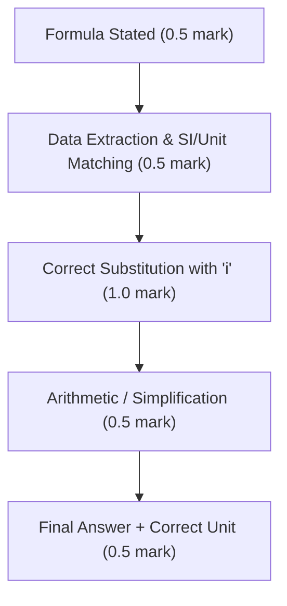

> ### **⚡ Powered by Kedar's Chemistry 😎**

# Speed Hacks, Examiner Traps, Common Evaluation Mistakes & Golden Points to Remember

# CBSE Class 12 Chemistry: Master Examiner Guide
**Unit: Solutions**
*From the Desk of a Senior CBSE Chemistry Head Examiner*

***

## 1. Speed Hacks & Fast Solving Shortcuts

### 1.1 Colligative Property Ratio Shortcuts
For questions comparing the depression of freezing point ($\Delta T_f$), elevation of boiling point ($\Delta T_b$), or osmotic pressure ($\Pi$) between two solutions with the same solvent:

$$
\frac{\Delta T_1}{\Delta T_2} = \frac{i_1 \cdot m_1}{i_2 \cdot m_2}
$$

- **Avoid calculating $K_b$ or $K_f$** whenever comparing two solutes in water.
- **Rule of Thumb for Multiple Choice / Section A:** For equimolar aqueous solutions ($m_1 = m_2$), the magnitude of $\Delta T_f$, $\Delta T_b$, and $\Pi$ depends solely on the effective particle count:
  

$$
\text{Colligative Effect} \propto i
$$

  *(Order of $\Delta T_f$ or $\Delta T_b$: $\text{Al}_2(\text{SO}_4)_3\ [i=5] > \text{FeCl}_3\ [i=4] > \text{CaCl}_2/\text{Na}_2\text{SO}_4\ [i=3] > \text{NaCl}/\text{KCl}\ [i=2] > \text{Glucose/Urea}\ [i=1]$)*.

> [!WARNING]
> **Freezing Point vs. Depression of Freezing Point Trap:**
> - Highest $\Delta T_f \implies$ **Lowest** actual freezing point ($T_f = T_f^\circ - \Delta T_f$).
> - Highest $\Delta T_b \implies$ **Highest** actual boiling point ($T_b = T_b^\circ + \Delta T_b$).

***

### 1.2 Direct Van 't Hoff Factor ($i$) Shortcuts
Instead of writing equilibrium ICE tables during numerical steps:
- **Dissociation:** 
  

$$
i = 1 + (n - 1)\alpha \quad \iff \quad \alpha = \frac{i - 1}{n - 1}
$$

  *(where $n$ is the total number of ions produced per formula unit; e.g., for $\text{K}_2\text{SO}_4$, $n = 3$)*.
  - If $\alpha = 100\%$ ($\alpha = 1$), then simply $i = n$.
  - For $50\%$ dissociation ($\alpha = 0.5$) of a binary salt ($n=2$): $i = 1 + 0.5 = 1.5$.
- **Association:**
  

$$
i = 1 + \left(\frac{1}{n} - 1\right)\alpha \quad \iff \quad \alpha = \frac{1 - i}{1 - \frac{1}{n}}
$$

  *(for dimerization like acetic acid or benzoic acid in benzene, $n = 2$, so $i = 1 - \frac{\alpha}{2}$)*.

***

### 1.3 Rapid Osmotic Pressure & Molar Mass Computations
For osmotic pressure $\Pi = \frac{w_B \cdot R \cdot T}{M_B \cdot V}$:
- If $T = 273\text{ K} + 27^\circ\text{C} = 300\text{ K}$, and pressure is in $\text{atm}$ (or $\text{bar}$), note that:
  

$$
R \cdot T \approx 0.0821 \times 300 = 24.63\ \text{L}\cdot\text{atm}\cdot\text{mol}^{-1}
$$

  

$$
R \cdot T \approx 0.08314 \times 300 = 24.94\ \text{L}\cdot\text{bar}\cdot\text{mol}^{-1}
$$

- Memorizing $24.63$ and $24.94$ eliminates tedious multiplication by decimal constants.

***

### 1.4 Henry's Law Quick Ratio Hack
When calculating dissolved gas concentrations at two different partial pressures at constant temperature ($K_H$ remains constant):

$$
\frac{p_1}{p_2} = \frac{\chi_1}{\chi_2} = \frac{m_1}{m_2}
$$

*(Do not waste time explicitly solving for $K_H$ if the question only asks for the solubility at a new pressure)*.

***

## 2. Examiner Traps & Common Board Evaluation Mistakes

CBSE Chemistry marking schemes prescribe **strict step-marking**. A 3-mark or 5-mark numerical is broken down into formula, substitution, calculation, and final answer with correct units.

### 2.1 The Top 8 Deduction Traps

| # | The Fatal Mistake | Lost Marks | Correct Board Examiner Expectation |
|---|---|:---:|---|
| **1** | **Missing the Van 't Hoff factor ($i$)** for electrolytes ($\text{CaCl}_2$, $\text{NaCl}$, $\text{K}_2\text{SO}_4$, benzoic acid in benzene). | $-1$ to $-1.5$ | Always start with $\Delta T_b = i K_b m$, $\Delta T_f = i K_f m$, $\Pi = iCRT$. If the solute is non-electrolyte (glucose, sucrose, urea), explicitly state: *"For non-electrolyte, $i = 1$"*. |
| **2** | **Confusing Freezing Point with Depression in Freezing Point.** | $-1$ | $\Delta T_f = T_f^\circ - T_f$. If the question asks for the **freezing point of the solution**, writing $\Delta T_f = 0.34\text{ K}$ without writing $T_f = 273.15 - 0.34 = 272.81\text{ K}$ (or $-0.34^\circ\text{C}$) loses the final answer mark. |
| **3** | **Incorrect Gas Constant ($R$) Value and Units.** | $-0.5$ | In $\Pi = CRT$: If $\Pi$ is in $\text{atm}$, use $R = 0.0821\ \text{L}\cdot\text{atm}\cdot\text{K}^{-1}\cdot\text{mol}^{-1}$. If $\Pi$ is in $\text{bar}$, use $R = 0.08314\ \text{L}\cdot\text{bar}\cdot\text{K}^{-1}\cdot\text{mol}^{-1}$. Never use $8.314\ \text{J}\cdot\text{K}^{-1}\cdot\text{mol}^{-1}$ unless volume is in $\text{m}^3$ and $\Pi$ is in $\text{Pa}$. |
| **4** | **Temperature in Celsius instead of Kelvin.** | $-1$ | In $\Pi = i C R T$, forgetting to convert $T(^\circ\text{C}) \to T(\text{K})$ throws off the entire calculation. |
| **5** | **Omitting or Writing Wrong Units.** | $-0.5$ | Writing $M = 120$ instead of $120\ \text{g}\cdot\text{mol}^{-1}$, or molality without $\text{mol}\cdot\text{kg}^{-1}$ / $\text{m}$. |
| **6** | **Mass of Solvent vs. Mass of Solution in Molality.** | $-1$ | Molality ($m$) denominator is **$w_A$ (mass of pure solvent in $\text{kg}$)**, NOT $w_{\text{solution}}$. If given a $10\%$ aqueous solution, $w_B = 10\text{ g}$, $w_A = 90\text{ g}$ (not $100\text{ g}$). |
| **7** | **Inverting Raoult's Law Relative Lowering Formula.** | $-1$ | $\frac{p_A^\circ - p_A}{p_A^\circ} = \chi_B \approx \frac{n_B}{n_A}$. Students often put $p_A$ in the denominator instead of pure solvent vapor pressure $p_A^\circ$. |
| **8** | **Writing Definition of Colligative Properties inaccurately.** | $-1$ | The definition must include: *"Properties which depend **only on the total number of solute particles** irrespective of their nature relative to the total number of particles present in solution."* |

***

### 2.2 How to Write Answers to Maximize Marks (Examiner Checklist)
1. **Always State the Master Formula First:** Even if your calculation goes wrong, you are awarded $0.5$ to $1$ mark for the correct formula.
2. **List the Given Variables with Units in the Margin:**
   

$$
\text{Given: } w_B = 2.0\text{ g},\quad w_A = 50.0\text{ g},\quad K_f = 5.12\ \text{K}\cdot\text{kg}\cdot\text{mol}^{-1},\quad \Delta T_f = 0.40\text{ K}
$$

3. **Show Clear Degree of Dissociation ($\alpha$) Working:**
   Explicitly write the ionization equation:
   

$$
\text{CaCl}_2 \rightleftharpoons \text{Ca}^{2+} + 2\text{Cl}^- \quad (n = 3)
$$

   

$$
i = 1 + (3 - 1)\alpha = 1 + 2\alpha
$$

***

## 3. Golden Points to Remember (NCERT High-Yield Points)

### 3.1 Henry's Law Constants ($K_H$) & Gas Solubility
- **Solubility Trend:** Higher the value of $K_H$ at a given pressure, the **lower** is the solubility of the gas in the liquid:
  

$$
p = K_H \cdot \chi \implies \chi = \frac{p}{K_H}
$$

- **Temperature Effect:** $K_H$ increases with an increase in temperature; therefore, gas solubility **decreases** with increasing temperature. *(Reason why aquatic species are more comfortable in cold water than in warm water).*
- **Biological Applications:**
  - *Scuba divers:* Dilution of air with Helium ($11.7\%\ \text{He}$, $56.2\%\ \text{N}_2$, $32.1\%\ \text{O}_2$) to prevent "bends" (painful/dangerous formation of $\text{N}_2$ bubbles in blood capilaries).
  - *High altitude:* Low atmospheric pressure leads to low dissolved oxygen in blood/tissues $\implies$ **Anoxia** (inability to think clearly and weakness).

***

### 3.2 Ideal vs. Non-Ideal Solutions & Azeotropes

| Parameter | Ideal Solutions | Positive Deviation (from Raoult's Law) | Negative Deviation (from Raoult's Law) |
|---|---|---|---|
| **Intermolecular Forces** | $A\text{--}B \approx A\text{--}A \text{ and } B\text{--}B$ | $A\text{--}B < A\text{--}A \text{ or } B\text{--}B$ | $A\text{--}B > A\text{--}A \text{ or } B\text{--}B$ |
| $\Delta H_{\text{mix}}$ | $\Delta H_{\text{mix}} = 0$ | $\Delta H_{\text{mix}} > 0$ (Endothermic) | $\Delta H_{\text{mix}} < 0$ (Exothermic) |
| $\Delta V_{\text{mix}}$ | $\Delta V_{\text{mix}} = 0$ | $\Delta V_{\text{mix}} > 0$ (Expansion) | $\Delta V_{\text{mix}} < 0$ (Contraction) |
| **Vapor Pressure** | $p = p_A + p_B = p_A^\circ \chi_A + p_B^\circ \chi_B$ | $p > p_A^\circ \chi_A + p_B^\circ \chi_B$ | $p < p_A^\circ \chi_A + p_B^\circ \chi_B$ |
| **Azeotrope Type** | Do **not** form azeotropes | **Minimum Boiling Azeotrope** | **Maximum Boiling Azeotrope** |
| **Boiling Point Behavior** | Continuous variation | Boiling point is lower than either component | Boiling point is higher than either component |
| **Crucial NCERT Examples** | • $n$-Hexane + $n$-Heptane
• Bromoethane + Chloroethane
• Benzene + Toluene | • Ethanol + Acetone
• $\text{CS}_2$ + Acetone
• Ethanol + Water ($95.4\%$ ethanol by vol) | • Chloroform + Acetone
• Phenol + Aniline
• $\text{HNO}_3$ + $\text{H}_2\text{O}$ ($68\%\ \text{HNO}_3$ by mass) |

> [!NOTE]
> **Why Chloroform + Acetone shows Negative Deviation:**
> Chloroform ($\text{CHCl}_3$) forms a strong intermolecular hydrogen bond with the carbonyl oxygen of acetone:
> 

$$
\text{Cl}_3\text{C}-\text{H}\cdots\text{O}=\text{C}(\text{CH}_3)_2
$$

> This makes $A\text{--}B$ interactions stronger than original $A\text{--}A$ and $B\text{--}B$ interactions.

***

### 3.3 Colligative Properties Peculiarities
- **Why Osmotic Pressure ($\Pi$) is preferred for Molar Mass of Polymers and Biomolecules (Proteins, Nucleic Acids):**
  1. Measured at **room temperature** (does not denature sensitive biomolecules).
  2. Uses **molarity ($C$)** instead of molality.
  3. The magnitude of $\Pi$ is significantly larger and easily measurable even for very dilute solutions ($10^{-3}\text{ M}$).
- **Abnormal Molar Mass:**
  

$$
M_{\text{abnormal}} = \frac{M_{\text{theoretical}}}{i}
$$

  - Dissociation ($i > 1$): $M_{\text{observed}} < M_{\text{theoretical}}$.
  - Association ($i < 1$): $M_{\text{observed}} > M_{\text{theoretical}}$ (e.g., ethanoic acid dimers in benzene exhibit nearly double the molar mass: $\approx 120\ \text{g}\cdot\text{mol}^{-1}$ instead of $60\ \text{g}\cdot\text{mol}^{-1}$).

***

## 4. Comprehensive Formula Bank & Reference Constants

### 4.1 Concentration Terms

| Quantity | Mathematical Formula | Temperature Dependency |
|---|---|:---:|
| **Mass % ($w/w$)** | $\frac{w_B}{w_A + w_B} \times 100$ | Independent |
| **Parts Per Million ($\text{ppm}$)** | $\frac{w_B}{w_{\text{solution}}} \times 10^6$ | Independent |
| **Mole Fraction ($\chi_B$)** | $\frac{n_B}{n_A + n_B},\quad \chi_A + \chi_B = 1$ | Independent |
| **Molarity ($M$)** | $M = \frac{n_B}{V_{\text{sol}}(\text{L})} = \frac{w_B \times 1000}{M_B \times V_{\text{sol}}(\text{mL})}$ | **Dependent** (Changes with $T$) |
| **Molality ($m$)** | $m = \frac{n_B}{w_A(\text{kg})} = \frac{w_B \times 1000}{M_B \times w_A(\text{g})}$ | Independent |

***

### 4.2 Governing Laws & Colligative Equations

| Governing Law / Colligative Property | Equation with Van 't Hoff Factor ($i$) | Calculation of Molar Mass ($M_B$) |
|---|---|---|
| **Henry's Law** |

$$
p = K_H \cdot \chi
$$

| — |
| **Raoult's Law (Volatile Liquid Mixture)** |

$$
p_{\text{total}} = p_A + p_B = p_A^\circ \chi_A + p_B^\circ \chi_B
$$

| In vapor phase: $y_A = \frac{p_A}{p_{\text{total}}}$ |
| **Relative Lowering of Vapor Pressure (RLVP)** |

$$
\frac{p_A^\circ - p_A}{p_A^\circ} = i \cdot \chi_B \approx i \frac{n_B}{n_A}
$$

|

$$
M_B = i \cdot \frac{w_B \cdot M_A \cdot p_A^\circ}{w_A \cdot (p_A^\circ - p_A)}
$$

|
| **Elevation of Boiling Point** |

$$
\Delta T_b = T_b - T_b^\circ = i \cdot K_b \cdot m
$$

|

$$
M_B = i \cdot \frac{1000 \cdot K_b \cdot w_B}{\Delta T_b \cdot w_A}
$$

|
| **Depression of Freezing Point** |

$$
\Delta T_f = T_f^\circ - T_f = i \cdot K_f \cdot m
$$

|

$$
M_B = i \cdot \frac{1000 \cdot K_f \cdot w_B}{\Delta T_f \cdot w_A}
$$

|
| **Osmotic Pressure** |

$$
\Pi = i \cdot C \cdot R \cdot T = i \left(\frac{n_B}{V}\right) R T
$$

|

$$
M_B = i \cdot \frac{w_B \cdot R \cdot T}{\Pi \cdot V}
$$

|

***

### 4.3 Thermodynamic Constants for Solvent Properties
- **Molal Elevation Constant (Ebullioscopic Constant, $K_b$):**
  

$$
K_b = \frac{R \cdot M_A \cdot (T_b^\circ)^2}{1000 \cdot \Delta_{\text{vap}}H}
$$

  *(For water: $K_b = 0.52\ \text{K}\cdot\text{kg}\cdot\text{mol}^{-1}$)*.
- **Molal Depression Constant (Cryoscopic Constant, $K_f$):**
  

$$
K_f = \frac{R \cdot M_A \cdot (T_f^\circ)^2}{1000 \cdot \Delta_{\text{fus}}H}
$$

  *(For water: $K_f = 1.86\ \text{K}\cdot\text{kg}\cdot\text{mol}^{-1}$)*.
- **Universal Gas Constant ($R$):**
  

$$
R = 0.0821\ \text{L}\cdot\text{atm}\cdot\text{K}^{-1}\cdot\text{mol}^{-1} = 0.08314\ \text{L}\cdot\text{bar}\cdot\text{K}^{-1}\cdot\text{mol}^{-1} = 8.314\ \text{J}\cdot\text{K}^{-1}\cdot\text{mol}^{-1}
$$

---
**⚡ Powered by Kedar's Chemistry 😎**
