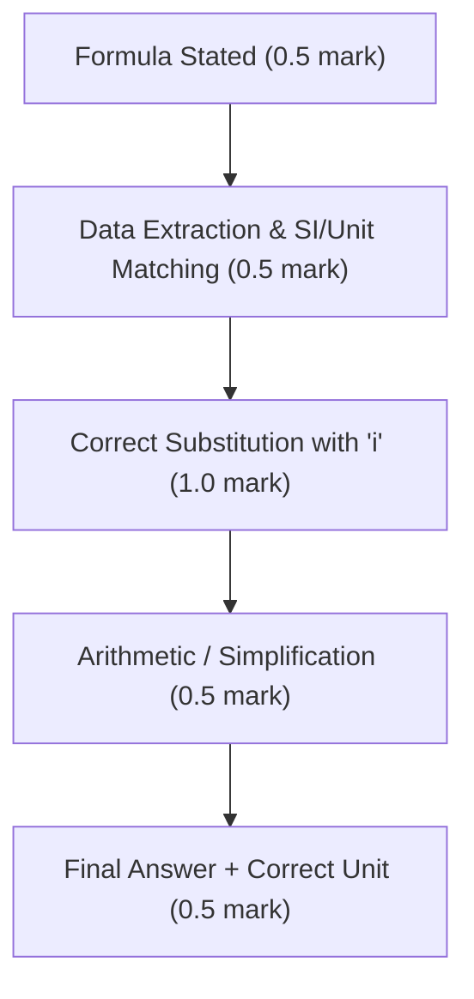

> ### **⚡ Powered by Kedar's Chemistry 😎**

# CBSE Class 12 Chemistry: Solutions

### *Comprehensive Modular Lecture Notes, Chemical Equations & 5-Year PYQs*

> ### **⚡ Powered by Kedar's Chemistry 😎**

# Types of Solutions and Methods of Expressing Concentration of Solutions

# CHAPTER: SOLUTIONS (Class 12 NCERT)

## TOPIC: Types of Solutions & Methods of Expressing Concentration of Solutions

***

## 1. Pedagogical Theory, Classifications & Core Concepts

### 1.1 Fundamental Definition & Characteristics of a Solution
A **solution** is defined as a *chemically non-reacting, homogeneous mixture of two or more components whose composition can be varied within certain limits*.

* **Homogeneity**: The physical properties (refractive index, density, viscosity) and chemical composition are uniform throughout any chosen macroscopic sub-volume.
* **Solute and Solvent (Binary Solutions)**:
  * In a binary solution (two components):
    * The component present in the largest stoichiometric/mass proportion, or that which determines the physical state of the resulting solution, is termed the **solvent** (usually indexed as component $1$ or $A$).
    * The other component present in lesser quantity is termed the **solute** (usually indexed as component $2$ or $B$).

***

### 1.2 Comprehensive Classification: The 9 Types of Binary Solutions
⭐⭐⭐ *(Priority: 3/5 — High Frequency in Objective/1-Mark Questions)*

The physical state of the solution is determined by the physical state of the solvent.

| S. No. | State of Solute | State of Solvent | Type of Solution | Representative NCERT Examples |
| :--- | :--- | :--- | :--- | :--- |
| 1 | **Gas** | **Gas** | Gaseous Solution | Mixture of oxygen ($\text{O}_2$) and nitrogen ($\text{N}_2$) gases in air |
| 2 | **Liquid** | **Gas** | Gaseous Solution | Chloroform ($\text{CHCl}_3$) vapor mixed with nitrogen gas; humidity |
| 3 | **Solid** | **Gas** | Gaseous Solution | Camphor in nitrogen gas; iodine vapors in air |
| 4 | **Gas** | **Liquid** | Liquid Solution | Oxygen ($\text{O}_2$) dissolved in water; carbonated aerated water ($\text{CO}_2$ in $\text{H}_2\text{O}$) |
| 5 | **Liquid** | **Liquid** | Liquid Solution | Ethanol ($\text{C}_2\text{H}_5\text{OH}$) dissolved in water |
| 6 | **Solid** | **Liquid** | Liquid Solution | Glucose ($\text{C}_6\text{H}_{12}\text{O}_6$) or common salt ($\text{NaCl}$) dissolved in water |
| 7 | **Gas** | **Solid** | Solid Solution | Solution of hydrogen gas in palladium ($\text{H}_2/\text{Pd}$) |
| 8 | **Liquid** | **Solid** | Solid Solution | Amalgam of mercury with sodium ($\text{Hg}-\text{Na}$) |
| 9 | **Solid** | **Solid** | Solid Solution | Copper dissolved in gold; Brass ($\text{Cu}-\text{Zn}$), Bronze ($\text{Cu}-\text{Sn}$) |

***

## 2. Quantitative Methods of Expressing Concentration

Concentration represents the amount of solute dissolved in a specified quantity of solvent or solution.

```
                            Concentration Terms
                                     |
         +---------------------------+---------------------------+
         |                                                       |
  Temperature Dependent                                  Temperature Independent
  (Involves Solution Volume, V)                         (Involves Masses Only, m)
  - Volume Percentage (% v/v)                            - Mass Percentage (% w/w)
  - Mass-by-Volume Percentage (% w/v)                    - Mole Fraction (x)
  - Molarity (M)                                         - Molality (m)
  - Parts per Million (ppm by volume)                    - Parts per Million (ppm by mass)
```

***

### 2.1 Mass Percentage ($w/w$)
⭐⭐⭐⭐ *(Priority: 4/5)*

#### Definition
The mass of solute present per $100\text{ g}$ of the solution.

#### Mathematical Derivation & Formulation
Let mass of solute be $w_B$ (or $w_2$) and mass of solvent be $w_A$ (or $w_1$).  
The total mass of the binary solution is:

$$
m_{\text{solution}} = w_A + w_B
$$

$$
\text{Mass } \% \text{ of solute } (B) = \left( \frac{w_B}{w_A + w_B} \right) \times 100 = \left( \frac{\text{Mass of component } B}{\text{Total mass of solution}} \right) \times 100
$$

* **NCERT Key Case**: A $10\%\text{ } (w/w)$ aqueous glucose solution means **$10\text{ g}$ of glucose is dissolved in $90\text{ g}$ of water**, yielding **$100\text{ g}$ of solution**.
* **Temperature Dependence**: **Independent of temperature** because mass is conserved and independent of thermal expansion.
* **SI Unit**: Dimensionless / unitless (expressed as $\% w/w$).

***

### 2.2 Volume Percentage ($v/v$)
⭐⭐⭐ *(Priority: 3/5)*

#### Definition
The volume of liquid solute present per $100\text{ mL}$ (or $100\text{ cm}^3$) of solution.

#### Mathematical Formulation

$$
\text{Volume } \% \text{ of solute } (B) = \left( \frac{V_B}{V_{\text{solution}}} \right) \times 100
$$

* **Standard Example**: A $35\%\text{ } (v/v)$ solution of ethylene glycol (ethane-1,2-diol) in water is used as an antifreeze in car cooling engines. It depresses the freezing point of water to $-17.6^\circ\text{C}$ ($255.55\text{ K}$).
* **Temperature Dependence**: **Dependent on temperature** due to volumetric expansion/contraction coefficients ($\gamma = \frac{1}{V}\frac{\partial V}{\partial T}$).
* **SI Unit**: Dimensionless / percentage.

***

### 2.3 Mass by Volume Percentage ($w/v$)
⭐⭐⭐ *(Priority: 3/5)*

#### Definition
The mass of solute in grams dissolved per $100\text{ mL}$ of the solution. Commonly used in pharmacy and clinical medicine.

#### Mathematical Formulation

$$
\text{Mass by Volume } \% \ (w/v) = \left( \frac{\text{Mass of solute in grams } (w_B)}{\text{Volume of solution in mL } (V_{\text{mL}})} \right) \times 100
$$

* **SI Unit**: $\text{g} \cdot (100\text{ mL})^{-1}$ (reported as $\% \ w/v$).
* **Temperature Dependence**: **Dependent on temperature** (volume in denominator changes with temperature).

***

### 2.4 Parts Per Million ($\text{ppm}$)
⭐⭐⭐ *(Priority: 3/5)*

#### Definition
The number of parts of a given component per million ($10^6$) parts of the solution. Applied when the solute is present in **trace quantities** (e.g., atmospheric pollution, water fluoridation, heavy metal toxins).

#### Mathematical Formulation

$$
\text{ppm}_B = \left( \frac{\text{Number of parts of the component } B}{\text{Total number of parts of all components in solution}} \right) \times 10^6
$$

* By Mass:

$$
\text{ppm} = \left( \frac{w_B}{m_{\text{solution}}} \right) \times 10^6
$$

* For dilute aqueous solutions where $\rho_{\text{solution}} \approx 1.00\text{ g/mL} = 1.00\text{ g/cm}^3$:

$$
1\text{ ppm} \approx 1\text{ mg of solute per 1 L of solution} = 1\text{ }\mu\text{g} \cdot \text{mL}^{-1}
$$

***

### 2.5 Mole Fraction ($\chi$ or $x$)
⭐⭐⭐⭐⭐ *(Priority: 5/5 — Foundation of Raoult's Law & Colligative Properties)*

#### Definition
The ratio of the number of moles of a specific component to the total number of moles of all the components present in the solution.

#### Mathematical Derivation & Proof of Property
For a binary mixture composed of $n_A$ moles of solvent and $n_B$ moles of solute:

$$
n_A = \frac{w_A}{M_A}, \quad n_B = \frac{w_B}{M_B}
$$

Where:
* $w_A, w_B$ = masses of solvent and solute in grams.
* $M_A, M_B$ = molar masses of solvent and solute in $\text{g}\cdot\text{mol}^{-1}$.

The mole fraction of solute ($x_B$) and solvent ($x_A$) are:

$$
x_B = \frac{n_B}{n_A + n_B}
$$

$$
x_A = \frac{n_A}{n_A + n_B}
$$

For a multicomponent system of $i$ components:

$$
x_i = \frac{n_i}{\sum_{k=1}^k n_k}
$$

**Fundamental Property**: The sum of mole fractions of all components in a solution is strictly equal to unity:

$$
x_A + x_B = \frac{n_A}{n_A + n_B} + \frac{n_B}{n_A + n_B} = \frac{n_A + n_B}{n_A + n_B} = 1
$$

$$
\sum_{i=1}^k x_i = 1
$$

* **Temperature Dependence**: **Independent of temperature**.
* **Unit**: Dimensionless quantity (no units).

***

### 2.6 Molarity ($M$)
⭐⭐⭐⭐⭐ *(Priority: 5/5)*

#### Definition
The total number of moles of solute dissolved per litre ($1\text{ dm}^3$) of the solution.

#### Rigorous Mathematical Derivation
Let $w_B$ be the mass of solute in grams, $M_B$ be the molar mass of the solute in $\text{g}\cdot\text{mol}^{-1}$, and $V_{\text{mL}}$ be the total volume of the resulting solution in millilitres:

1. Moles of solute:

$$
n_B = \frac{w_B}{M_B}
$$

2. Volume in litres:

$$
V_{\text{L}} = \frac{V_{\text{mL}}}{1000}
$$

3. Molarity:

$$
M = \frac{n_B}{V_{\text{L}}} = \frac{w_B / M_B}{V_{\text{mL}} / 1000}
$$

$$
\boxed{M = \frac{w_B \times 1000}{M_B \times V_{\text{mL}}}}
$$

* **SI Unit**: $\text{mol}\cdot\text{L}^{-1}$ or $\text{mol}\cdot\text{dm}^{-3}$ (designated by symbol $\text{M}$).
* **Thermal Invariance Check**: **Temperature Dependent**. As temperature $T$ rises, liquid volume expands ($V \uparrow$), causing molarity to decrease ($M \downarrow$).

***

### 2.7 Molality ($m$)
⭐⭐⭐⭐⭐ *(Priority: 5/5)*

#### Definition
The number of moles of solute present per kilogram ($1000\text{ g}$) of the **solvent**.

#### Rigorous Mathematical Derivation
Let $w_B$ be the mass of solute in grams, $M_B$ the molar mass of solute in $\text{g}\cdot\text{mol}^{-1}$, and $w_A$ the mass of **solvent** (NOT solution) in grams:

1. Moles of solute:

$$
n_B = \frac{w_B}{M_B}
$$

2. Mass of solvent in kilograms:

$$
W_{\text{solvent, kg}} = \frac{w_A}{1000}
$$

3. Molality:

$$
m = \frac{n_B}{W_{\text{solvent, kg}}} = \frac{w_B / M_B}{w_A / 1000}
$$

$$
\boxed{m = \frac{w_B \times 1000}{M_B \times w_A}}
$$

* **SI Unit**: $\text{mol}\cdot\text{kg}^{-1}$ (designated by symbol $\text{m}$).
* **Temperature Dependence**: **Strictly independent of temperature** because mass does not vary with thermal expansion.

***

## 3. Inter-Conversion Equations & Mathematical Derivations

### Derivation 1: Converting Mass Percentage ($x\% \ w/w$) and Density ($\rho$) to Molarity ($M$)
Consider a solution with mass percentage $x\% \ (w/w)$ and density $\rho\text{ g}\cdot\text{mL}^{-1}$:

1. Mass of $1000\text{ mL}$ solution:

$$
m_{\text{solution}} = 1000 \times \rho \quad (\text{in grams})
$$

2. Mass of solute present in this $1000\text{ mL}$:

$$
w_B = m_{\text{solution}} \times \frac{x}{100} = 1000 \times \rho \times \frac{x}{100} = 10 \times x \times \rho
$$

3. Moles of solute ($n_B$) in $1\text{ L}$:

$$
n_B = \frac{w_B}{M_B} = \frac{10 \cdot x \cdot \rho}{M_B}
$$

$$
\boxed{M = \frac{10 \times (\% \ w/w) \times \rho}{M_B}}
$$

***

### Derivation 2: Relationship Between Molality ($m$) and Molarity ($M$)
Let:
* Molarity = $M\text{ mol}\cdot\text{L}^{-1}$
* Density of solution = $\rho\text{ g}\cdot\text{mL}^{-1}$
* Molar mass of solute = $M_B\text{ g}\cdot\text{mol}^{-1}$

Consider $1\text{ L}$ ($1000\text{ mL}$) of solution:
1. Moles of solute:

$$
n_B = M
$$

2. Mass of solute:

$$
w_B = M \times M_B\text{ g}
$$

3. Total mass of $1000\text{ mL}$ solution:

$$
m_{\text{solution}} = 1000 \times \rho\text{ g}
$$

4. Mass of solvent ($w_A$):

$$
w_A = m_{\text{solution}} - w_B = (1000\rho - M \cdot M_B)\text{ g}
$$

5. Molality ($m$):

$$
m = \frac{n_B}{w_A / 1000} = \frac{M \times 1000}{1000\rho - M \cdot M_B}
$$

$$
\boxed{m = \frac{1000 \cdot M}{1000\rho - M \cdot M_B}}
$$

Rearranging for Molarity ($M$):

$$
\boxed{M = \frac{1000 \cdot m \cdot \rho}{1000 + m \cdot M_B}}
$$

***

### Derivation 3: Relationship Between Molality ($m$) and Mole Fraction of Solute ($x_B$)
Consider a binary solution composed of solvent $A$ (molar mass $M_A$) and solute $B$:

1. By definition of mole fractions:

$$
\frac{x_B}{x_A} = \frac{n_B}{n_A} = \frac{n_B}{w_A / M_A} = \frac{n_B \times M_A}{w_A}
$$

2. Divide both sides by $M_A$ and multiply by $1000$:

$$
\frac{x_B}{x_A \cdot M_A} \times 1000 = \frac{n_B \times 1000}{w_A} = m
$$

3. Since $x_A = 1 - x_B$:

$$
\boxed{m = \frac{x_B}{1 - x_B} \times \frac{1000}{M_A}}
$$

Inverting to find $x_B$ from Molality $m$:

$$
\boxed{x_B = \frac{m}{m + \frac{1000}{M_A}}}
$$

*(For aqueous solutions where $M_A = 18.015\text{ g}\cdot\text{mol}^{-1}$, $\frac{1000}{M_A} = \frac{1000}{18} \approx 55.56$.)*

***

### Derivation 4: Dilution Formula & Mixing Formulae

#### Case A: Dilution of a Single Solution
Since solute moles remain conserved when adding pure solvent:

$$
n_{\text{initial}} = n_{\text{final}}
$$

$$
\boxed{M_1 V_1 = M_2 V_2}
$$

#### Case B: Mixing Solutions of the Same Solute
When mixing Solution 1 ($M_1, V_1$) and Solution 2 ($M_2, V_2$):

$$
n_{\text{total}} = n_1 + n_2 = M_1 V_1 + M_2 V_2
$$

Assuming volume additivity ($V_{\text{final}} = V_1 + V_2$):

$$
\boxed{M_{\text{mix}} = \frac{M_1 V_1 + M_2 V_2}{V_1 + V_2}}
$$

***

## 4. High-Yield Examples & 5-Year Solved CBSE Board Papers (2020–2025)

### Example 1: [CBSE 2024, 3 Marks]
**Problem**: Concentrated commercial nitric acid is $68\%\text{ } \text{HNO}_3$ by mass in aqueous solution and has a density of $1.504\text{ g}\cdot\text{mL}^{-1}$.  
Calculate:
1. The molarity of the solution.
2. The molality of the solution.  
*(Given: Molar mass of $\text{HNO}_3 = 63.0\text{ g}\cdot\text{mol}^{-1}$)*

**Solution**:
* **Step 1: Understand the basis of calculation.**  
  Assume $100\text{ g}$ of concentrated $\text{HNO}_3$ solution.  
  * Mass of solute ($\text{HNO}_3$), $w_B = 68\text{ g}$
  * Mass of solvent ($\text{H}_2\text{O}$), $w_A = 100 - 68 = 32\text{ g}$
  * Molar mass of solute, $M_B = 1 + 14 + 3(16) = 63\text{ g}\cdot\text{mol}^{-1}$

* **Step 2: Calculate Molarity ($M$).**  
  Volume of $100\text{ g}$ solution:
  

$$
V = \frac{\text{Mass}}{\text{Density}} = \frac{100\text{ g}}{1.504\text{ g}\cdot\text{mL}^{-1}} = 66.489\text{ mL}
$$

  Moles of $\text{HNO}_3$:
  

$$
n_B = \frac{68\text{ g}}{63\text{ g}\cdot\text{mol}^{-1}} = 1.0794\text{ mol}
$$

  Molarity:
  

$$
M = \frac{n_B \times 1000}{V_{\text{mL}}} = \frac{1.0794 \times 1000}{66.489} = 16.234\text{ M}
$$

  *(Direct Formula Check: $M = \frac{10 \times 68 \times 1.504}{63} = \frac{1022.72}{63} = 16.234\text{ M}$)*

* **Step 3: Calculate Molality ($m$).**  
  

$$
m = \frac{w_B \times 1000}{M_B \times w_A} = \frac{68 \times 1000}{63 \times 32} = \frac{68000}{2016} = 33.73\text{ mol}\cdot\text{kg}^{-1}
$$

**Final Boxed Answer**:

$$
\boxed{M = 16.23\text{ mol}\cdot\text{L}^{-1}, \quad m = 33.73\text{ mol}\cdot\text{kg}^{-1}}
$$

***

### Example 2: [CBSE 2023, 2 Marks]
**Problem**: An aqueous solution of sodium hydroxide ($\text{NaOH}$) is marked $2.0\text{ M}$. The density of this solution is $1.08\text{ g}\cdot\text{mL}^{-1}$. Compute the molality of the solution.  
*(Molar mass of $\text{NaOH} = 40.0\text{ g}\cdot\text{mol}^{-1}$)*

**Solution**:
* **Step 1: Quantify components for $1.0\text{ L}$ ($1000\text{ mL}$) of solution.**
  * Moles of $\text{NaOH}$, $n_B = 2.0\text{ mol}$
  * Mass of solute $w_B = n_B \times M_B = 2.0 \times 40.0 = 80.0\text{ g}$
* **Step 2: Determine solvent mass.**
  

$$
\text{Mass of solution } = V \times \rho = 1000\text{ mL} \times 1.08\text{ g}\cdot\text{mL}^{-1} = 1080.0\text{ g}
$$

  

$$
\text{Mass of solvent } (w_A) = m_{\text{solution}} - w_B = 1080.0\text{ g} - 80.0\text{ g} = 1000.0\text{ g} = 1.00\text{ kg}
$$

* **Step 3: Calculate molality ($m$).**
  

$$
m = \frac{n_B}{\text{Mass of solvent in kg}} = \frac{2.0\text{ mol}}{1.00\text{ kg}} = 2.00\text{ mol}\cdot\text{kg}^{-1}
$$

**Final Boxed Answer**:

$$
\boxed{m = 2.00\text{ m}}
$$

***

### Example 3: [CBSE 2022 Term-1, 1 Mark]
**Problem**: Which of the following concentration units is temperature-dependent and why?  
(A) Molality  
(B) Mole fraction  
(C) Mass percentage  
(D) Molarity  

**Answer & Marking Scheme Explanation**:  
* **Correct Option**: **(D)**
* **Justification**: Molarity is defined as the number of moles of solute per unit volume of solution ($M = \frac{n}{V}$). Since volume depends on temperature due to thermal expansion/contraction of liquids, **molarity changes with temperature**. Molality, mole fraction, and mass percentage depend solely on mass, which is invariant with temperature.

***

### Example 4: [CBSE 2021, 3 Marks]
**Problem**: Calculate the mole fraction of ethylene glycol ($\text{C}_2\text{H}_6\text{O}_2$) in a solution containing $20\%\text{ } \text{C}_2\text{H}_6\text{O}_2$ by mass.

**Solution**:
* **Step 1: Basis of $100\text{ g}$ of solution.**
  * Mass of glycol ($w_B$) = $20\text{ g}$
  * Mass of water ($w_A$) = $100 - 20 = 80\text{ g}$
* **Step 2: Compute molar masses.**
  * $M_B (\text{C}_2\text{H}_6\text{O}_2) = (2 \times 12) + (6 \times 1) + (2 \times 16) = 24 + 6 + 32 = 62\text{ g}\cdot\text{mol}^{-1}$
  * $M_A (\text{H}_2\text{O}) = 18\text{ g}\cdot\text{mol}^{-1}$
* **Step 3: Calculate molar amounts.**
  * $n_B = \frac{20\text{ g}}{62\text{ g}\cdot\text{mol}^{-1}} = 0.3226\text{ mol}$
  * $n_A = \frac{80\text{ g}}{18\text{ g}\cdot\text{mol}^{-1}} = 4.4444\text{ mol}$
* **Step 4: Compute mole fraction.**
  

$$
x_{\text{glycol}} = \frac{n_B}{n_A + n_B} = \frac{0.3226}{4.4444 + 0.3226} = \frac{0.3226}{4.7670} = 0.0677 \approx 0.068
$$

  

$$
x_{\text{water}} = 1 - 0.0677 = 0.9323
$$

**Final Boxed Answer**:

$$
\boxed{x_{\text{glycol}} = 0.068, \quad x_{\text{water}} = 0.932}
$$

***

### Example 5: [CBSE 2020, 3 Marks]
**Problem**: A sample of drinking water was found to be severely contaminated with chloroform ($\text{CHCl}_3$), supposed to be a carcinogen. The level of contamination was $15\text{ ppm}$ (by mass).  
1. Express this in percent by mass.
2. Determine the molality of chloroform in the water sample.  
*(Molar mass of $\text{CHCl}_3 = 119.5\text{ g}\cdot\text{mol}^{-1}$)*

**Solution**:
* **Part 1: Express in percent by mass.**  
  $15\text{ ppm}$ means $15\text{ g}$ of $\text{CHCl}_3$ is present in $10^6\text{ g}$ of total solution.
  

$$
\% \text{ by mass} = \left(\frac{15\text{ g}}{10^6\text{ g}}\right) \times 100 = 15 \times 10^{-4}\% = 1.5 \times 10^{-3}\%
$$

* **Part 2: Calculate molality ($m$).**  
  * Mass of solute ($w_B$) = $15\text{ g}$
  * Mass of solvent ($w_A$) = $10^6\text{ g} - 15\text{ g} \approx 10^6\text{ g}$ (since $15 \ll 10^6$)
  * Molar mass of $\text{CHCl}_3$ ($M_B$) = $12 + 1 + 3(35.5) = 119.5\text{ g}\cdot\text{mol}^{-1}$
  * Molality:
  

$$
m = \frac{w_B \times 1000}{M_B \times w_A} = \frac{15 \times 1000}{119.5 \times 10^6} = \frac{15 \times 10^{-3}}{119.5} = 1.255 \times 10^{-4}\text{ mol}\cdot\text{kg}^{-1}
$$

**Final Boxed Answer**:

$$
\boxed{\% \text{ by mass} = 1.5 \times 10^{-3}\%, \quad m = 1.255 \times 10^{-4}\text{ m}}
$$

***

## 5. Examiner Traps & Common Mistakes

> [!CAUTION]
> **Trap 1: Confusing Solution Mass with Solvent Mass in Molality Calculations**  
> * **The Mistake**: Substituting the mass of the *solution* into the denominator of the molality formula instead of the mass of the *solvent*.
> * **The NCERT Rule**:
>   

$$
m = \frac{n_{\text{solute}}}{w_{\text{solvent}}\text{ (in kg)}} \quad \text{where } w_{\text{solvent}} = m_{\text{solution}} - w_{\text{solute}}
$$

> [!WARNING]
> **Trap 2: Forgetting to Convert Density to Correct Volume Units**  
> When given density $\rho$ in $\text{g}\cdot\text{mL}^{-1}$, $V = \frac{\text{mass}}{\rho}$ yields volume in **millilitres ($\text{mL}$)**, not litres. Neglecting the factor of $1000$ leads to answers that are off by a factor of $10^3$.

> [!WARNING]
> **Trap 3: Assuming Volume Additivity upon Mixing Liquids**  
> When $50\text{ mL}$ of ethanol is mixed with $50\text{ mL}$ of water, the final volume is **not** $100\text{ mL}$ (due to intermolecular hydrogen bonding causing $\Delta V_{\text{mix}} < 0$). Do not sum volumes directly unless the question explicitly specifies: *"Assume volumes are additive."*

> [!NOTE]
> **Trap 4: Missing Significant Figures & Units**  
> Writing simply "$M = 2$" instead of "$2.0\text{ M}$" or "$2.0\text{ mol}\cdot\text{L}^{-1}$" can result in losing half a mark on CBSE board marking schemes. Always state SI units explicitly.

***

## 6. Speed Hacks & Golden Revision Points

* **Golden Formula 1 (The $10\cdot x\cdot\rho$ shortcut)**:
  

$$
M = \frac{10 \times (\% \ w/w) \times \rho}{M_B}
$$

  *Eliminates the multi-step assumption of $100\text{ g}$ solution.*

* **Golden Formula 2 (Direct Molarity to Molality Transition)**:
  

$$
\frac{1}{m} = \frac{\rho}{M} - \frac{M_B}{1000}
$$

  *(Or: $m = \frac{1000 M}{1000\rho - M M_B}$)*

* **Golden Formula 3 (Direct Mole Fraction to Molality Transition)**:
  

$$
\frac{x_B}{1 - x_B} = \frac{m \cdot M_A}{1000}
$$

  *For dilute aqueous solutions, $55.56 \cdot x_B \approx m$.*

* **Temperature Invariance Checklist**:
  

$$
\text{Temperature Independent: } \% (w/w), \quad \text{ppm (mass)}, \quad x_i \text{ (mole fraction)}, \quad m \text{ (molality)}
$$

  

$$
\text{Temperature Dependent: } \% (v/v), \quad \% (w/v), \quad M \text{ (molarity)}, \quad \text{Normality } (N)
$$

* **Memory Mnemonic for Units**:
  * **MolaRity** has an **R** for **R**oom / **R**eservoir volume $\rightarrow \text{mol}\cdot\text{L}^{-1}$.
  * **MolaLity** has an **L** for **L**ump / **L**oad of solvent mass $\rightarrow \text{mol}\cdot\text{kg}^{-1}$.

```{=openxml}
<w:p><w:r><w:br w:type="page"/></w:r></w:p>
```

> ### **⚡ Powered by Kedar's Chemistry 😎**

# Solubility of Solids and Gases in Liquids and Henry's Law

# CLASS 12 CHEMISTRY: SOLUTIONS

## TOPIC LECTURE NOTES: SOLUBILITY OF SOLIDS AND GASES IN LIQUIDS & HENRY'S LAW

***

# 1. In-Depth Pedagogical Theory & Concepts

## 1.1 Solubility: Fundamental Definitions & Thermodynamics
**Priority: ⭐⭐⭐**

* **Solubility:** The maximum amount of a solute that can dissolve in a specified amount of a given solvent at a specified temperature and pressure. It is typically expressed in $\text{g}\cdot(100\,\text{g solvent})^{-1}$ or $\text{mol}\cdot\text{L}^{-1}$ (molarity).
* **Saturated Solution:** A solution in which no more solute can dissolve at the same temperature and pressure. A dynamic equilibrium exists between dissolved solute and undissolved solute:

$$
\text{Solute (undissolved)} + \text{Solvent} \rightleftharpoons \text{Solution (dissolved)}
$$

* **Unsaturated Solution:** A solution in which more solute can be dissolved at the given temperature without altering external conditions.
* **Supersaturated Solution:** A metastable state containing more dissolved solute than the equilibrium saturation concentration at a given temperature, prepared by cooling a concentrated hot saturated solution slowly without disturbance.

***

## 1.2 Solubility of a Solid in a Liquid
**Priority: ⭐⭐⭐⭐**

### Factors Governing Solid Solubility:

#### A. Nature of Solute and Solvent ("Like Dissolves Like")
Dissolution occurs when solute–solvent interactions are comparable to or greater than solute–solute and solvent–solvent interactions.
* **Polar/Ionic Solutes** (e.g., $\text{NaCl}, \text{sugar}$) dissolve in polar solvents ($\text{H}_2\text{O}$) due to strong ion-dipole or dipole-dipole attractions and high hydration enthalpy.
* **Non-polar Solutes** (e.g., naphthalene, anthracene) dissolve in non-polar solvents ($\text{C}_6\text{H}_6, \text{CCl}_4$) mediated by London dispersion forces. Polar solutes do not dissolve appreciably in non-polar solvents because solvation energy fails to compensate for the lattice enthalpy of the solute.

#### B. Dynamic Equilibrium and Le Chatelier's Principle
When solid solute dissolves in liquid solvent:

$$
\text{Solute} + \text{Solvent} \underset{\text{Crystallization}}{\overset{\text{Dissolution}}{\rightleftharpoons}} \text{Solution} \quad (\Delta_{\text{sol}}H)
$$

* **Dissolution rate:** Rate at which solute particles enter the solution phase.
* **Crystallization rate:** Rate at which dissolved solute particles collide with undissolved solid and precipitate out.
* At dynamic equilibrium:

$$
\text{Rate of Dissolution} = \text{Rate of Crystallization}
$$

#### C. Effect of Temperature
1. **Endothermic Dissolution ($\Delta_{\text{sol}}H > 0$):**
   * Examples: $\text{KNO}_3$, $\text{NaNO}_3$, $\text{NH}_4\text{Cl}$, $\text{KCl}$, $\text{glucose}$.
   * By Le Chatelier's Principle, increasing temperature shifts equilibrium in the forward direction.
   * **Result:** **Solubility increases with temperature.**
2. **Exothermic Dissolution ($\Delta_{\text{sol}}H < 0$):**
   * Examples: $\text{Ce}_2(\text{SO}_4)_3$, $\text{Li}_2\text{SO}_4$, $\text{CaO}$.
   * Increasing temperature shifts equilibrium in the reverse direction.
   * **Result:** **Solubility decreases with temperature.**
3. **Discontinuous Solubility Curves:**
   * Substances exhibiting change in phase or hydration state at a specific **transition temperature** (e.g., Glauber's salt, $\text{Na}_2\text{SO}_4 \cdot 10\text{H}_2\text{O}$).
   

$$
\text{Na}_2\text{SO}_4 \cdot 10\text{H}_2\text{O} \xrightarrow{32.4\,^\circ\text{C}} \text{Na}_2\text{SO}_4\text{ (anhydrous)} + 10\text{H}_2\text{O}
$$

   * Below $32.4\,^\circ\text{C}$, dissolution of $\text{Na}_2\text{SO}_4 \cdot 10\text{H}_2\text{O}$ is endothermic (solubility increases).
   * Above $32.4\,^\circ\text{C}$, dissolution of anhydrous $\text{Na}_2\text{SO}_4$ is exothermic (solubility decreases).

#### D. Effect of Pressure
* Solids and liquids are virtually incompressible.
* **Result:** **Pressure has no significant effect on the solubility of solids in liquids.**

***

## 1.3 Solubility of Gases in Liquids
**Priority: ⭐⭐⭐⭐⭐**

### Factors Influencing Gas Solubility:

#### A. Nature of Gas and Solvent
* Gases chemically non-reactive with water and non-polar (e.g., $\text{O}_2$, $\text{N}_2$, $\text{H}_2$, $\text{He}$) have low solubility in water.
* Gases that ionize or react chemically with the solvent (e.g., $\text{HCl}$, $\text{NH}_3$, $\text{SO}_2$, $\text{CO}_2$) exhibit high solubility:

$$
\text{HCl}(g) + \text{H}_2\text{O}(l) \rightarrow \text{H}_3\text{O}^{+}(aq) + \text{Cl}^{-}(aq)
$$

$$
\text{NH}_3(g) + \text{H}_2\text{O}(l) \rightleftharpoons \text{NH}_4^{+}(aq) + \text{OH}^{-}(aq)
$$

#### B. Effect of Temperature
* Dissolution of a gas in a liquid is an **exothermic process** because gas molecules lose translational entropy as they are trapped in the liquid phase:

$$
\text{Gas}(g) + \text{Solvent}(l) \rightleftharpoons \text{Solution}(l) + \text{Heat} \quad (\Delta_{\text{sol}}H < 0)
$$

* Entropy change: $\Delta_{\text{sol}}S < 0$ (gas becomes condensed into solution).
* For spontaneous dissolution: $\Delta G = \Delta H - T\Delta S < 0$. Since $\Delta S < 0$, $-T\Delta S$ is positive; hence, increasing $T$ makes $\Delta G$ less negative or positive.
* By Le Chatelier's Principle, an increase in temperature shifts the equilibrium in the reverse direction.
* **Result:** **Solubility of gases in liquids decreases with an increase in temperature.**
* *Biological Consequence:* Aquatic species (fishes) are more comfortable in cold waters than warm waters due to higher dissolved oxygen concentration.

#### C. Effect of Pressure: Henry's Law
* Increase in pressure above the liquid surface increases the number of gas molecules per unit volume striking the liquid surface, raising the rate of dissolution until a new dynamic equilibrium is established at a higher concentration.

***

# 2. Complete Step-by-Step Chemical Derivations & Mathematical Formulations

## 2.1 Henry's Law Formulations & Derivations
**Priority: ⭐⭐⭐⭐⭐**

### NCERT Statement 1 (Historical / Qualitative):
> "The mass of a gas dissolved per unit volume of the solvent at a constant temperature is directly proportional to the pressure of the gas in equilibrium with the solution."

$$
m \propto p \implies m = k' \cdot p
$$

Where $m$ is mass of dissolved gas per unit volume, $p$ is partial pressure of gas, and $k'$ is proportionality constant.

### NCERT Statement 2 (Dalton's Modification / Standard Quantitative Board Form):
> "The partial pressure of the gas in the vapour phase ($p$) is proportional to the mole fraction of the gas ($\chi$) in the solution."

### Derivation & Mathematical Expression:
Let $p$ be the partial pressure of the gas over the solution, and $\chi$ be the mole fraction of the gas dissolved in the liquid phase at equilibrium.

$$
p \propto \chi
$$

Introducing Henry's law proportionality constant, $K_{\text{H}}$:

$$
\boxed{p = K_{\text{H}} \cdot \chi}
$$

* **SI / Common Units:**
  * Partial pressure ($p$): $\text{Pa}$, $\text{bar}$, $\text{atm}$, or $\text{Torr}$ / $\text{mm Hg}$.
  * Mole fraction ($\chi$): Dimensionless.
  * Henry's Law constant ($K_{\text{H}}$): Same units as pressure ($\text{Pa}$, $\text{bar}$, $\text{atm}$, $\text{Torr}$).
  * Unit conversions:
    

$$
1\,\text{atm} = 1.01325 \times 10^5\,\text{Pa} = 1.01325\,\text{bar} = 760\,\text{Torr} = 760\,\text{mm Hg}
$$

    

$$
1\,\text{bar} = 10^5\,\text{Pa} = 0.9869\,\text{atm}
$$

### Alternative Formulation (Concentration-based):

$$
\chi = K_{\text{H}}' \cdot p \quad \text{or} \quad C = k \cdot p
$$

Where $K_{\text{H}}' = \frac{1}{K_{\text{H}}}$.
*Note:* In CBSE Board evaluations, unless explicitly specified otherwise, always write $p = K_{\text{H}}\chi$.

***

## 2.2 Graphical Representation
1. **Plot of $p$ versus $\chi$:**
   * Equation: $y = mx$ where $y = p$, $x = \chi$, and slope $m = K_{\text{H}}$.
   * Passing through origin $(0,0)$.
   * Steeper slope $\implies$ higher $K_{\text{H}}$ value.

```
      p (Partial pressure)
      ^
      |         / (Slope = K_H)
      |        /
      |       /
      |      /
      |     /
      |    /
      |   /
      |  /
      | /
      +------------------------> \chi (Mole fraction)
     (0,0)
```

***

## 2.3 Crucial Properties & Significance of Henry's Law Constant ($K_{\text{H}}$)
1. **Inversely Related to Gas Solubility:**
   From $p = K_{\text{H}} \cdot \chi \implies \chi = \frac{p}{K_{\text{H}}}$.
   * At constant partial pressure ($p$), **higher $K_{\text{H}} \implies$ lower solubility ($\chi$)**.
   * Lower $K_{\text{H}} \implies$ higher solubility ($\chi$).
2. **Temperature Dependence:**
   * Since solubility ($\chi$) decreases with increasing temperature at fixed $p$:
     

$$
T \uparrow \implies \chi \downarrow \implies K_{\text{H}} \uparrow
$$

   * **Value of $K_{\text{H}}$ increases with an increase in temperature.**
3. **Gas-Specific Nature:**
   * $K_{\text{H}}$ is a function of both the chemical identity of the gas and the solvent medium. For example, at $293\,\text{K}$:
     * $K_{\text{H}}(\text{He}) \approx 144.97\,\text{kbar}$
     * $K_{\text{H}}(\text{N}_2) \approx 76.48\,\text{kbar}$
     * $K_{\text{H}}(\text{O}_2) \approx 34.86\,\text{kbar}$
     * Trend in solubility: $\text{O}_2 > \text{N}_2 > \text{He}$.

***

## 2.4 Limitations of Henry's Law
Henry's law is valid only when:
1. **Pressure is low** (the gas behaves ideally).
2. **Temperature is not too low** (well above critical temperature).
3. **The gas does not undergo chemical reaction** with the solvent (e.g., $\text{NH}_3 + \text{H}_2\text{O} \rightleftharpoons \text{NH}_4^+ + \text{OH}^-$ deviates from simple Henry's Law).
4. **The gas does not dissociate or associate** in the solution (e.g., $\text{HCl}$ dissociates into $\text{H}^+$ and $\text{Cl}^-$, causing non-ideality).

***

## 2.5 Industrial and Biological Applications of Henry's Law
**Priority: ⭐⭐⭐⭐⭐**

### 1. Carbonated Beverages
To increase the solubility of $\text{CO}_2$ in soft drinks and soda water, the bottles are sealed under high pressure. When opened at $1\,\text{atm}$, the partial pressure of $\text{CO}_2$ drops abruptly, decreasing its solubility and causing effervescence.

### 2. Deep-Sea Diving (The Bends)
* At high underwater depths, scuba divers breathe air at elevated hydrostatic pressure.
* Increased pressure forces excessive amounts of atmospheric gases ($\text{N}_2$ and $\text{O}_2$) to dissolve into the blood and bodily tissues.
* When the diver ascends rapidly to the surface, the ambient pressure decreases quickly.
* Dissolved $\text{N}_2$ rapidly comes out of solution, forming bubbles in blood vessels.
* These gas bubbles block capillaries and restrict blood circulation, leading to a painful and potentially fatal medical condition termed **decompression sickness** or **the bends**.
* **Remedial Formulation:** Scuba diving gas cylinders are filled with air diluted with Helium:
  

$$
\mathbf{11.7\%\ \text{He}} + \mathbf{56.2\%\ \text{N}_2} + \mathbf{32.1\%\ \text{O}_2}
$$

  *Helium has extremely low solubility in blood ($K_{\text{H}}$ is exceptionally high) and small atomic size, preventing bubble-induced embolism.*

### 3. High Altitude Sickness (Anoxia)
* At high altitudes, the atmospheric pressure is significantly lower than at sea level.
* The partial pressure of oxygen ($p_{\text{O}_2}$) in air is lower, leading to lower concentrations of dissolved oxygen in the blood and brain tissues of climbers.
* Deficiency of cellular oxygen causes weakness, fatigue, disorientation, and impaired thinking, a condition known as **anoxia**.

***

# 3. High-Yield Examples & 5-Year PYQs (2020–2025)

### Example 1: Calculation of Millimoles Dissolved
**[CBSE 2024, 3 Marks]**
**Problem:** If $\text{N}_2$ gas is bubbled through water at $293\,\text{K}$, how many millimoles of $\text{N}_2$ gas would dissolve in $1\,\text{litre}$ of water? Assume that $\text{N}_2$ exerts a partial pressure of $0.987\,\text{bar}$. Given that Henry’s law constant for $\text{N}_2$ at $293\,\text{K}$ is $76.48\,\text{kbar}$.

**Step-by-Step Solution:**
1. **Given Data:**
   * $p_{\text{N}_2} = 0.987\,\text{bar}$
   * $K_{\text{H}} = 76.48\,\text{kbar} = 76.48 \times 10^3\,\text{bar} = 76480\,\text{bar}$
   * Volume of water $= 1\,\text{L} \implies \text{Mass of water} = 1000\,\text{g}$ (taking density $\rho = 1\,\text{g}\cdot\text{mL}^{-1}$)

2. **Determine Mole Fraction ($\chi_{\text{N}_2}$):**
   Using Henry's Law:
   

$$
p_{\text{N}_2} = K_{\text{H}} \cdot \chi_{\text{N}_2}
$$

   

$$
\chi_{\text{N}_2} = \frac{p_{\text{N}_2}}{K_{\text{H}}} = \frac{0.987\,\text{bar}}{76480\,\text{bar}} = 1.29 \times 10^{-5}
$$

3. **Determine Moles of Water ($n_{\text{H}_2\text{O}}$):**
   

$$
n_{\text{H}_2\text{O}} = \frac{1000\,\text{g}}{18.015\,\text{g}\cdot\text{mol}^{-1}} \approx 55.55\,\text{mol}
$$

4. **Calculate Moles of $\text{N}_2$ ($n_{\text{N}_2}$):**
   

$$
\chi_{\text{N}_2} = \frac{n_{\text{N}_2}}{n_{\text{N}_2} + n_{\text{H}_2\text{O}}}
$$

   Since $\chi_{\text{N}_2} \ll 1$, $n_{\text{N}_2} \ll n_{\text{H}_2\text{O}}$, therefore $(n_{\text{N}_2} + n_{\text{H}_2\text{O}}) \approx n_{\text{H}_2\text{O}}$:
   

$$
\chi_{\text{N}_2} \approx \frac{n_{\text{N}_2}}{55.55}
$$

   

$$
n_{\text{N}_2} = \chi_{\text{N}_2} \times 55.55 = 1.29 \times 10^{-5} \times 55.55 = 7.16 \times 10^{-4}\,\text{mol}
$$

5. **Convert to Millimoles:**
   

$$
\text{Millimoles of } \text{N}_2 = n_{\text{N}_2} \times 1000 = 7.16 \times 10^{-4} \times 10^3 = \mathbf{0.716\,\text{mmol}}
$$

***

### Example 2: Determining Henry's Law Constant from STP Solubility
**[CBSE 2023, 2 Marks]**
**Problem:** The solubility of $\text{H}_2\text{S}$ gas in water at $\text{STP}$ is $0.195\,\text{m}$. Calculate Henry’s law constant ($K_{\text{H}}$) for $\text{H}_2\text{S}$ in water at this temperature.

**Step-by-Step Solution:**
1. **Decode Molality ($m$):**
   * Solubility $= 0.195\,\text{m}$ means $0.195\,\text{mol}$ of $\text{H}_2\text{S}$ is dissolved in $1000\,\text{g}$ of solvent ($\text{H}_2\text{O}$).
   * $n_{\text{H}_2\text{S}} = 0.195\,\text{mol}$
   * $n_{\text{H}_2\text{O}} = \frac{1000}{18} = 55.55\,\text{mol}$

2. **Calculate Mole Fraction ($\chi_{\text{H}_2\text{S}}$):**
   

$$
\chi_{\text{H}_2\text{S}} = \frac{n_{\text{H}_2\text{S}}}{n_{\text{H}_2\text{S}} + n_{\text{H}_2\text{O}}} = \frac{0.195}{0.195 + 55.55} = \frac{0.195}{55.745} = 0.003498 \approx 3.50 \times 10^{-3}
$$

3. **Pressure at STP:**
   * At STP (standard temperature and pressure per IUPAC/NCERT):
     

$$
p = 0.987\,\text{bar} \quad (\text{or } 1\,\text{bar})
$$

4. **Calculate $K_{\text{H}}$:**
   

$$
p = K_{\text{H}} \cdot \chi_{\text{H}_2\text{S}} \implies K_{\text{H}} = \frac{p}{\chi_{\text{H}_2\text{S}}}
$$

   

$$
K_{\text{H}} = \frac{0.987\,\text{bar}}{0.00350} = \mathbf{282\,\text{bar}} \quad (\text{or if using } 1\,\text{bar: } K_{\text{H}} = 285.7\,\text{bar})
$$

***

### Example 3: Comparative Solubility Based on $K_{\text{H}}$
**[CBSE 2022 Term-1, 1 Mark]**
**Problem:** The values of Henry's law constant for four gases $W, X, Y,$ and $Z$ in water at $298\,\text{K}$ are:
* Gas $W$: $0.5\,\text{kbar}$
* Gas $X$: $2.0\,\text{kbar}$
* Gas $Y$: $35.0\,\text{kbar}$
* Gas $Z$: $0.025\,\text{kbar}$

Arrange these gases in increasing order of their solubility in water at the same partial pressure.

**Step-by-Step Solution:**
* Governing Law: $\chi = \frac{p}{K_{\text{H}}}$. For a given $p$, $\text{Solubility} \propto \frac{1}{K_{\text{H}}}$.
* Given $K_{\text{H}}$ values: $K_{\text{H}}(Y) > K_{\text{H}}(X) > K_{\text{H}}(W) > K_{\text{H}}(Z)$.
* Increasing order of solubility:

$$
\mathbf{Y < X < W < Z}
$$

***

### Example 4: Conceptual Reasoning on Scuba Diving & Aquatic Life
**[CBSE 2020, 2021 Comp., 2 Marks]**
**Problem:** 
(a) Why do aquatic species feel more comfortable in lakes during winter than in summer?  
(b) Why is helium added to the oxygen tanks used by deep-sea divers?

**Step-by-Step Solution:**
*(a) NCERT Key Sentence:*
* Dissolution of oxygen gas in water is an exothermic process ($\Delta_{\text{sol}}H < 0$).
* According to Le Chatelier's principle, lower temperature shifts the equilibrium forward, **increasing the concentration of dissolved oxygen** in cold water. Hence, respiration is easier for aquatic fauna in winter.

*(b) NCERT Key Sentence:*
* High pressure underwater increases the solubility of atmospheric gases in blood.
* Unlike Nitrogen, **Helium has an extremely low solubility in blood** (very high $K_{\text{H}}$) and does not produce toxic narcotic effects at high pressure.
* Diluting the gas with Helium prevents the formation of Nitrogen gas bubbles (the bends) in the blood capillaries during rapid ascent.

***

# 4. Examiner Traps & Common Student Mistakes

| Trap / Mistake Type | Common Student Error | Correct Pedagogical Formulation |
| :--- | :--- | :--- |
| **Unit Neglect of $K_{\text{H}}$** | Writing $K_{\text{H}}$ in $\text{kbar}$ directly into calculation without converting to $\text{bar}$ or $\text{Pa}$. | If $K_{\text{H}} = 76.48\,\text{kbar}$, multiply by $10^3$ to get $76480\,\text{bar}$ before applying $p = K_{\text{H}}\chi$. |
| **STP Pressure Confusion** | Using $p = 1\,\text{atm}$ ($1.01325\,\text{bar}$) instead of modern IUPAC STP ($0.987\,\text{bar}$ or $1\,\text{bar}$). | Clearly state the STP convention used. In NCERT, $p_{\text{STP}} = 0.987\,\text{bar}$ (equivalent to $1\,\text{atm} = 1.013\,\text{bar}$). |
| **$K_{\text{H}}$ vs Solubility Direct Correlation** | Writing "Higher $K_{\text{H}}$ means higher solubility." | State clearly: **Higher $K_{\text{H}} \implies$ LOWER solubility**. |
| **Denominator Approximation Errors** | In $0.195\,\text{m}$ calculations, approximating $0.195 + 55.55 \approx 55.55$ when finding $K_{\text{H}}$. | For molalities $\ge 0.1\,\text{m}$, do NOT neglect $n_{\text{solute}}$ in the denominator; calculate $55.55 + 0.195 = 55.745$. |
| **Temperature Effect on $K_{\text{H}}$** | Confusing the effect of $T$ on $K_{\text{H}}$ with its effect on solubility. | $T \uparrow \implies \text{Solubility} \downarrow \implies K_{\text{H}} \uparrow$. Both $T$ and $K_{\text{H}}$ change in the **same** direction. |
| **Vague Biological Answers** | Stating "deep sea divers get bends because of oxygen." | Oxygen is consumed metabolically; **Nitrogen gas** bubbles cause the bends. |

***

# 5. Speed Hacks & Golden Points

### Golden Formula Sheet:
1. **Henry's Law Equation:**
   

$$
p = K_{\text{H}} \cdot \chi
$$

2. **Mole Fraction of Dissolved Gas:**
   

$$
\chi_{\text{gas}} = \frac{n_{\text{gas}}}{n_{\text{gas}} + n_{\text{water}}} \approx \frac{n_{\text{gas}}}{55.55} \quad (\text{for } 1\,\text{L water and } \chi \ll 1)
$$

3. **Number of millimoles in $1\,\text{L}$ water:**
   

$$
\text{mmol} = \left(\frac{p}{K_{\text{H}}}\right) \times 55550
$$

***

### Quick Recall Mnemonics:

* **$K_{\text{H}}$ Relationship: "HOT-K-LESS"**
  * **H**igher **T**emperature $\rightarrow$ Higher **K**$_{\text{H}}$ $\rightarrow$ **LESS** solubility.
* **Scuba Cylinder Composition: "H-N-O 11-56-32"**
  * $\text{He} = \mathbf{11.7\%}$
  * $\text{N}_2 = \mathbf{56.2\%}$
  * $\text{O}_2 = \mathbf{32.1\%}$
  *(Sum: $11.7 + 56.2 + 32.1 = 100\%$)*

***

### Checklist for Board Answer Scripts:
- [ ] Stated constant temperature assumption when quoting Henry's Law.
- [ ] Specified units for both $p$ and $K_{\text{H}}$ matching precisely.
- [ ] Explicitly mentioned that gas dissolution is **exothermic** ($\Delta H < 0$) when explaining temperature effects.
- [ ] Included Le Chatelier's principle by name in theoretical questions.
- [ ] Stated that solids/liquids are **incompressible** when answering the pressure dependence of solid solubility.

```{=openxml}
<w:p><w:r><w:br w:type="page"/></w:r></w:p>
```

> ### **⚡ Powered by Kedar's Chemistry 😎**

# Vapour Pressure of Liquid Solutions, Raoult's Law, Ideal and Non-Ideal Solutions

# MASTER LECTURE NOTE: SOLUTIONS (CLASS 12 CHEMISTRY)
**Module:** Vapour Pressure of Liquid Solutions, Raoult’s Law, Ideal & Non-Ideal Solutions  
**Target Examination:** CBSE Board Examinations & Competitive Foundations (JEE Main / NEET)  
**Pedagogical Blueprint:** Strict NCERT Concordance | Step-by-Step Mathematical Rigour | Microscopic Interpretations

***

## 1. Vapour Pressure of Liquid Solutions & Dynamic Equilibrium

### 1.1 Microscopic Picture & Definition (⭐⭐⭐⭐)

> **Definition (NCERT):**  
> The pressure exerted by the vapours above the liquid surface in equilibrium with the liquid phase at a given constant temperature is termed the **vapour pressure** of the liquid.

#### Molecular Mechanism of Dynamic Equilibrium
In any liquid sample enclosed within an evacuated container at a constant temperature $T$:
1. Molecules possess a Maxwell–Boltzmann distribution of kinetic energies. Molecules residing at the liquid surface with kinetic energy exceeding the intermolecular attractive forces escape into the gaseous phase (**Evaporation**).
2. As gaseous molecules accumulate in the headspace, they strike the liquid surface, lose energy, and are recaptured into the liquid bulk (**Condensation**).
3. At dynamic equilibrium, the rate of evaporation equals the rate of condensation:

$$
\text{Rate of Evaporation} = \text{Rate of Condensation}
$$

$$
\text{Liquid} \xrightleftharpoons[\text{Condensation}]{\text{Evaporation}} \text{Vapour}
$$

At this equilibrium state, the concentration of vapor molecules in the enclosed headspace remains invariant over time, exerting an intrinsic equilibrium pressure ($P^\circ$).

```
       ┌──────────────────────────────────────────────┐
       │   Vapour Phase  (P = P° at dynamic equil.)   │
       │        o       o       o       o       o     │
       │       ↑↓      ↑↓      ↑↓      ↑↓      ↑↓     │
       ├──────────────────────────────────────────────┤  ← Liquid Surface
       │  •   •   •   •   •   •   •   •   •   •   •   │
       │    •   •   Bulk Liquid Phase   •   •   •     │
       └──────────────────────────────────────────────┘
```

***

### 1.2 Factors Governing Vapour Pressure (⭐⭐⭐)

1. **Nature of the Liquid ($A\cdots A$ Cohesive Forces):**
   * Vapour pressure is inversely related to the magnitude of intermolecular forces (IMF).
   * **Sequence of IMF:** Dispersion Forces < Dipole-Dipole Interaction < Hydrogen Bonding.
   * *Example:* Diethyl ether ($\text{CH}_3\text{CH}_2-\text{O}-\text{CH}_2\text{CH}_3$) has a substantially higher vapour pressure than Ethanol ($\text{CH}_3\text{CH}_2\text{OH}$) at $298\text{ K}$ because ethanol molecules are held by intermolecular hydrogen bonds.

2. **Temperature of the System:**
   * Evaporation is an endothermic phase change ($\Delta_{\text{vap}}H > 0$).
   * As temperature rises, the fraction of surface molecules possessing kinetic energy greater than the threshold barrier ($\text{KE} \ge E_{\text{escape}}$) increases exponentially.
   * Vapour pressure varies with temperature according to the **Clausius-Clapeyron Equation**:

$$
\ln\left(\frac{P_2^\circ}{P_1^\circ}\right) = \frac{\Delta_{\text{vap}}H}{R}\left(\frac{1}{T_1} - \frac{1}{T_2}\right)
$$

3. **Invariance to Geometric Factors (High-Yield Conceptual Point):**
   * Vapour pressure is an **intensive property**. It depends **strictly** on temperature and the chemical identity of the components.
   * It is **independent** of:
     * Surface area of the liquid
     * Volume/shape of the vessel
     * Total volume of the liquid phase (provided both liquid and vapour phases coexist)

***

## 2. Raoult's Law for Binary Volatile Liquid Solutions

### 2.1 Statement & Mathematical Formulation (⭐⭐⭐⭐⭐)

> **Raoult's Law (Volatile Solute & Volatile Solvent):**  
> For a solution of volatile liquids, the partial vapour pressure of each volatile component in the solution is directly proportional to its mole fraction present in the liquid phase at a given temperature.

Consider a binary homogeneous mixture consisting of two volatile liquid components, denoted as Component $1$ (solvent) and Component $2$ (solute).

For Component 1:

$$
p_1 \propto x_1 \implies p_1 = k \cdot x_1
$$

When $x_1 = 1$ (pure component 1), the partial vapour pressure is the vapour pressure of pure component 1 ($p_1^\circ$). Thus, $k = p_1^\circ$:

$$
\boxed{p_1 = p_1^\circ x_1}
$$

Similarly, for Component 2:

$$
\boxed{p_2 = p_2^\circ x_2}
$$

*Where:*
* $p_1, p_2$ = Partial vapour pressures of components 1 and 2 above the solution.
* $p_1^\circ, p_2^\circ$ = Vapour pressures of pure components 1 and 2 at the specified temperature.
* $x_1, x_2$ = Mole fractions of components 1 and 2 in the **liquid phase**.

***

### 2.2 Derivation of Total Vapour Pressure ($P_{\text{total}}$) (⭐⭐⭐⭐)

Applying **Dalton’s Law of Partial Pressures**, the total pressure exerted over the binary solution inside a closed system is the sum of the partial pressures:

$$
P_{\text{total}} = p_1 + p_2
$$

Substitute expressions from Raoult's Law:

$$
P_{\text{total}} = p_1^\circ x_1 + p_2^\circ x_2
$$

Since the system is a binary mixture:

$$
x_1 + x_2 = 1 \implies x_1 = 1 - x_2
$$

Substituting $x_1$:

$$
P_{\text{total}} = p_1^\circ(1 - x_2) + p_2^\circ x_2
$$

$$
P_{\text{total}} = p_1^\circ - p_1^\circ x_2 + p_2^\circ x_2
$$

$$
\boxed{P_{\text{total}} = p_1^\circ + (p_2^\circ - p_1^\circ)x_2}
$$

Alternately, expressing solely in terms of $x_1$ ($x_2 = 1 - x_1$):

$$
\boxed{P_{\text{total}} = p_2^\circ + (p_1^\circ - p_2^\circ)x_1}
$$

#### Mathematical Inferences:
1. $P_{\text{total}}$ is a linear function of the mole fraction of either component ($x_1$ or $x_2$).
2. $P_{\text{total}}$ varies monotonically between the limits $p_1^\circ$ and $p_2^\circ$. If $p_2^\circ > p_1^\circ$, component 2 is more volatile than component 1, and $P_{\text{total}}$ increases linearly with an increase in $x_2$.

***

### 2.3 Graphical Representation (Ideal Binary Solution) (⭐⭐⭐⭐⭐)

```
Vapour
Pressure
   ^
   │                           p2°  (Pure Component 2)
   │                         / │
   │                       /   │
   │      P_total = p1 + p2    │
   │             /             │
   │           /               │
p1°│─────────/                 │
   │\                          │
   │  \                        │
   │    \   p1 = p1° x1        │
   │      \                    │
   │        \                  │  p2 = p2° x2
   │          \                │ /
   │            \              │/
 0 └──────────────\────────────┴──────────────> Mole Fraction
   x1 = 1                    x1 = 0
   x2 = 0                    x2 = 1
```

* **Dotted/Linear lines:** Represent the individual linear relations $p_1 = p_1^\circ x_1$ and $p_2 = p_2^\circ x_2$.
* **Top straight line:** Represents $P_{\text{total}} = p_1 + p_2$.

***

### 2.4 Composition of the Vapour Phase (Dalton’s Law Formulation) (⭐⭐⭐⭐⭐)

Let $y_1$ and $y_2$ denote the mole fractions of Component 1 and Component 2 in the **vapour phase** at equilibrium.

By Dalton’s Law:

$$
p_1 = y_1 P_{\text{total}} \implies \boxed{y_1 = \frac{p_1}{P_{\text{total}}} = \frac{p_1^\circ x_1}{p_1^\circ x_1 + p_2^\circ x_2}}
$$

$$
p_2 = y_2 P_{\text{total}} \implies \boxed{y_2 = \frac{p_2}{P_{\text{total}}} = \frac{p_2^\circ x_2}{p_1^\circ x_1 + p_2^\circ x_2}}
$$

#### Konovalov’s Rule:
> The vapour phase is always richer in the component that is more volatile (i.e., has a lower boiling point / higher pure vapour pressure) compared to the liquid phase. If $p_2^\circ > p_1^\circ$, then $y_2 > x_2$.

#### Relation Connecting Vapour-Phase Mole Fraction Directly to Pressure:

$$
x_1 = \frac{y_1 P_{\text{total}}}{p_1^\circ} \quad \text{and} \quad x_2 = \frac{y_2 P_{\text{total}}}{p_2^\circ}
$$

Since $x_1 + x_2 = 1$:

$$
\frac{y_1 P_{\text{total}}}{p_1^\circ} + \frac{y_2 P_{\text{total}}}{p_2^\circ} = 1
$$

Dividing throughout by $P_{\text{total}}$:

$$
\boxed{\frac{1}{P_{\text{total}}} = \frac{y_1}{p_1^\circ} + \frac{y_2}{p_2^\circ}}
$$

***

### 2.5 Raoult’s Law as a Special Case of Henry’s Law (⭐⭐⭐⭐)

According to **Raoult’s Law** for a volatile solute in liquid solvent:

$$
p_i = x_i \cdot p_i^\circ
$$

According to **Henry’s Law** for the dissolution of a gas in a liquid:

$$
p = K_{\text{H}} \cdot x
$$

* **Comparison:** In both laws, the partial pressure of the volatile component or gas is directly proportional to its mole fraction in the liquid phase ($p \propto x$).
* **Conclusion:** Raoult’s law is a special case of Henry’s law where the proportionality constant $K_{\text{H}}$ becomes equal to the vapour pressure of the pure component ($p^\circ$).

$$
\lim_{\text{Gas} \to \text{Volatile Liquid}} K_{\text{H}} = p_i^\circ
$$

***

### 2.6 Raoult’s Law for Non-Volatile Solutes (⭐⭐⭐⭐)

When a non-volatile, non-electrolyte solid solute (Component 2) is dissolved in a volatile solvent (Component 1):
* Solute molecules occupy a fraction of the surface area.
* Only solvent molecules can evaporate ($p_2 = 0$).

Therefore:

$$
P_{\text{total}} = p_1 = p_1^\circ x_1
$$

Since $x_1 + x_2 = 1 \implies x_1 = 1 - x_2$:

$$
p_1 = p_1^\circ(1 - x_2) = p_1^\circ - p_1^\circ x_2
$$

Rearranging gives the **Relative Lowering of Vapour Pressure (RLVP)**:

$$
\boxed{\frac{p_1^\circ - p_1}{p_1^\circ} = x_2}
$$

*Where:*
* $(p_1^\circ - p_1) = \Delta p$ is the Lowering of Vapour Pressure.
* $\frac{\Delta p}{p_1^\circ}$ is the Relative Lowering of Vapour Pressure (a dimensionless colligative property).

***

## 3. Ideal vs. Non-Ideal Solutions

### 3.1 Ideal Solutions (⭐⭐⭐⭐⭐)

> **Definition (NCERT):**  
> An ideal solution is a solution in which each component obeys Raoult's Law over the entire range of concentration and temperature.

#### Thermodynamic Criteria:
1. **Obeys Raoult’s Law:**
   

$$
p_1 = p_1^\circ x_1 \quad \text{and} \quad p_2 = p_2^\circ x_2 \implies P_{\text{total}} = p_1^\circ x_1 + p_2^\circ x_2
$$

2. **Enthalpy of Mixing is Zero:**
   

$$
\boxed{\Delta_{\text{mix}}H = 0}
$$

   *No heat is absorbed or evolved during dissolution.*

3. **Volume of Mixing is Zero:**
   

$$
\boxed{\Delta_{\text{mix}}V = 0}
$$

   *The total volume equals the sum of the volumes of the unmixed components: $V_{\text{final}} = V_1 + V_2$.*

4. **Entropic and Free Energy Conditions (General Spontaneous Process):**
   

$$
\Delta_{\text{mix}}S > 0 \quad (\text{Entropy increases upon mixing})
$$

   

$$
\Delta_{\text{mix}}G = \Delta_{\text{mix}}H - T\Delta_{\text{mix}}S = 0 - T\Delta_{\text{mix}}S < 0 \quad (\text{Spontaneous})
$$

#### Molecular Level Mechanism:
In pure components, intermolecular attractions are of types $A\cdots A$ and $B\cdots B$. In the binary solution, new interactions of type $A\cdots B$ are established.
For an ideal solution, the attractive forces between unlike molecules are identical in magnitude and type to those between like molecules:

$$
\text{Force}(A\cdots B) \approx \text{Force}(A\cdots A) \approx \text{Force}(B\cdots B)
$$

#### Classic NCERT Examples:
* $n$-hexane and $n$-heptane
* Benzene and Toluene
* Bromoethane ($\text{C}_2\text{H}_5\text{Br}$) and Chloroethane ($\text{C}_2\text{H}_5\text{Cl}$)
* Chlorobenzene and Bromobenzene

***

### 3.2 Non-Ideal Solutions (⭐⭐⭐⭐⭐)

When a solution does not obey Raoult’s law over the entire range of concentration, it is termed a **non-ideal solution**. The vapour pressure of such a solution is either higher or lower than that predicted by Raoult's Law.

***

### 3.3 Non-Ideal Solutions Showing Positive Deviation (⭐⭐⭐⭐⭐)

#### Molecular Mechanism:
* The intermolecular attractive forces between solute-solvent molecules ($A\cdots B$) are **weaker** than those between solvent-solvent ($A\cdots A$) and solute-solute ($B\cdots B$) molecules:

$$
\text{Force}(A\cdots B) < \text{Force}(A\cdots A) \quad \text{and} \quad \text{Force}(B\cdots B)
$$

* Molecules have a greater tendency to escape from the liquid phase into the vapour phase.
* As a result, the observed vapour pressure of each component and the total vapour pressure are **greater** than predicted by Raoult’s law:

$$
p_1 > p_1^\circ x_1, \quad p_2 > p_2^\circ x_2, \quad \boxed{P_{\text{total}} > p_1^\circ x_1 + p_2^\circ x_2}
$$

#### Thermodynamic Profile:
* **$\Delta_{\text{mix}}H > 0$ (Endothermic):** Energy absorbed to break strong $A\cdots A$ or $B\cdots B$ interactions is greater than the energy released when weak $A\cdots B$ interactions form.
* **$\Delta_{\text{mix}}V > 0$ (Expansion):** Weaker $A\cdots B$ interactions cause molecules to sit slightly further apart on average.
* $\Delta_{\text{mix}}S > 0$, $\Delta_{\text{mix}}G < 0$.

#### NCERT Real-World Examples & Specific Microscopic Rationale:
1. **Ethanol and Acetone:**  
   In pure ethanol, molecules are held together by intermolecular hydrogen bonding. Upon adding acetone, its molecules enter between ethanol molecules and break/disrupt some of the pre-existing hydrogen bonds. This weakens the net cohesive forces, increasing escaping tendency.
2. **Carbon Disulphide ($\text{CS}_2$) and Acetone:**  
   Dipole-dipole attractions in acetone are disrupted by linear, non-polar $\text{CS}_2$ molecules.
3. **Ethanol and Water**
4. **$\text{CCl}_4$ and Benzene / Toluene / Chloroform**

```
Vapour
Pressure
   ^             ------- P_total (Observed > Raoult's)
   │            /       \
   │           /         \  p2°
   │          /           \ │
   │        /               │
p1°│───────/                │
   │\     /                 │
   │ \   /                  │
   │  \ /                   │
   │   '                    │  /---- p2 (Observed)
   │   \                    │ /
   │     \                  │/
 0 └───────\────────────────┴──────────────> Mole Fraction
   x1 = 1                  x1 = 0
   x2 = 0                  x2 = 1
```

***

### 3.4 Non-Ideal Solutions Showing Negative Deviation (⭐⭐⭐⭐⭐)

#### Molecular Mechanism:
* The intermolecular attractive forces between solute and solvent molecules ($A\cdots B$) are **stronger** than the cohesive forces between like molecules ($A\cdots A$ and $B\cdots B$):

$$
\text{Force}(A\cdots B) > \text{Force}(A\cdots A) \quad \text{and} \quad \text{Force}(B\cdots B)
$$

* Escaping tendency of individual molecules is diminished.
* Observed partial and total vapour pressures are **lower** than predicted by Raoult's law:

$$
p_1 < p_1^\circ x_1, \quad p_2 < p_2^\circ x_2, \quad \boxed{P_{\text{total}} < p_1^\circ x_1 + p_2^\circ x_2}
$$

#### Thermodynamic Profile:
* **$\Delta_{\text{mix}}H < 0$ (Exothermic):** Stronger bonds form than are broken; heat is evolved.
* **$\Delta_{\text{mix}}V < 0$ (Contraction):** Stronger attractive forces pull molecules closer together.
* $\Delta_{\text{mix}}S > 0$, $\Delta_{\text{mix}}G < 0$.

#### NCERT Real-World Examples & Specific Microscopic Rationale:
1. **Chloroform ($\text{CHCl}_3$) and Acetone ($\text{CH}_3\text{COCH}_3$):**  
   Pure chloroform exhibits weak dipole interactions; pure acetone exhibits dipole interactions. When mixed, chloroform's acidic hydrogen (due to the strong $-I$ effect of three chlorine atoms) forms a stable intermolecular **hydrogen bond** with the carbonyl oxygen of acetone:

$$
\begin{array}{ccc}
\text{Cl}_3\text{C}-\text{H} & \cdots\cdots & \text{O}=\text{C}(\text{CH}_3)_2 \\
\text{(Chloroform)} & & \text{(Acetone)}
\end{array}
$$

2. **Phenol and Aniline:**  
   The intermolecular hydrogen bond between the phenolic proton and the lone pair on the nitrogen atom of aniline is stronger than the respective self-associations:

$$
\text{C}_6\text{H}_5-\text{O}-\text{H} \cdots\cdots \text{NH}_2-\text{C}_6\text{H}_5
$$

3. **Nitric Acid ($\text{HNO}_3$) and Water:**  
   Strong hydration forces and protonation ($68\% \text{ HNO}_3 + 32\% \text{ H}_2\text{O}$ by mass).
4. **Hydrochloric Acid ($\text{HCl}$) and Water**

***

### 3.5 Comprehensive Comparative Matrix

| Parameter / Property | Ideal Solution | Non-Ideal (Positive Deviation) | Non-Ideal (Negative Deviation) |
| :--- | :--- | :--- | :--- |
| **Intermolecular Forces** | $F_{AB} \approx F_{AA} \approx F_{BB}$ | $F_{AB} < F_{AA} \text{ or } F_{BB}$ | $F_{AB} > F_{AA} \text{ or } F_{BB}$ |
| **Raoult's Law Conformity** | $P_{\text{total}} = p_1 + p_2$ | $P_{\text{total}} > p_1^\circ x_1 + p_2^\circ x_2$ | $P_{\text{total}} < p_1^\circ x_1 + p_2^\circ x_2$ |
| **Enthalpy of Mixing ($\Delta_{\text{mix}}H$)** | $\Delta_{\text{mix}}H = 0$ | $\Delta_{\text{mix}}H > 0$ (Endothermic) | $\Delta_{\text{mix}}H < 0$ (Exothermic) |
| **Volume of Mixing ($\Delta_{\text{mix}}V$)** | $\Delta_{\text{mix}}V = 0$ | $\Delta_{\text{mix}}V > 0$ (Expansion) | $\Delta_{\text{mix}}V < 0$ (Contraction) |
| **Boiling Point Behavior** | Intermediate | Lower than expected | Higher than expected |
| **Type of Azeotrope Formed** | None | **Minimum Boiling Azeotrope** | **Maximum Boiling Azeotrope** |

***

## 4. Azeotropes (Azeotropic Mixtures)

### 4.1 Fundamental Concept & Definition (⭐⭐⭐⭐⭐)

> **Definition (NCERT):**  
> Azeotropes are binary mixtures of liquids that have the same composition in the liquid and vapour phases and boil at a constant temperature without undergoing change in composition.

* Because both phases share an identical mole fraction ($x_1 = y_1$ and $x_2 = y_2$), an azeotrope behaves like a single pure substance.
* **Separation Limit:** The components of an azeotropic mixture **cannot** be separated by fractional distillation. Chemical methods, azeotropic distillation (adding an entrainer like benzene), or pressure-swing distillation must be employed.

***

### 4.2 Minimum Boiling Azeotrope (⭐⭐⭐⭐)
* **Origin:** Formed by non-ideal solutions showing **large positive deviations** from Raoult's law.
* **Mechanism:** At a specific intermediate composition, the total vapour pressure exhibits a maximum. Correspondingly, the boiling point reaches an absolute minimum.
* **Key NCERT Benchmark:**
  * **System:** Ethanol–Water Mixture
  * **Azeotropic Composition:** $95.4\%$ Ethanol and $4.6\%$ Water by volume (or $\approx 95\%$ by mass).
  * **Boiling Point Data:**  
    * Pure Water: $373.15\text{ K}$
    * Pure Ethanol: $351.3\text{ K}$
    * Azeotropic Mixture: $351.15\text{ K}$ (Boils lower than both pure components).

***

### 4.3 Maximum Boiling Azeotrope (⭐⭐⭐⭐)
* **Origin:** Formed by non-ideal solutions showing **large negative deviations** from Raoult's law.
* **Mechanism:** At an intermediate composition, the vapour pressure exhibits a minimum. As a result, the boiling point reaches a maximum.
* **Key NCERT Benchmark:**
  * **System:** Nitric Acid–Water Mixture
  * **Azeotropic Composition:** $68\%$ $\text{HNO}_3$ and $32\%$ $\text{H}_2\text{O}$ by mass.
  * **Boiling Point Data:**  
    * Pure Water: $373\text{ K}$
    * Pure $\text{HNO}_3$: $359\text{ K}$
    * Azeotropic Mixture: $393.5\text{ K}$ (Boils higher than both pure components).

***

## 5. High-Yield Solved Examples & Recent 5-Year Board PYQs (2020–2025)

***

### [CBSE 2024, 3 Marks]
**Problem:**  
At $300\text{ K}$, the vapour pressures of pure benzene ($\text{C}_6\text{H}_6$) and pure toluene ($\text{C}_7\text{H}_8$) are $50.71\text{ mm Hg}$ and $32.06\text{ mm Hg}$, respectively. A solution is prepared by mixing $78\text{ g}$ of benzene and $46\text{ g}$ of toluene. Assuming the solution behaves ideally, calculate:
1. The mole fractions of benzene and toluene in the liquid phase.
2. The partial vapour pressure of each component and the total vapour pressure.
3. The mole fraction of benzene in the vapour phase.

#### Step-by-Step Solution:

**Step 1: Calculate molar masses and moles of each component**
* Molar mass of Benzene ($\text{C}_6\text{H}_6$) = $(6 \times 12) + (6 \times 1) = 78\text{ g mol}^{-1}$
* Molar mass of Toluene ($\text{C}_7\text{H}_8$) = $(7 \times 12) + (8 \times 1) = 92\text{ g mol}^{-1}$

$$
n_{\text{benzene}} = \frac{78\text{ g}}{78\text{ g mol}^{-1}} = 1.0\text{ mol}
$$

$$
n_{\text{toluene}} = \frac{46\text{ g}}{92\text{ g mol}^{-1}} = 0.5\text{ mol}
$$

Total moles in liquid phase:

$$
n_{\text{total}} = 1.0 + 0.5 = 1.5\text{ mol}
$$

**Step 2: Calculate mole fractions in the liquid phase ($x$)**

$$
x_{\text{benzene}} = \frac{n_{\text{benzene}}}{n_{\text{total}}} = \frac{1.0}{1.5} = \frac{2}{3} \approx 0.667
$$

$$
x_{\text{toluene}} = 1 - x_{\text{benzene}} = 1 - 0.667 = 0.333
$$

**Step 3: Calculate partial vapour pressures and total pressure**
Using Raoult’s law:

$$
p_{\text{benzene}} = p^\circ_{\text{benzene}} \cdot x_{\text{benzene}} = 50.71\text{ mm Hg} \times \frac{2}{3} = 33.81\text{ mm Hg}
$$

$$
p_{\text{toluene}} = p^\circ_{\text{toluene}} \cdot x_{\text{toluene}} = 32.06\text{ mm Hg} \times \frac{1}{3} = 10.69\text{ mm Hg}
$$

Total Vapour Pressure ($P_{\text{total}}$):

$$
P_{\text{total}} = p_{\text{benzene}} + p_{\text{toluene}} = 33.81 + 10.69 = \mathbf{44.50\text{ mm Hg}}
$$

**Step 4: Calculate mole fraction of benzene in the vapour phase ($y_{\text{benzene}}$)**
Applying Dalton’s Law:

$$
y_{\text{benzene}} = \frac{p_{\text{benzene}}}{P_{\text{total}}} = \frac{33.81\text{ mm Hg}}{44.50\text{ mm Hg}} = \mathbf{0.760}
$$

*(Notice $y_{\text{benzene}} (0.760) > x_{\text{benzene}} (0.667)$, in agreement with Konovalov's rule since benzene is more volatile).*

***

### [CBSE 2023, 2 Marks]
**Problem:**  
State Raoult’s law for a solution containing non-volatile solute. What type of deviation from Raoult's law is shown by a mixture of Chloroform and Acetone? Give the molecular reason for this deviation.

#### Step-by-Step Solution:
1. **Statement:** For a solution containing a non-volatile solute, Raoult's law states that the relative lowering of vapour pressure of the solvent is equal to the mole fraction of the solute present in the solution at a given temperature:
   

$$
\frac{p_1^\circ - p_1}{p_1^\circ} = x_2
$$

2. **Type of Deviation:** A mixture of chloroform and acetone exhibits a **Negative Deviation** from Raoult's Law.
3. **Reason:** In pure liquid states, both chloroform and acetone have weaker individual dipole interactions. When mixed, chloroform forms an **intermolecular hydrogen bond** with acetone due to the presence of an electronegative oxygen on acetone and acidic hydrogen on chloroform:
   

$$
\text{Cl}_3\text{C}-\text{H}\cdots\cdots\text{O}=\text{C}(\text{CH}_3)_2
$$

   The solute-solvent ($A\cdots B$) interactions are **stronger** than $A\cdots A$ and $B\cdots B$ interactions, which decreases the escaping tendency of molecules, leading to a drop in vapor pressure.

***

### [CBSE 2022, Term-1, 1 Mark (MCQ)]
**Problem:**  
Which of the following binary liquid mixtures represents an ideal solution?  
(a) Acetone + Chloroform  
(b) Ethanol + Water  
(c) Benzene + Toluene  
(d) Carbon disulphide + Acetone  

**Answer:** **(c) Benzene + Toluene**  
**Pedagogical Note:** Benzene ($\text{C}_6\text{H}_6$) and Toluene ($\text{C}_6\text{H}_5\text{CH}_3$) have nearly identical molecular sizes, structures, and London dispersion forces, satisfying the condition $F_{AB} \approx F_{AA} \approx F_{BB}$.

***

### [CBSE 2021 Comp., 3 Marks]
**Problem:**  
Components $A$ and $B$ form a non-ideal solution with a positive deviation from Raoult's Law.  
(i) What is the sign of $\Delta_{\text{mix}}H$ and $\Delta_{\text{mix}}V$?  
(ii) Give one example of such a pair.  
(iii) What type of azeotrope does this mixture form?

#### Step-by-Step Solution:
* **(i) Signs:**  
  $\Delta_{\text{mix}}H = \mathbf{+ve} \quad (\Delta_{\text{mix}}H > 0)$  
  $\Delta_{\text{mix}}V = \mathbf{+ve} \quad (\Delta_{\text{mix}}V > 0)$
* **(ii) Example:** **Ethanol + Acetone** (or Ethanol + Water, $\text{CS}_2$ + Acetone).
* **(iii) Azeotrope Type:** Forms a **Minimum Boiling Azeotrope** at a specific intermediate concentration.

***

### [CBSE 2020, 3 Marks]
**Problem:**  
Two liquids $A$ and $B$ have pure vapour pressures of $450\text{ mm Hg}$ and $700\text{ mm Hg}$ respectively at $350\text{ K}$. Find the composition of the liquid mixture if the total vapour pressure is $600\text{ mm Hg}$. Also find the composition of the vapour phase.

#### Step-by-Step Solution:
Given:

$$
p_A^\circ = 450\text{ mm Hg}, \quad p_B^\circ = 700\text{ mm Hg}, \quad P_{\text{total}} = 600\text{ mm Hg}
$$

**Step 1: Determine liquid phase composition ($x_A, x_B$)**
Using Raoult’s Law formulation:

$$
P_{\text{total}} = p_A^\circ x_A + p_B^\circ x_B
$$

Since $x_B = 1 - x_A$:

$$
P_{\text{total}} = p_A^\circ x_A + p_B^\circ(1 - x_A) = p_B^\circ + (p_A^\circ - p_B^\circ)x_A
$$

Substitute the values:

$$
600 = 700 + (450 - 700)x_A
$$

$$
600 = 700 - 250 x_A
$$

$$
250 x_A = 100 \implies x_A = \frac{100}{250} = \mathbf{0.40}
$$

$$
x_B = 1 - 0.40 = \mathbf{0.60}
$$

**Step 2: Calculate partial pressures**

$$
p_A = p_A^\circ x_A = 450 \times 0.40 = 180\text{ mm Hg}
$$

$$
p_B = p_B^\circ x_B = 700 \times 0.60 = 420\text{ mm Hg}
$$

Check: $P_{\text{total}} = 180 + 420 = 600\text{ mm Hg}$ (Verified).

**Step 3: Determine vapour phase composition ($y_A, y_B$)**

$$
y_A = \frac{p_A}{P_{\text{total}}} = \frac{180}{600} = \mathbf{0.30}
$$

$$
y_B = \frac{p_B}{P_{\text{total}}} = \frac{420}{600} = \mathbf{0.70}
$$

***

## 6. Examiner Traps & Common Student Pitfalls

```
┌─────────────────────────────────────────────────────────────────────────────┐
│                             CRITICAL EXAM TRAPS                             │
├──────────────────────────┬────────────────────────────┬─────────────────────┤
│ Issue                    │ Common Student Error       │ Correct Approach    │
├──────────────────────────┼────────────────────────────┼─────────────────────┤
│ 1. Phase Notation        │ Using $x_i$ for vapour     │ $x_i$ = LIQUID mole │
│    Confusion             │ composition.               │ fraction;           │
│                          │                            │ $y_i$ = VAPOUR mole │
│                          │                            │ fraction.           │
├──────────────────────────┼────────────────────────────┼─────────────────────┤
│ 2. Inverse Boiling vs    │ Positive deviation linked  │ High Vapour Press.  │
│    Vapour Pressure       │ to Maximum boiling         │ means LOWER Boiling │
│    Logic                 │ azeotrope.                 │ Point → MINIMUM     │
│                          │                            │ Boiling Azeotrope!  │
├──────────────────────────┼────────────────────────────┼─────────────────────┤
│ 3. Mass vs Volume        │ Ignoring whether azeotrope │ State mass or vol%  │
│    Azeotrope fractions   │ composition is mass/vol.   │ explicitly:         │
│                          │                            │ 95% Ethanol by vol  │
│                          │                            │ 68% HNO3 by mass    │
├──────────────────────────┼────────────────────────────┼─────────────────────┤
│ 4. Unit Inconsistencies  │ Adding torr to bar or kPa  │ Convert all values  │
│                          │ directly without           │ to a common unit    │
│                          │ conversion.                │ before summing.     │
└──────────────────────────┴────────────────────────────┴─────────────────────┘
```

1. **Confusing Liquid ($x$) and Vapour ($y$) Mole Fractions:**  
   * **The Trap:** Using $p_1 = p_1^\circ y_1$.  
   * **Correction:** Raoult's law partial pressure is determined by the mole fraction in the **liquid phase** ($x_1$). Dalton's law relates partial pressure to the mole fraction in the **vapour phase** ($y_1$).

2. **Inverse Relationship Between Deviation and Azeotrope Type:**  
   * **The Trap:** Matching positive deviation with a "maximum" boiling azeotrope.
   * **Correction:** Higher vapour pressure means the mixture reaches atmospheric pressure at a **lower temperature**. Therefore:
     

$$
\text{Positive Deviation} \implies \text{Minimum Boiling Azeotrope}
$$

     

$$
\text{Negative Deviation} \implies \text{Maximum Boiling Azeotrope}
$$

3. **Intermolecular Force Explanation Clarity:**  
   * In board evaluations, writing only "forces change" will lose marks. You must identify the specific interactions:
     * *Example (Positive Deviation):* "Intermolecular hydrogen bonding between ethanol molecules is disrupted by acetone molecules."
     * *Example (Negative Deviation):* "New intermolecular hydrogen bonds are formed between the acidic hydrogen of chloroform and the carbonyl oxygen of acetone."

***

## 7. Speed Hacks & Memory Mnemonics

### Mnemonic 1: The "PLUS" Rule for Deviations
* **P**ositive deviation
* **L**ooser interactions ($F_{AB} < F_{AA}, F_{BB}$)
* **U**pward shift in Vapour Pressure ($P_{\text{total}} > \text{Raoult}$)
* **S**maller boiling point (**Minimum** Boiling Azeotrope)
* *Thermodynamic sign:* All $\Delta_{\text{mix}}$ are positive ($\Delta H > 0, \Delta V > 0$) except $\Delta G$.

***

### Mnemonic 2: The "NEGATIVE" Logic
* **N**egative deviation
* **E**xothermic ($\Delta_{\text{mix}}H < 0$)
* **G**reater attractive forces ($A\cdots B > A\cdots A, B\cdots B$)
* **A**dded attraction decreases volume ($\Delta_{\text{mix}}V < 0$)
* **T**otal pressure drops
* **I**ncreased boiling point (**Maximum** Boiling Azeotrope)

***

### Speed Hack: Inverse Pressure Rule for Vapour Composition
When calculating the total pressure directly from vapour phase mole fractions ($y_1, y_2$), skip intermediate steps and use:

$$
\frac{1}{P_{\text{total}}} = \frac{y_1}{p_1^\circ} + \frac{y_2}{p_2^\circ}
$$

*Example:* If $y_1 = 0.5$, $p_1^\circ = 100\text{ mm Hg}$, and $p_2^\circ = 200\text{ mm Hg}$:

$$
\frac{1}{P_{\text{total}}} = \frac{0.5}{100} + \frac{0.5}{200} = \frac{1}{200} + \frac{0.5}{200} = \frac{1.5}{200} \implies P_{\text{total}} = \frac{200}{1.5} = 133.33\text{ mm Hg}
$$

***

### Golden Checkpoints for Numerical Problems
1. $\sum x_i = 1$ and $\sum y_i = 1$.
2. If $p_A^\circ > p_B^\circ$, component $A$ is more volatile; therefore, $y_A$ must be strictly greater than $x_A$ (Konovalov’s rule).
3. The numerical value of $P_{\text{total}}$ for an ideal solution must always lie strictly between $p_1^\circ$ and $p_2^\circ$.

```{=openxml}
<w:p><w:r><w:br w:type="page"/></w:r></w:p>
```

> ### **⚡ Powered by Kedar's Chemistry 😎**

# Colligative Properties: Relative Lowering of Vapour Pressure and Elevation of Boiling Point

# Class 12 Chemistry — Teaching Master-Note

## Chapter 2: Solutions

### Sub-Unit: Colligative Properties — Relative Lowering of Vapour Pressure & Elevation of Boiling Point

***

## 1. Pedagogical Foundation & Definitions

### 1.1 What are Colligative Properties?
⭐⭐⭐⭐⭐ **[Star Priority: High Frequency — 1M/2M Definition]**

* **Rigorous Definition (NCERT):**  
  Colligative properties are those properties of ideal dilute solutions that depend **solely on the total number of solute particles (molecules or ions)** relative to the total number of particles present in the solution, and **not upon the nature, chemical identity, size, or shape** of the solute particles.
* **Origin of the Term:**  
  Derived from the Latin *colligatus* (*co* = together, *ligare* = to bind), meaning "bound together by number."
* **The Four Fundamental Colligative Properties:**
  1. Relative Lowering of Vapour Pressure ($\frac{\Delta P}{P_1^\circ}$)
  2. Elevation of Boiling Point ($\Delta T_b$)
  3. Depression of Freezing Point ($\Delta T_f$)
  4. Osmotic Pressure ($\Pi$)

> [!IMPORTANT]
> **Pre-conditions for Ideal Colligative Behaviour:**
> 1. The solution must be **dilute** ($C \le 0.1\text{ M}$), behaving ideally where solute-solvent interactions match solvent-solvent interactions.
> 2. The solute must be **non-volatile** ($P_2^\circ = 0$).
> 3. The solute must undergo **neither dissociation nor association** in the chosen solvent (otherwise, the van 't Hoff factor $i \ne 1$ must be incorporated).

***

## 2. Property I: Relative Lowering of Vapour Pressure (RLVP)
⭐⭐⭐⭐⭐ **[Star Priority: High Board & Entrance Yield]**

### 2.1 Molecular Interpretation (Why Does Vapour Pressure Decrease?)
* Consider a pure volatile liquid solvent (component 1) in a closed container at a constant temperature $T$. An equilibrium exists:
  

$$
\text{Solvent}_{(l)} \rightleftharpoons \text{Solvent}_{(g)}
$$

  The dynamic equilibrium pressure exerted by the gas molecules on the liquid surface is $P_1^\circ$.
* In pure solvent, **100% of the liquid surface area is occupied by volatile solvent molecules**.
* When a **non-volatile, non-electrolyte solute** (component 2) is dissolved:
  1. A fraction of the surface area is occupied by non-volatile solute particles.
  2. The fraction of surface area covered by solvent molecules is reduced to $(1 - x_2)$.
  3. Consequently, the rate of evaporation decreases, leading to a reduced number of solvent molecules entering the vapour phase per unit time.
  4. The dynamic equilibrium shifts to a lower vapour pressure, $P_1 < P_1^\circ$.

***

### 2.2 Complete Mathematical Derivation (Step-by-Step)

#### Step 1: Raoult's Law for Non-Volatile Solute
According to Raoult's Law, for any volatile component in a solution, the partial vapour pressure is directly proportional to its mole fraction:

$$
P_1 = x_1 P_1^\circ
$$

Where:
* $P_1$: Vapour pressure of the solvent above the solution.
* $P_1^\circ$: Vapour pressure of the pure solvent at temperature $T$.
* $x_1$: Mole fraction of the solvent in the solution.

Since the solute is non-volatile ($P_2^\circ = 0$), the total vapour pressure of the solution $P_{\text{total}} = P_1$:

$$
P = x_1 P_1^\circ
$$

#### Step 2: Formulating Absolute Lowering of Vapour Pressure ($\Delta P_1$)
The mole fraction of a binary system satisfies:

$$
x_1 + x_2 = 1 \implies x_1 = 1 - x_2
$$

Substitute $x_1$ into the vapour pressure equation:

$$
P_1 = (1 - x_2) P_1^\circ = P_1^\circ - x_2 P_1^\circ
$$

Rearranging to obtain the absolute decrease in vapour pressure:

$$
\Delta P_1 = P_1^\circ - P_1 = x_2 P_1^\circ
$$

#### Step 3: Deriving Relative Lowering of Vapour Pressure (RLVP)
Divide absolute lowering $\Delta P_1$ by the pure solvent vapour pressure $P_1^\circ$:

$$
\frac{P_1^\circ - P_1}{P_1^\circ} = x_2
$$

> **NCERT Definition:** The relative lowering of vapour pressure of a dilute solution containing a non-volatile solute is equal to the mole fraction of the solute present in the solution.

#### Step 4: Expressing in Terms of Molar Masses for Dilute Solutions
Let:
* $w_1$ = mass of solvent in grams, $M_1$ = molar mass of solvent in $\text{g mol}^{-1}$
* $w_2$ = mass of solute in grams, $M_2$ = molar mass of solute in $\text{g mol}^{-1}$

Moles of solvent ($n_1$) and solute ($n_2$):

$$
n_1 = \frac{w_1}{M_1}, \quad n_2 = \frac{w_2}{M_2}
$$

Mole fraction of solute:

$$
x_2 = \frac{n_2}{n_1 + n_2} = \frac{\frac{w_2}{M_2}}{\frac{w_1}{M_1} + \frac{w_2}{M_2}}
$$

**Dilute Solution Approximation:**  
For very dilute solutions, $n_2 \ll n_1$, hence $(n_1 + n_2) \approx n_1$:

$$
\frac{P_1^\circ - P_1}{P_1^\circ} \approx \frac{n_2}{n_1} = \frac{w_2 / M_2}{w_1 / M_1}
$$

$$
\boxed{\frac{P_1^\circ - P_1}{P_1^\circ} = \frac{w_2 \cdot M_1}{M_2 \cdot w_1}}
$$

Rearranging to solve for the unknown molar mass of solute ($M_2$):

$$
\boxed{M_2 = \frac{w_2 \cdot M_1}{w_1} \cdot \left(\frac{P_1^\circ}{P_1^\circ - P_1}\right)}
$$

> [!NOTE]
> **Exact Formula for Concentrated/Non-Dilute Cases:**  
> When $n_2$ is not negligible compared to $n_1$, taking the reciprocal:
> 

$$
\frac{P_1^\circ}{P_1^\circ - P_1} = \frac{n_1 + n_2}{n_2} = \frac{n_1}{n_2} + 1 \implies \frac{P_1^\circ - P_1}{P_1} = \frac{n_2}{n_1} = \frac{w_2 M_1}{M_2 w_1}
$$

> Notice the denominator is $P_1$ (solution pressure), not $P_1^\circ$. This eliminates approximation errors in competitive problems.

***

## 3. Property II: Elevation of Boiling Point ($\Delta T_b$)
⭐⭐⭐⭐⭐ **[Star Priority: Most Frequently Asked in Board Numericals]**

### 3.1 Thermodynamic & Physical Definitions

* **Boiling Point ($T_b$):** The temperature at which the vapour pressure of a liquid equals the external atmospheric pressure (at standard state, $1\text{ atm} = 1.013\text{ bar}$).
* **Why Boiling Point Elevates:**  
  1. Adding a non-volatile solute lowers the vapour pressure of the liquid at all temperatures.
  2. The vapour pressure curve of the solution lies uniformly below that of the pure solvent.
  3. Consequently, the solution must be heated to a higher temperature ($T_b$) than the pure solvent ($T_b^\circ$) for its vapour pressure to reach $1.013\text{ bar}$.

```
Vapour Pressure (bar)
   ^
   |                     / (Pure Solvent)
1.013 bar -------------/-------/ (Solution)
   |                  /       /
   |                 /       /
   |                /       /
   |               /       /
   |              /       /
   +-------------|-------|-----------------> Temperature (K)
               T_b°     T_b
                 <----->
                  ΔT_b
```

$$
\Delta T_b = T_b - T_b^\circ > 0
$$

Where:
* $T_b$: Boiling point of the solution
* $T_b^\circ$: Boiling point of pure solvent
* $\Delta T_b$: Elevation of boiling point (Units: $\text{K}$ or $^\circ\text{C}$)

***

### 3.2 Thermodynamic Derivation & The Molality Relationship

From the Clausius-Clapeyron equation applied to dilute solutions:

$$
\ln\left(\frac{P_1}{P_1^\circ}\right) = -\frac{\Delta_{\text{vap}}H}{R}\left(\frac{1}{T_b^\circ} - \frac{1}{T_b}\right) = -\frac{\Delta_{\text{vap}}H}{R}\left(\frac{T_b - T_b^\circ}{T_b \cdot T_b^\circ}\right)
$$

For dilute solutions, $T_b \approx T_b^\circ$, hence $T_b \cdot T_b^\circ \approx (T_b^\circ)^2$, and:

$$
\ln\left(\frac{P_1}{P_1^\circ}\right) = \ln(1 - x_2) \approx -x_2 \quad (\text{since } x_2 \ll 1)
$$

Equating both expressions:

$$
-x_2 = -\frac{\Delta_{\text{vap}}H}{R(T_b^\circ)^2} \Delta T_b \implies \Delta T_b = \left[\frac{R(T_b^\circ)^2}{\Delta_{\text{vap}}H}\right] x_2
$$

Substitute $x_2 \approx \frac{n_2}{n_1} = \frac{n_2}{w_1 / M_1} = \frac{n_2 \cdot M_1}{w_1}$:

$$
\Delta T_b = \left[\frac{R(T_b^\circ)^2 M_1}{\Delta_{\text{vap}}H}\right] \frac{n_2}{w_1}
$$

By definition, molality $m = \frac{n_2}{w_1\text{ (in kg)}} = \frac{1000 \cdot n_2}{w_1\text{ (in g)}}$.  
Grouping all solvent constants into a single constant $K_b$:

$$
K_b = \frac{R (T_b^\circ)^2 M_1}{1000 \cdot \Delta_{\text{vap}}H} = \frac{R (T_b^\circ)^2}{1000 \cdot l_v}
$$

*(Where $l_v = \frac{\Delta_{\text{vap}}H}{M_1}$ is the latent heat of vaporization per gram of solvent).*

Therefore:

$$
\boxed{\Delta T_b = K_b \cdot m}
$$

Including van 't Hoff factor ($i$) for electrolytes/associating species:

$$
\boxed{\Delta T_b = i \cdot K_b \cdot m}
$$

***

### 3.3 Molal Boiling Point Elevation Constant ($K_b$ or Ebullioscopic Constant)
⭐⭐⭐⭐ **[Star Priority: Definition & Unit — 1M Guarantee]**

* **Definition:**  
  $K_b$ is defined as the elevation in boiling point produced when **one mole of a non-volatile, non-electrolyte solute is dissolved in $1\text{ kg}$ ($1000\text{ g}$) of the solvent** (i.e., when molality $m = 1\text{ mol kg}^{-1}$).
* **Units of $K_b$:**
  

$$
K_b = \frac{\Delta T_b}{m} = \frac{\text{K}}{\text{mol kg}^{-1}} = \mathbf{\text{K kg mol}^{-1}} \quad \text{or} \quad ^\circ\mathbf{\text{C kg mol}^{-1}}
$$

* **Physical Nature:**  
  $K_b$ depends **only on the nature of the solvent**, not on the solute.
  * For Water: $K_b = 0.52\text{ K kg mol}^{-1}$
  * For Benzene: $K_b = 2.53\text{ K kg mol}^{-1}$
  * For Chloroform: $K_b = 3.63\text{ K kg mol}^{-1}$

***

### 3.4 Working Formula for Molecular Mass Determination

Since molality $m = \frac{w_2 / M_2}{w_1 / 1000} = \frac{w_2 \times 1000}{M_2 \times w_1}$:

$$
\boxed{\Delta T_b = \frac{K_b \times w_2 \times 1000}{M_2 \times w_1}}
$$

Solving for the molar mass of the unknown solute ($M_2$):

$$
\boxed{M_2 = \frac{1000 \times K_b \times w_2}{\Delta T_b \times w_1}}
$$

Where:
* $w_2$ = mass of solute in grams ($\text{g}$)
* $w_1$ = mass of solvent in grams ($\text{g}$)
* $M_2$ = molar mass of solute in $\text{g mol}^{-1}$
* $\Delta T_b = T_b - T_b^\circ$ in $\text{K}$ or $^\circ\text{C}$

***

## 4. Solved Board PYQs (2020 – 2025)

### Problem 1: RLVP & Molar Mass Calculation
**[CBSE Board 2024, 3 Marks]**  
*The vapour pressure of pure water at $298\text{ K}$ is $23.8\text{ mm Hg}$. $50\text{ g}$ of urea ($\text{NH}_2\text{CONH}_2$) is dissolved in $850\text{ g}$ of water. Calculate:*  
*(i) The vapour pressure of water for this solution.*  
*(ii) Its relative lowering.*

#### Solution:
* **Given Data:**
  * $P_1^\circ = 23.8\text{ mm Hg}$
  * Solute: Urea ($\text{NH}_2\text{CONH}_2$) $\implies M_2 = 14\times 2 + 1\times 4 + 12 + 16 = 60\text{ g mol}^{-1}$
  * $w_2 = 50\text{ g}$
  * Solvent: Water ($\text{H}_2\text{O}$) $\implies M_1 = 18\text{ g mol}^{-1}$
  * $w_1 = 850\text{ g}$

* **Step 1: Calculate moles of solute ($n_2$) and solvent ($n_1$):**
  

$$
n_2 = \frac{w_2}{M_2} = \frac{50}{60} = 0.8333\text{ mol}
$$

  

$$
n_1 = \frac{w_1}{M_1} = \frac{850}{18} = 47.222\text{ mol}
$$

* **Step 2: Calculate mole fraction of solute ($x_2$):**
  

$$
x_2 = \frac{n_2}{n_1 + n_2} = \frac{0.8333}{47.222 + 0.8333} = \frac{0.8333}{48.0553} = 0.01734
$$

* **Step 3: Relative Lowering of Vapour Pressure:**
  

$$
\frac{P_1^\circ - P_1}{P_1^\circ} = x_2 = \mathbf{0.01734 \text{ (or } 1.734 \times 10^{-2}\text{)}}
$$

* **Step 4: Vapour pressure of solution ($P_1$):**
  

$$
\frac{23.8 - P_1}{23.8} = 0.01734
$$

  

$$
23.8 - P_1 = 23.8 \times 0.01734 = 0.4127\text{ mm Hg}
$$

  

$$
P_1 = 23.8 - 0.4127 = \mathbf{23.39\text{ mm Hg}}
$$

***

### Problem 2: Boiling Point Elevation of a Non-Electrolyte
**[CBSE Board 2023, 3 Marks]**  
*A solution containing $18\text{ g}$ of a non-volatile solute in $200\text{ g}$ of benzene boils at a temperature $0.52\text{ K}$ higher than pure benzene. Calculate the molar mass of the solute. ($K_b$ for benzene $= 2.53\text{ K kg mol}^{-1}$).*

#### Solution:
* **Given Data:**
  * $w_2 = 18\text{ g}$
  * $w_1 = 200\text{ g}$
  * $\Delta T_b = 0.52\text{ K}$
  * $K_b = 2.53\text{ K kg mol}^{-1}$

* **Formula:**
  

$$
M_2 = \frac{1000 \times K_b \times w_2}{\Delta T_b \times w_1}
$$

* **Substitution:**
  

$$
M_2 = \frac{1000 \times 2.53 \times 18}{0.52 \times 200}
$$

  

$$
M_2 = \frac{45540}{104} = \mathbf{437.88\text{ g mol}^{-1}}
$$

***

### Problem 3: Determining Boiling Point of an Electrolyte Solution
**[CBSE Board 2022 Term-2 / 2020 Compt., 3 Marks]**  
*Calculate the boiling point of a solution prepared by dissolving $15.0\text{ g}$ of $\text{NaCl}$ in $250.0\text{ g}$ of water. ($K_b\text{ for water} = 0.52\text{ K kg mol}^{-1}$, Molar mass of $\text{NaCl} = 58.5\text{ g mol}^{-1}$, assume complete dissociation).*

#### Solution:
* **Step 1: Determine van 't Hoff factor ($i$):**
  

$$
\text{NaCl}_{(aq)} \longrightarrow \text{Na}^+_{(aq)} + \text{Cl}^-_{(aq)}
$$

  For complete dissociation ($\alpha = 1$):
  

$$
i = 1 + (n - 1)\alpha = 1 + (2 - 1)(1) = 2
$$

* **Step 2: Calculate Molality ($m$):**
  

$$
m = \frac{w_2 \times 1000}{M_2 \times w_1} = \frac{15.0 \times 1000}{58.5 \times 250.0} = \frac{15000}{14625} = 1.0256\text{ mol kg}^{-1}
$$

* **Step 3: Calculate $\Delta T_b$:**
  

$$
\Delta T_b = i \times K_b \times m = 2 \times 0.52\text{ K kg mol}^{-1} \times 1.0256\text{ mol kg}^{-1} = 1.067\text{ K}
$$

* **Step 4: Boiling point of the solution ($T_b$):**
  

$$
T_b^\circ\text{ of water} = 373.15\text{ K} \quad (100^\circ\text{C})
$$

  

$$
T_b = T_b^\circ + \Delta T_b = 373.15 + 1.067 = \mathbf{374.217\text{ K}} \quad (\text{or } \mathbf{101.067^\circ\text{C}})
$$

***

## 5. Examiner Traps & Common Mistakes

| Trap / Error Area | Common Student Mistake | Correct Pedagogical Rule |
| :--- | :--- | :--- |
| **1. Temperature Units in $\Delta T_b$ vs $T_b$** | Converting $\Delta T_b$ from Celsius to Kelvin by adding $273.15$ (e.g., $\Delta T_b = 2^\circ\text{C} \to 275.15\text{ K}$). | **A difference in temperature is identical in magnitude:** $\Delta T(\text{K}) = \Delta T(^\circ\text{C})$. Add $273.15$ **only** to the absolute boiling point $T_b^\circ$, never to $\Delta T_b$. |
| **2. Formula for $T_b$** | Writing $T_b = T_b^\circ - \Delta T_b$ (confusing elevation with freezing point depression). | Elevation means an increase: $\mathbf{T_b = T_b^\circ + \Delta T_b}$. |
| **3. Dilute vs. Concentrated RLVP Formula** | Using the approximate formula $\frac{\Delta P}{P^\circ} = \frac{n_2}{n_1}$ when $n_2$ is $> 5\%$ of $n_1$. | If mole fraction of solute $> 0.05$, use the exact relation $\frac{P_1^\circ - P_1}{P_1^\circ} = \frac{n_2}{n_1 + n_2}$ or $\frac{P_1^\circ - P_1}{P_1} = \frac{n_2}{n_1}$. |
| **4. Solvent Mass in Grams vs. kg** | Forgetting the factor of $1000$ in $\Delta T_b = \frac{1000 \cdot K_b \cdot w_2}{M_2 \cdot w_1}$ when $w_1$ is in grams. | Ensure $w_1$ is explicitly expressed in $\text{kg}$, or keep $w_1$ in grams and multiply the numerator by $1000$. |
| **5. Omitting the van 't Hoff factor ($i$)** | Calculating $\Delta T_b = K_b \cdot m$ for salts like $\text{CaCl}_2$, $\text{KCl}$, or $\text{Al}_2(\text{SO}_4)_3$. | Always inspect whether the solute is an electrolyte. If ionic, determine $i = 1 + (n - 1)\alpha$. |
| **6. Units of $K_b$** | Writing $\text{K mol}^{-1}$ or $\text{K kg}^{-1}$. | The correct SI unit is $\mathbf{\text{K kg mol}^{-1}}$ (derived from $\frac{\text{K}}{\text{mol/kg}}$). |

***

## 6. Speed Hacks & Golden Memory Anchors

### 6.1 The "Cross-Relation" Formula (Direct RLVP $\to$ Molality)
To convert directly between Relative Lowering of Vapour Pressure and Molality ($m$) for an aqueous solution without finding $n_1$ and $n_2$ separately:

$$
\frac{P_1^\circ - P_1}{P_1^\circ} \approx \frac{m \times M_1}{1000}
$$

* For water ($M_1 = 18\text{ g mol}^{-1}$):
  

$$
\boxed{\frac{\Delta P}{P^\circ} \approx \frac{18 \cdot m}{1000} = 0.018 \cdot m}
$$

### 6.2 Relative Ordering of Boiling Points (Objective Questions Hack)
When comparing $0.1\text{ M}$ solutions of different solutes:

$$
\Delta T_b \propto i \cdot C
$$

* $0.1\text{ M Glucose} \implies i = 1 \implies iC = 0.1$
* $0.1\text{ M NaCl} \implies i = 2 \implies iC = 0.2$
* $0.1\text{ M BaCl}_2 \implies i = 3 \implies iC = 0.3$
* $0.1\text{ M Al}_2(\text{SO}_4)_3 \implies i = 5 \implies iC = 0.5$

$$
Boiling Point Order:  \text{Al}_2(\text{SO}_4)_3 > \text{BaCl}_2 > \text{NaCl} > \text{Glucose} > \text{Pure Water}
$$

$$
Vapour Pressure Order:  \text{Pure Water} > \text{Glucose} > \text{NaCl} > \text{BaCl}_2 > \text{Al}_2(\text{SO}_4)_3
$$

*(Highest boiling point corresponds to lowest vapour pressure!)*

### 6.3 Mnemonic Anchor
* **"B.E.F.D." Rule:**
  * **B**oiling point **E**levates ($T_b = T_b^\circ + \Delta T_b$)
  * **F**reezing point **D**epresses ($T_f = T_f^\circ - \Delta T_f$)

```{=openxml}
<w:p><w:r><w:br w:type="page"/></w:r></w:p>
```

> ### **⚡ Powered by Kedar's Chemistry 😎**

# Colligative Properties: Depression of Freezing Point and Osmotic Pressure

# Class 12 Chemistry — Chapter 1: Solutions

## Master Lecture Notes: Depression of Freezing Point & Osmotic Pressure

***

# SECTION 1: Depression of Freezing Point ($\Delta T_f$)

### Pedagogical Overview & Exam Weightage
- **Board Weightage / Priority**: ⭐⭐⭐⭐⭐ (Guaranteed numerical or conceptual reasoning question in Section B/C/D)
- **NCERT Core Focus**: Definition of freezing point in terms of vapor pressure, thermodynamic derivation of cryoscopic constant ($K_f$), application in anti-freeze solutions, determination of molar mass of non-volatile solutes.

***

## 1.1 Conceptual Foundation & Strict NCERT Definition

### 1. Definition of Freezing Point (⭐⭐⭐⭐⭐)
> **Freezing Point**: The freezing point of a substance may be defined as the **temperature at which the vapor pressure of the substance in its liquid phase is equal to its vapor pressure in the solid phase**.

A solution freezes when its vapor pressure equals the vapor pressure of the **pure solid solvent**.

```
                       Liquid Solvent
                            │
               Vapor Pressure of Liquid = Vapor Pressure of Solid
                            │
                            ▼
                       Solid Solvent
```

### 2. Molecular Origin of Freezing Point Depression
1. According to **Raoult’s Law**, the addition of a non-volatile solute lowers the vapor pressure of the solvent.
2. Because the solution vapor pressure curve lies strictly below that of the pure solvent at all temperatures, the solution's vapor pressure curve intersects the sublimation curve of the pure solid solvent at a **lower temperature**.
3. Solute particles do not enter the crystal lattice of the freezing solvent (assuming the solid that separates out is pure solvent). The solute particles physically hinder the solvent molecules from packing into the ordered crystalline lattice.
4. Hence, cooling to a lower temperature is required to reduce the kinetic energy of solvent molecules sufficiently for crystallization to occur.

***

## 1.2 Mathematical Derivation & Governing Equations

### Step 1: Definition of Depression
Let:
- $T_f^\circ = \text{Freezing point of pure solvent}$
- $T_f = \text{Freezing point of the solution containing non-volatile solute}$

Because $T_f^\circ > T_f$, the depression of freezing point is defined as:

$$
\Delta T_f = T_f^\circ - T_f
$$

### Step 2: Relation to Molality ($m$)
For dilute solutions (ideal behavior):

$$
\Delta T_f \propto m
$$

$$
\Delta T_f = K_f \cdot m
$$

Where:
- $m$ = molality of the solution ($\text{mol}\cdot\text{kg}^{-1}$)
- $K_f$ = **Molal Freezing Point Depression Constant** or **Molal Cryoscopic Constant**

### Step 3: Definition and Units of $K_f$ (⭐⭐⭐⭐⭐)
If $m = 1\ \text{mol}\cdot\text{kg}^{-1}$, then:

$$
\Delta T_f = K_f
$$

> **NCERT Definition of $K_f$**: Molal depression constant is defined as the depression in freezing point produced when **one mole of non-volatile solute is dissolved in $1\ \text{kg}$ ($1000\ \text{g}$) of the solvent**.

- **SI Unit of $K_f$**: $\text{K}\cdot\text{kg}\cdot\text{mol}^{-1}$
- Alternative common unit: $^{\circ}\text{C}\cdot\text{kg}\cdot\text{mol}^{-1}$ or $\text{K}\cdot\text{m}^{-1}$

### Step 4: Full Formula for Molar Mass Determination
Let:
- $w_2 = \text{mass of solute (in grams)}$
- $M_2 = \text{molar mass of solute (in }\text{g}\cdot\text{mol}^{-1}\text{)}$
- $w_1 = \text{mass of solvent (in grams)}$

Number of moles of solute ($n_2$):

$$
n_2 = \frac{w_2}{M_2}
$$

Mass of solvent in kilograms ($W_1$):

$$
W_1 = \frac{w_1}{1000}
$$

Molality ($m$):

$$
m = \frac{n_2}{W_1} = \frac{w_2 \times 1000}{M_2 \times w_1}
$$

Substituting $m$ into $\Delta T_f = K_f \cdot m$:

$$
\Delta T_f = \frac{K_f \times w_2 \times 1000}{M_2 \times w_1}
$$

Rearranging for the molar mass of the solute ($M_2$):

$$
M_2 = \frac{K_f \times w_2 \times 1000}{\Delta T_f \times w_1}
$$

*When dissociation or association occurs, include the van 't Hoff factor ($i$):*

$$
\Delta T_f = i \cdot K_f \cdot m \implies M_{2,\text{calc}} = \frac{i \cdot K_f \cdot w_2 \times 1000}{\Delta T_f \times w_1}
$$

***

## 1.3 Thermodynamic Relation for $K_f$ (⭐⭐⭐⭐)

The value of $K_f$ depends **only on the nature of the solvent** and not on the solute:

$$
K_f = \frac{R \cdot M_1 \cdot (T_f^\circ)^2}{1000 \cdot \Delta_{\text{fus}}H}
$$

Where:
- $R$ = Universal gas constant ($8.314\ \text{J}\cdot\text{K}^{-1}\cdot\text{mol}^{-1}$ or $2\ \text{cal}\cdot\text{K}^{-1}\cdot\text{mol}^{-1}$)
- $M_1$ = Molar mass of the solvent ($\text{g}\cdot\text{mol}^{-1}$)
- $T_f^\circ$ = Freezing point of pure solvent in **Kelvin**
- $\Delta_{\text{fus}}H$ = Enthalpy of fusion of the solvent ($\text{J}\cdot\text{mol}^{-1}$)

Since latent heat of fusion per gram ($l_f$) is $l_f = \frac{\Delta_{\text{fus}}H}{M_1}$:

$$
K_f = \frac{R \cdot (T_f^\circ)^2}{1000 \cdot l_f}
$$

*(Where $l_f$ is in $\text{J}\cdot\text{g}^{-1}$ or $\text{cal}\cdot\text{g}^{-1}$ matching $R$)*

***

## 1.4 High-Yield Conceptual Cases & Board Applications

### 1. Ethylene Glycol as an Antifreeze (⭐⭐⭐⭐⭐)
- **Application**: Used in car radiators in cold countries / sub-zero climates.
- **Principle**: Ethylene glycol ($\text{CH}_2\text{OH}-\text{CH}_2\text{OH}$) is miscible with water due to extensive intermolecular hydrogen bonding. It drastically lowers the freezing point of water below $0^{\circ}\text{C}$ (e.g., a $35\%\ (\text{v/v})$ solution lowers $T_f$ to $-17.6^{\circ}\text{C}$ or $255.4\ \text{K}$).
- **Dual Action**: It also raises the boiling point, preventing the radiator coolant from boiling over during summers.

### 2. Clearing Snow from Roads (De-icing Agents) (⭐⭐⭐⭐)
- Common salt ($\text{NaCl}$) or anhydrous calcium chloride ($\text{CaCl}_2$) is spread over snow-covered roads.
- **Mechanism**: Salt dissolves in the thin layer of surface moisture. The resulting ionic solution has a much lower freezing point than ambient sub-zero temperatures, causing the ice to melt.
- **Comparative Efficiency**: $\text{CaCl}_2$ is more effective than $\text{NaCl}$ per mole because $\text{CaCl}_2 \rightarrow \text{Ca}^{2+} + 2\text{Cl}^-$ ($i = 3$, producing 3 moles of ions) compared to $\text{NaCl} \rightarrow \text{Na}^+ + \text{Cl}^-$ ($i = 2$). Furthermore, dissolution of anhydrous $\text{CaCl}_2$ is exothermic ($\Delta H_{\text{sol}} < 0$).

***

# SECTION 2: Osmotic Pressure ($\Pi$)

### Pedagogical Overview & Exam Weightage
- **Board Weightage / Priority**: ⭐⭐⭐⭐⭐ (Highest-frequency conceptual & numerical colligative property)
- **NCERT Core Focus**: Semi-permeable membranes (SPM), van 't Hoff equation, why osmotic pressure is preferred for macromolecules, isotonic/hypotonic/hypertonic solutions, reverse osmosis and desalination.

***

## 2.1 Semipermeable Membrane (SPM) & Osmosis

### 1. Semipermeable Membrane (SPM) (⭐⭐⭐)
> A membrane that contains a network of submicroscopic pores and allows the passage of **solvent molecules only**, while blocking larger solute molecules.

- **Natural SPMs**: Pig’s bladder, parchment paper, cell membranes.
- **Synthetic SPMs**: Cellophane, cellulose acetate, and synthetic copper ferrocyanide $\text{Cu}_2[\text{Fe}(\text{CN})_6]$ deposited in porous porcelain.

### 2. Osmosis vs. Diffusion (⭐⭐⭐⭐)

| Parameter | Osmosis | Diffusion |
| :--- | :--- | :--- |
| **Membrane** | Requires a semipermeable membrane (SPM) | No membrane required |
| **Flow Direction** | Solvent flows strictly from lower solute concentration to higher solute concentration | Solute/solvent particles flow from higher concentration to lower concentration |
| **Flow Medium** | Solvent only | Both solute and solvent molecules migrate |
| **Stoppage/Reversal** | Can be stopped or reversed by applying external pressure | Cannot be stopped or reversed by external mechanical pressure |

***

## 2.2 Osmotic Pressure ($\Pi$): Definition & Derivation

### 1. Strict NCERT Definition (⭐⭐⭐⭐⭐)
> **Osmotic Pressure**: The excess hydrostatic pressure that must be applied to the solution side to **just prevent the inward flow of solvent molecules through a semipermeable membrane**.

```
              External Pressure P = P_atm + Π
                             │
                             ▼
     ┌───────────────────────┬───────────────────────┐
     │      SOLUTION         │      PURE SOLVENT     │
     │  (Solute + Solvent)   │       (Solvent)       │
     └───────────────────────┴───────────────────────┘
                             ▲
                             │
                     Semipermeable Membrane
                      (Flow Halted: Π applied)
```

### 2. van 't Hoff Law of Osmotic Pressure (⭐⭐⭐⭐⭐)
For dilute solutions, van 't Hoff established that osmotic pressure is directly proportional to molar concentration ($C$) and absolute temperature ($T$):

$$
\Pi \propto C \cdot T
$$

$$
\Pi = C \cdot R \cdot T
$$

Where:
- $\Pi$ = Osmotic pressure (in $\text{atm}$, $\text{bar}$, or $\text{Pa}$)
- $C$ = Molar concentration of solution ($C = \frac{n_2}{V}$, in $\text{mol}\cdot\text{L}^{-1}$ or $\text{mol}\cdot\text{m}^{-3}$)
- $R$ = Solution gas constant:
  - $0.0821\ \text{L}\cdot\text{atm}\cdot\text{K}^{-1}\cdot\text{mol}^{-1}$
  - $0.08314\ \text{L}\cdot\text{bar}\cdot\text{K}^{-1}\cdot\text{mol}^{-1}$
  - $8.314\ \text{J}\cdot\text{K}^{-1}\cdot\text{mol}^{-1}\ (\text{or }\text{Pa}\cdot\text{m}^3\cdot\text{K}^{-1}\cdot\text{mol}^{-1})$
- $T$ = Absolute temperature in Kelvin ($T = t^{\circ}\text{C} + 273.15$)
- $V$ = Volume of solution in liters ($\text{L}$)

### 3. Determination of Molar Mass of Solute ($M_2$)
Substituting $C = \frac{n_2}{V} = \frac{w_2}{M_2 \cdot V}$:

$$
\Pi = \frac{w_2 \cdot R \cdot T}{M_2 \cdot V}
$$

Rearranging for $M_2$:

$$
M_2 = \frac{w_2 \cdot R \cdot T}{\Pi \cdot V}
$$

*With van 't Hoff factor ($i$):*

$$
\Pi = i \cdot C \cdot R \cdot T = \frac{i \cdot w_2 \cdot R \cdot T}{M_2 \cdot V}
$$

***

## 2.3 Why Osmotic Pressure is the Preferred Method for Macromolecules (⭐⭐⭐⭐⭐)
*Frequently asked in CBSE Board Examinations (2 Marks).*

1. **Measurable Magnitude at Room Temperature**: Biomolecules, proteins, polymers, and colloids have very high molar masses ($10^4 - 10^6\ \text{g}\cdot\text{mol}^{-1}$). Their dilute solutions yield negligibly small, unmeasurable values for $\Delta T_b$, $\Delta T_f$, or $\Delta P$. However, osmotic pressure ($\Pi$) is measured in terms of liquid column height/pressure, which is large and easily measurable even for $10^{-3}\ \text{M}$ solutions at room temperature.
2. **Measurement at Room Temperature ($298\ \text{K}$)**: Freezing point methods require cooling to near $0^{\circ}\text{C}$, and boiling point methods require heating to $100^{\circ}\text{C}$. Most proteins, enzymes, and polymers **denature or decompose at elevated temperatures** and become unstable near the freezing point. Osmotic pressure is measured at room temperature without altering sample stability.
3. **Use of Molarity**: Osmotic pressure uses molarity ($C = n/V$) instead of molality ($m$), making preparation and measurement in volumetric glassware straightforward.

***

## 2.4 Classification of Solutions Based on Osmotic Pressure

### 1. Isotonic Solutions (⭐⭐⭐⭐⭐)
Two solutions having the **same osmotic pressure** at a given temperature ($\Pi_1 = \Pi_2$).
- When separated by an SPM, **no net osmosis** occurs.
- If both are non-electrolytes at the same $T$:

$$
C_1 = C_2 \implies \frac{w_1}{M_1 \cdot V_1} = \frac{w_2}{M_2 \cdot V_2}
$$

### 2. Biological Reference: Red Blood Cells (RBCs)
The fluid inside red blood cells is isotonic with a **$0.9\%\ (\text{mass/volume})$ aqueous sodium chloride solution**, termed **normal saline solution**.

```
                HYPOTONIC                      ISOTONIC                     HYPERTONIC
              (< 0.9% NaCl)                  (0.9% NaCl)                   (> 0.9% NaCl)
          
               H2O enters                     Equilibrium                    H2O exits
             ┌───────────┐                  ┌───────────┐                  ┌───────────┐
             │   O O O   │                  │   O O O   │                  │    / \    │
             │  ( SWELL )│                  │  (NORMAL) │                  │   (SHRINK)│
             │   O O O   │                  │   O O O   │                  │    \ /    │
             └───────────┘                  └───────────┘                  └───────────┘
               HEMOLYSIS                       NO CHANGE                    PLASMOLYSIS
```

- **Hypertonic Solution**: A solution having **higher osmotic pressure** than the cellular fluid ($> 0.9\%\ \text{NaCl}$). If RBCs are placed in this solution, water flows **out** of the cell; the cell shrinks and crinkles (**crenation / plasmolysis**).
- **Hypotonic Solution**: A solution having **lower osmotic pressure** than the cellular fluid ($< 0.9\%\ \text{NaCl}$). If RBCs are placed in this solution, water flows **into** the cell; the cell swells and may burst (**hemolysis**).
- **Intravenous Injections Rule**: Medical IV fluids must always be isotonic with blood plasma to prevent cell lysis or crenation.

### 3. Everyday Biological Phenomena (⭐⭐⭐)
- **Edema**: People who consume excess table salt retain water in tissue cells and intercellular spaces due to osmosis, resulting in puffiness and swelling called edema.
- **Preservation by Salt and Sugar**:
  - Salting meat/pickles prevents bacterial growth because water is drawn out of bacterial cells via osmosis, causing them to shrivel and die.
  - High sugar concentration in jams and jellies acts as a preservative by dehydrating fungal/bacterial spores.
- **Wilting of Plants**: A wilted limp plant revives when placed in fresh water because water moves into cells via osmosis, restoring turgidity.

***

## 2.5 Reverse Osmosis (RO) & Water Desalination (⭐⭐⭐⭐)

### Principle and Working
If a hydrostatic pressure **greater than the osmotic pressure** ($P > \Pi$) is applied to the solution side, the direction of osmosis is reversed:

> **Reverse Osmosis**: Solvent molecules flow **out of the solution** through the SPM into the pure solvent compartment.

```
                  Piston Pressure P > Π
                            │
                            ▼
     ┌──────────────────────┬──────────────────────┐
     │       SEA WATER      │     FRESH WATER      │
     │    (High Solute)     │     (Pure Solvent)   │
     └──────────────────────┴──────────────────────┘
                   ───────► │
                 Flow of Pure Water
                            ▲
                            │
                 Cellulose Acetate SPM
```

- **Membrane Requirements**: The membrane must withstand extremely high pressures ($40-70\ \text{bar}$).
- **Material Used**: Thin films of **Cellulose Acetate** supported over a porous substrate. Cellulose acetate is permeable to water molecules while remaining impermeable to $\text{Na}^+$, $\text{Cl}^-$, and other dissolved mineral ions.
- **Primary Industrial Application**: Desalination of seawater to obtain potable water.

***

# SECTION 3: Solved CBSE Board Past Year Questions (2020–2025)

***

### Question 1 [CBSE 2024, 3 Marks]
**A $5\%\ (\text{w/v})$ solution of cane sugar (molar mass $= 342\ \text{g}\cdot\text{mol}^{-1}$) is isotonic with a $0.877\%\ (\text{w/v})$ solution of an unknown substance 'X'. Find the molecular mass of 'X'. Both solutes are non-electrolytes and non-volatile.**

#### Solution:
- **Given**:
  - For Cane Sugar (Solution 1):
    - $w_1 = 5\ \text{g}$, $V_1 = 100\ \text{mL} = 0.1\ \text{L}$
    - $M_1 = 342\ \text{g}\cdot\text{mol}^{-1}$
  - For Substance 'X' (Solution 2):
    - $w_2 = 0.877\ \text{g}$, $V_2 = 100\ \text{mL} = 0.1\ \text{L}$
    - $M_2 = ?$
- **Condition for Isotonic Solutions**:
  

$$
\Pi_1 = \Pi_2 \implies C_1 \cdot R \cdot T = C_2 \cdot R \cdot T \implies C_1 = C_2
$$

- Expressing molar concentration:
  

$$
\frac{w_1}{M_1 \times V_1} = \frac{w_2}{M_2 \times V_2}
$$

  Since $V_1 = V_2 = 0.1\ \text{L}$:
  

$$
\frac{5}{342} = \frac{0.877}{M_2}
$$

- Solving for $M_2$:
  

$$
M_2 = \frac{0.877 \times 342}{5} = \frac{299.934}{5} = 59.987\ \text{g}\cdot\text{mol}^{-1} \approx 60\ \text{g}\cdot\text{mol}^{-1}
$$

**Answer:**

$$
\mathbf{M_2 = 60\ \text{g}\cdot\text{mol}^{-1}}\quad \text{(The unknown substance is Urea, }\text{NH}_2\text{CONH}_2\text{)}
$$

***

### Question 2 [CBSE 2023, 3 Marks]
**$45\ \text{g}$ of ethylene glycol ($\text{C}_2\text{H}_6\text{O}_2$) is mixed with $600\ \text{g}$ of water. Calculate:**
**(a) The freezing point depression ($\Delta T_f$)**
**(b) The freezing point of the solution ($T_f$)**
*(Given: $K_f\text{ for water} = 1.86\ \text{K}\cdot\text{kg}\cdot\text{mol}^{-1}$, Molar mass of $\text{C} = 12$, $\text{H} = 1$, $\text{O} = 16\ \text{g}\cdot\text{mol}^{-1}$)*

#### Solution:
- **Molar Mass of Ethylene Glycol ($\text{C}_2\text{H}_6\text{O}_2$)**:
  

$$
M_2 = (2 \times 12) + (6 \times 1) + (2 \times 16) = 24 + 6 + 32 = 62\ \text{g}\cdot\text{mol}^{-1}
$$

- **Step (a): Calculate Molality ($m$)**:
  

$$
n_2 = \frac{w_2}{M_2} = \frac{45\ \text{g}}{62\ \text{g}\cdot\text{mol}^{-1}} = 0.7258\ \text{mol}
$$

  

$$
W_{\text{solvent}} = \frac{600}{1000} = 0.6\ \text{kg}
$$

  

$$
m = \frac{0.7258}{0.6} = 1.2097\ \text{mol}\cdot\text{kg}^{-1}
$$

- **Calculate $\Delta T_f$**:
  

$$
\Delta T_f = K_f \times m = 1.86\ \text{K}\cdot\text{kg}\cdot\text{mol}^{-1} \times 1.2097\ \text{mol}\cdot\text{kg}^{-1} = 2.25\ \text{K}
$$

- **Step (b): Calculate Freezing Point of Solution ($T_f$)**:
  

$$
\Delta T_f = T_f^\circ - T_f \implies T_f = T_f^\circ - \Delta T_f
$$

  

$$
T_f = 273.15\ \text{K} - 2.25\ \text{K} = 270.90\ \text{K}
$$

  *(Or in Celsius: $T_f = 0.00^{\circ}\text{C} - 2.25^{\circ}\text{C} = -2.25^{\circ}\text{C}$)*

**Answers:**

$$
\mathbf{(a)\ \Delta T_f = 2.25\ \text{K}}\qquad \mathbf{(b)\ T_f = 270.90\ \text{K}\ (-2.25^{\circ}\text{C})}
$$

***

### Question 3 [CBSE 2022 Term-2 / 2020, 3 Marks]
**$200\ \text{cm}^3$ of an aqueous solution of a protein contains $1.26\ \text{g}$ of the protein. The osmotic pressure of such a solution at $300\ \text{K}$ is found to be $2.57 \times 10^{-3}\ \text{bar}$. Calculate the molar mass of the protein.**
*(Given: $R = 0.083\ \text{L}\cdot\text{bar}\cdot\text{K}^{-1}\cdot\text{mol}^{-1}$)*

#### Solution:
- **Given**:
  - $w_2 = 1.26\ \text{g}$
  - $V = 200\ \text{cm}^3 = 200\ \text{mL} = 0.200\ \text{L}$
  - $T = 300\ \text{K}$
  - $\Pi = 2.57 \times 10^{-3}\ \text{bar}$
  - $R = 0.083\ \text{L}\cdot\text{bar}\cdot\text{K}^{-1}\cdot\text{mol}^{-1}$

- **Formula**:
  

$$
\Pi = \frac{w_2 \cdot R \cdot T}{M_2 \cdot V} \implies M_2 = \frac{w_2 \cdot R \cdot T}{\Pi \cdot V}
$$

- **Calculation**:
  

$$
M_2 = \frac{1.26 \times 0.083 \times 300}{(2.57 \times 10^{-3}) \times 0.200}
$$

  

$$
\text{Numerator} = 1.26 \times 24.9 = 31.374
$$

  

$$
\text{Denominator} = 2.57 \times 10^{-3} \times 0.2 = 0.514 \times 10^{-3} = 5.14 \times 10^{-4}
$$

  

$$
M_2 = \frac{31.374}{5.14 \times 10^{-4}} \approx 61038.9\ \text{g}\cdot\text{mol}^{-1}
$$

**Answer:**

$$
\mathbf{M_2 \approx 61,039\ \text{g}\cdot\text{mol}^{-1}}
$$

***

### Question 4 [CBSE 2021 / Sample Paper Standard, 2 Marks]
**(a) What happens when blood cells are placed in pure water?**
**(b) Give one practical application of Reverse Osmosis.**

#### Solution:
- **(a)** Pure water is hypotonic relative to the internal fluid of blood cells ($< 0.9\%\ \text{NaCl}$). Water rapidly enters the blood cells via **endosmosis**, causing them to swell and ultimately rupture (**hemolysis**).
- **(b)** **Desalination of seawater** to produce fresh, safe drinking water using cellulose acetate semipermeable membranes under applied pressure exceeding osmotic pressure.

***

### Question 5 [CBSE 2020, 3 Marks]
**A solution containing $1.8\ \text{g}$ of a non-volatile, non-electrolyte solute in $90\ \text{g}$ of benzene has its freezing point lowered by $0.88\ \text{K}$. Calculate the molar mass of the solute.**
*($K_f\text{ for benzene} = 5.12\ \text{K}\cdot\text{kg}\cdot\text{mol}^{-1}$)*

#### Solution:
- **Given**:
  - $w_2 = 1.8\ \text{g}$
  - $w_1 = 90\ \text{g}$
  - $\Delta T_f = 0.88\ \text{K}$
  - $K_f = 5.12\ \text{K}\cdot\text{kg}\cdot\text{mol}^{-1}$

- **Formula**:
  

$$
M_2 = \frac{K_f \times w_2 \times 1000}{\Delta T_f \times w_1}
$$

- **Substitution**:
  

$$
M_2 = \frac{5.12 \times 1.8 \times 1000}{0.88 \times 90}
$$

  

$$
\text{Simplify: } \frac{1.8 \times 1000}{90} = \frac{1800}{90} = 20
$$

  

$$
M_2 = \frac{5.12 \times 20}{0.88} = \frac{102.4}{0.88} \approx 116.36\ \text{g}\cdot\text{mol}^{-1}
$$

**Answer:**

$$
\mathbf{M_2 = 116.36\ \text{g}\cdot\text{mol}^{-1}}
$$

***

# SECTION 4: Examiner Traps & Common Student Mistakes

| Trap / Pitfall Area | The Common Mistake | Correct Concept & Method |
| :--- | :--- | :--- |

| **Freezing Point vs. Depression** | Reporting $\Delta T_f$ as the freezing point $T_f$, or writing $T_f = T_f^\circ + \Delta T_f$. | $\Delta T_f$ is the **decrease**.
For water: $T_f = 0^{\circ}\text{C} - \Delta T_f = 273.15\ \text{K} - \Delta T_f$.
$T_f$ of an aqueous solution is always negative in $^{\circ}\text{C}$. |
| **Gas Constant ($R$) Unit Mismatch** | Using $R = 8.314$ with pressure in $\text{atm}$ and volume in $\text{L}$. | If $P$ is in $\text{atm}$ & $V$ in $\text{L}$, use **$R = 0.0821$**.
If $P$ is in $\text{bar}$ & $V$ in $\text{L}$, use **$R = 0.08314$**.
If $P$ is in $\text{Pa}$ ($\text{N}\cdot\text{m}^{-2}$) & $V$ in $\text{m}^3$, use **$R = 8.314$**. |

| **Temperature Scale Errors** | Plugging Celsius directly into the osmotic formula: $\Pi = C R (t^{\circ}\text{C})$. | **Absolute temperature ($T$ in Kelvin) is mandatory**: $T = t^{\circ}\text{C} + 273.15$. However, note that $\Delta T_f\ (\text{in K}) \equiv \Delta T_f\ (\text{in }^{\circ}\text{C})$ because it is a temperature difference. |
| **Solvent vs. Solution Mass in Molality** | Using mass of total solution in the denominator instead of mass of solvent ($w_1$). | Molality is moles of solute per **$\text{kg}$ of solvent** ($w_1$). If solution mass and solute mass are given: $w_1 = w_{\text{solution}} - w_{\text{solute}}$. |
| **Ignoring the van 't Hoff factor ($i$)** | Using $M_2 = \frac{K_f w_2 1000}{\Delta T_f w_1}$ for ionic salts like $\text{NaCl}, \text{CaCl}_2, \text{K}_2\text{SO}_4$. | Always check if the solute dissociates or associates. For electrolytes, multiply by $i$: $\Delta T_f = i \cdot K_f \cdot m$ and $\Pi = i \cdot C \cdot R \cdot T$. |
| **Definition of Osmotic Pressure** | Stating "pressure exerted by solvent molecules through SPM." | Osmotic pressure is the **external hydrostatic pressure applied to the solution** to prevent the inward movement of solvent. |

***

# SECTION 5: Speed Hacks & Golden Points for Quick Revision

```
╔════════════════════════════════════════════════════════════════════════════════════╗
║                           GOLDEN BULLETS FOR THE BOARD EXAM                        ║
╠════════════════════════════════════════════════════════════════════════════════════╣
║ 1. R-Constants Cheat Sheet:                                                        ║
║    • R = 0.0821 L·atm·K⁻¹·mol⁻¹ ≈ 1/12 L·atm·K⁻¹·mol⁻¹ (simplifies calculations!)  ║
║    • R = 0.08314 L·bar·K⁻¹·mol⁻¹ ≈ 1/12 L·bar·K⁻¹·mol⁻¹                            ║
║    • R·(300 K) ≈ 24.63 L·atm·mol⁻¹                                                 ║
║    • R·(298 K) ≈ 24.46 L·atm·mol⁻¹                                                 ║
║                                                                                    ║
║ 2. Water Cryoscopic Constant:                                                      ║
║    • Kf(H2O) = 1.86 K·kg·mol⁻¹                                                     ║
║    • For 1 m aqueous non-electrolyte: freezes at -1.86 °C (271.29 K)               ║
║                                                                                    ║
║ 3. Isotonic Shortcut:                                                              ║
║    • For two non-electrolytes: C₁ = C₂  ⟹  (w₁ / M₁·V₁) = (w₂ / M₂·V₂)             ║
║    • For %(w/v) solutions: (%(w/v)₁) / M₁ = (%(w/v)₂) / M₂                         ║
║                                                                                    ║
║ 4. Colligative Property Sensitivity Comparison:                                    ║
║    • Order of numerical magnitude for dilute polymer solutions:                    ║
║      Π >>> ΔTf > ΔTb > ΔP                                                          ║
║    • This is why Π is selected for polymers/proteins.                              ║
║                                                                                    ║
║ 5. van 't Hoff Factor Multiplier:                                                  ║
║    • Pure non-electrolyte (Glucose, Urea, Sucrose): i = 1                         ║
║    • NaCl: i ≈ 2 | CaCl₂ / BaCl₂: i ≈ 3 | K₄[Fe(CN)₆]: i ≈ 5                       ║
║    • Benzoic acid in benzene (dimerization): i ≈ 0.5                               ║
╚════════════════════════════════════════════════════════════════════════════════════╝
```

```{=openxml}
<w:p><w:r><w:br w:type="page"/></w:r></w:p>
```

> ### **⚡ Powered by Kedar's Chemistry 😎**

# Abnormal Molar Masses and the van 't Hoff Factor

# Solutions (Class 12 Chemistry)

## Topic: Abnormal Molar Masses and the van 't Hoff Factor ($i$)

***

# 1. In-Depth Pedagogical Theory & Concepts

### 1.1 Colligative Properties: Fundamental Premise ⭐⭐⭐
Colligative properties depend solely on the **number of solute particles** present in a given volume of solution, completely independent of their chemical nature, charge, or identity:

$$
\text{Colligative Property} \propto n_{\text{solute}} \propto \frac{1}{M_{\text{solute}}}
$$

Where:
* $n_{\text{solute}}$ is the number of moles/particles of solute.
* $M_{\text{solute}}$ is the molar mass of the solute.

Because colligative properties are inversely proportional to the molar mass of the dissolved solute, any change in the total count of solute particles in solution directly skews the experimentally determined molar mass.

***

### 1.2 Abnormal Molar Mass ⭐⭐⭐⭐⭐
> **Definition (NCERT):** When the experimentally determined molar mass of a substance calculated from a colligative property deviates from its normal (theoretically expected) molecular mass, the observed mass is known as an **abnormal molar mass**.

#### Molecular Origins of Abnormality:
1. **Dissociation (Electrolytes):**
   * Occurs when ionic compounds or polar covalent electrolytes dissolve in polar ionizing solvents like $\text{H}_2\text{O}$.
   * Example: $\text{KCl}, \text{NaCl}, \text{CaCl}_2, \text{Fe}_2(\text{SO}_4)_3$.
   * **Effect:** Total number of particles in solution **increases**.
   * **Consequence:** Observed colligative property is **higher** than normal; observed molar mass is **lower** than theoretical:
     

$$
M_{\text{observed}} < M_{\text{theoretical}}
$$

2. **Association (Non-polar / Organic Solvents):**
   * Occurs when solute molecules combine via intermolecular forces (predominantly intermolecular hydrogen bonding) in non-polar solvents like benzene ($\text{C}_6\text{H}_6$), carbon tetrachloride ($\text{CCl}_4$), or chloroform ($\text{CHCl}_3$).
   * Example: Acetic acid ($\text{CH}_3\text{COOH}$) or benzoic acid ($\text{C}_6\text{H}_5\text{COOH}$) in benzene.
   * **Effect:** Total number of particles in solution **decreases** (e.g., monomers form dimers).
   * **Consequence:** Observed colligative property is **lower** than normal; observed molar mass is **higher** than theoretical:
     

$$
M_{\text{observed}} > M_{\text{theoretical}}
$$

***

### 1.3 The van 't Hoff Factor ($i$) ⭐⭐⭐⭐⭐
To account for the extent of dissociation or association of solute particles, J.H. van 't Hoff introduced the factor **$i$** in 1880.

#### Definitions of $i$:

$$
i = \frac{\text{Normal (Theoretical) Molar Mass}}{\text{Abnormal (Observed) Molar Mass}} = \frac{M_{\text{theoretical}}}{M_{\text{observed}}}
$$

$$
i = \frac{\text{Observed / Experimental Colligative Property}}{\text{Calculated / Theoretical Colligative Property}}
$$

$$
i = \frac{\text{Total number of moles of particles after association / dissociation}}{\text{Number of moles of particles before association / dissociation}}
$$

#### Boundary Value Rules:

| Case | Solute Behavior | Value of $i$ | $M_{\text{observed}}$ vs $M_{\text{theor}}$ | Examples |
| :--- | :--- | :---: | :---: | :--- |
| **I** | Non-electrolyte (No change) | $i = 1$ | $M_{\text{obs}} = M_{\text{theor}}$ | Urea, Glucose, Sucrose |
| **II** | Dissociation (Electrolyte) | $i > 1$ | $M_{\text{obs}} < M_{\text{theor}}$ | $\text{NaCl}, \text{MgCl}_2, \text{K}_4[\text{Fe(CN)}_6]$ |
| **III** | Association | $i < 1$ | $M_{\text{obs}} > M_{\text{theor}}$ | $\text{CH}_3\text{COOH}$ or $\text{C}_6\text{H}_5\text{COOH}$ in benzene |

***

### 1.4 Modified Form of Colligative Equations ⭐⭐⭐⭐⭐
Every colligative equation must include $i$ as a prefactor for practical solutions:

1. **Relative Lowering of Vapour Pressure (RLVP):**
   

$$
\frac{p_1^\circ - p_1}{p_1^\circ} = i \cdot x_2 \approx i \cdot \frac{n_2}{n_1} = i \left( \frac{w_2 \cdot M_1}{M_2 \cdot w_1} \right) \quad (\text{for dilute solutions})
$$

2. **Elevation of Boiling Point:**
   

$$
\Delta T_b = i \cdot K_b \cdot m = i \cdot K_b \left( \frac{w_2 \times 1000}{M_2 \times w_1(\text{g})} \right)
$$

3. **Depression of Freezing Point:**
   

$$
\Delta T_f = i \cdot K_f \cdot m = i \cdot K_f \left( \frac{w_2 \times 1000}{M_2 \times w_1(\text{g})} \right)
$$

4. **Osmotic Pressure:**
   

$$
\Pi = i \cdot C \cdot R \cdot T = i \left( \frac{n_2}{V} \right) R T = i \left( \frac{w_2 \cdot R \cdot T}{M_2 \cdot V} \right)
$$

***

# 2. Complete Derivations & Mechanisms

### 2.1 Relation Between van 't Hoff Factor ($i$) and Degree of Dissociation ($\alpha$) ⭐⭐⭐⭐⭐

#### Chemical Equation:
Consider 1 mole of an electrolyte $A_x B_y$ (or generally $A_n$) which dissociates in aqueous solution into $n$ ions:

$$
A_n \rightleftharpoons n A
$$

* **Initial state (at $t = 0$):**
  * Moles of undissociated $A_n = 1$
  * Moles of ions produced = $0$

* **At equilibrium:**
  * Let $\alpha$ be the **degree of dissociation** ($0 \le \alpha \le 1$).
  * Moles of $A_n$ dissociated = $\alpha$
  * Equilibrium moles of un-ionized $A_n = 1 - \alpha$
  * Equilibrium moles of ions formed = $n\alpha$

#### Total Number of Moles at Equilibrium:

$$
n_{\text{total}} = (1 - \alpha) + n\alpha = 1 + (n - 1)\alpha
$$

#### Applying the Definition of $i$:

$$
i = \frac{\text{Total moles after dissociation}}{\text{Initial moles before dissociation}} = \frac{1 + (n - 1)\alpha}{1}
$$

$$
i = 1 + (n - 1)\alpha
$$

#### Solving for $\alpha$:

$$
\boxed{\alpha = \frac{i - 1}{n - 1}}
$$

* **Unit:** Dimensionless / fraction (multiply by $100$ for $\%$ dissociation).
* **Special Case (Complete Ionization, $\alpha = 1$):**
  

$$
i = 1 + (n - 1)(1) = n
$$

  * For $\text{NaCl}$ ($n = 2$): $i = 2$
  * For $\text{CaCl}_2$ ($n = 3$): $i = 3$
  * For $\text{Fe}_2(\text{SO}_4)_3$ ($n = 2 + 3 = 5$): $i = 5$
  * For $\text{K}_4[\text{Fe(CN)}_6]$ ($n = 4 + 1 = 5$): $i = 5$

***

### 2.2 Relation Between van 't Hoff Factor ($i$) and Degree of Association ($\alpha$) ⭐⭐⭐⭐

#### Chemical Equation:
Consider $n$ simple molecules (monomers) $A$ associating in a non-polar solvent to form a complex molecule (polymeric form / $n$-mer) $A_n$:

$$
n A \rightleftharpoons A_n
$$

* **Initial state (at $t = 0$):**
  * Moles of monomer $A = 1$
  * Moles of $A_n = 0$

* **At equilibrium:**
  * Let $\alpha$ be the **degree of association** ($0 \le \alpha \le 1$).
  * Moles of $A$ associated = $\alpha$
  * Equilibrium moles of free unassociated monomer $A = 1 - \alpha$
  * Equilibrium moles of associated cluster $A_n = \frac{\alpha}{n}$

#### Total Number of Moles at Equilibrium:

$$
n_{\text{total}} = (1 - \alpha) + \frac{\alpha}{n} = 1 - \alpha \left( 1 - \frac{1}{n} \right)
$$

#### Applying the Definition of $i$:

$$
i = \frac{1 - \alpha \left( 1 - \frac{1}{n} \right)}{1} = 1 + \left( \frac{1}{n} - 1 \right)\alpha
$$

#### Solving for $\alpha$:

$$
\boxed{\alpha = \frac{1 - i}{1 - \frac{1}{n}} = \frac{i - 1}{\frac{1}{n} - 1}}
$$

* **Special Case (Complete Dimerization, $n = 2$ and $\alpha = 1$):**
  

$$
i = 1 + \left( \frac{1}{2} - 1 \right)(1) = \frac{1}{2} = 0.5
$$

#### Mechanism of Dimerization (Acetic Acid in Benzene):
In non-polar solvents of low dielectric constant (e.g., benzene, $\epsilon_r \approx 2.3$), carboxylic acids cannot ionize. Instead, two molecules minimize their Gibbs energy by forming a planar, 8-membered cyclic ring stabilized by two strong intermolecular hydrogen bonds:

```
        O ········ H — O
       //                \
  CH3—C                    C—CH3
       \                //
        O — H ········ O
```

Because of this dimerization, the theoretical molar mass ($60\text{ g mol}^{-1}$) is measured experimentally as approximately $120\text{ g mol}^{-1}$.

***

# 3. High-Yield Examples & 5-Year PYQs (2020–2025)

### Example 1: [CBSE 2024, 3 Marks] ⭐⭐⭐⭐⭐
**Problem:** A $0.01\text{ M}$ aqueous solution of $\text{K}_3[\text{Fe(CN)}_6]$ freezes at $-0.062^\circ\text{C}$. Calculate the percentage dissociation of the complex. ($K_f \text{ for water} = 1.86\text{ K kg mol}^{-1}$; assume molarity $\approx$ molality for dilute aqueous solutions).

**Solution:**
1. **Given Data:**
   * Concentration $m \approx 0.01\text{ mol kg}^{-1}$
   * Freezing point of solution $T_f = -0.062^\circ\text{C}$
   * Freezing point of pure water $T_f^\circ = 0.000^\circ\text{C}$
   * $\Delta T_f = T_f^\circ - T_f = 0 - (-0.062) = 0.062\text{ K}$
   * $K_f = 1.86\text{ K kg mol}^{-1}$

2. **Step 1: Calculate the van 't Hoff Factor ($i$)**
   

$$
\Delta T_f = i \cdot K_f \cdot m
$$

   

$$
0.062 = i \times 1.86 \times 0.01
$$

   

$$
0.062 = i \times 0.0186 \implies i = \frac{0.062}{0.0186} = \frac{620}{186} \approx 3.333
$$

3. **Step 2: Determine $n$ (Number of Ions per Formula Unit)**
   

$$
\text{K}_3[\text{Fe(CN)}_6] \longrightarrow 3\text{K}^+ + [\text{Fe(CN)}_6]^{3-}
$$

   Total ions per formula unit, $n = 3 + 1 = 4$.

4. **Step 3: Calculate Degree of Dissociation ($\alpha$)**
   

$$
\alpha = \frac{i - 1}{n - 1} = \frac{3.333 - 1}{4 - 1} = \frac{2.333}{3} \approx 0.7777
$$

   

$$
\% \text{ dissociation} = \alpha \times 100 = 77.78\%
$$

$$
\boxed{\text{Percentage Dissociation} = 77.78\%}
$$

***

### Example 2: [CBSE 2023, 3 Marks] ⭐⭐⭐⭐⭐
**Problem:** $2.0\text{ g}$ of benzoic acid ($\text{C}_6\text{H}_5\text{COOH}$, $M = 122\text{ g mol}^{-1}$) dissolved in $25.0\text{ g}$ of benzene shows a depression in freezing point of $1.62\text{ K}$. Molal depression constant ($K_f$) of benzene is $4.9\text{ K kg mol}^{-1}$. What is the percentage association of acid if it forms a dimer in solution?

**Solution:**
1. **Given Data:**
   * Solute mass $w_2 = 2.0\text{ g}$
   * Solvent mass $w_1 = 25.0\text{ g}$
   * Depression $\Delta T_f = 1.62\text{ K}$
   * $K_f = 4.9\text{ K kg mol}^{-1}$
   * Molar mass of benzoic acid $M_2 = 122\text{ g mol}^{-1}$
   * Nature: Dimer $\implies n = 2$

2. **Step 1: Calculate Theoretical Molality ($m$)**
   

$$
m = \frac{w_2 \times 1000}{M_2 \times w_1} = \frac{2.0 \times 1000}{122 \times 25.0} = \frac{2000}{3050} \approx 0.6557\text{ mol kg}^{-1}
$$

3. **Step 2: Calculate van 't Hoff Factor ($i$)**
   

$$
\Delta T_f = i \cdot K_f \cdot m
$$

   

$$
1.62 = i \times 4.9 \times 0.6557 = i \times 3.213
$$

   

$$
i = \frac{1.62}{3.213} \approx 0.5042
$$

4. **Step 3: Calculate Degree of Association ($\alpha$)**
   

$$
\alpha = \frac{1 - i}{1 - \frac{1}{n}} = \frac{1 - 0.5042}{1 - \frac{1}{2}} = \frac{0.4958}{0.5} = 0.9916
$$

   

$$
\% \text{ association} = \alpha \times 100 = 99.16\%
$$

$$
\boxed{\text{Percentage Association} = 99.2\%}
$$

***

### Example 3: [CBSE 2022 Term-2 / 2020, 2 Marks] ⭐⭐⭐⭐
**Problem:** Arrange the following $0.1\text{ M}$ aqueous solutions in order of increasing freezing point:
$\text{NaCl}, \text{Glucose}, \text{CaCl}_2, \text{FeCl}_3$.

**Solution:**
1. **Governing Law:**
   Freezing point of solution: $T_f = T_f^\circ - \Delta T_f$.
   Because all solutions share the same solvent ($\text{H}_2\text{O}$) and molarity ($C = 0.1\text{ M}$), we use:
   

$$
\Delta T_f \propto i
$$

   A larger depression $\Delta T_f$ produces a lower actual freezing point $T_f$.

2. **Evaluate $i$ for Each Solute (assuming complete dissociation, $\alpha = 1$):**
   * **Glucose:** Non-electrolyte $\implies i = 1 \implies i \cdot C = 0.10$
   * **$\text{NaCl}$:** $\text{Na}^+ + \text{Cl}^- \implies n = 2 \implies i = 2 \implies i \cdot C = 0.20$
   * **$\text{CaCl}_2$:** $\text{Ca}^{2+} + 2\text{Cl}^- \implies n = 3 \implies i = 3 \implies i \cdot C = 0.30$
   * **$\text{FeCl}_3$:** $\text{Fe}^{3+} + 3\text{Cl}^- \implies n = 4 \implies i = 4 \implies i \cdot C = 0.40$

3. **Comparison of Depression ($\Delta T_f$):**
   

$$
\Delta T_f(\text{Glucose}) < \Delta T_f(\text{NaCl}) < \Delta T_f(\text{CaCl}_2) < \Delta T_f(\text{FeCl}_3)
$$

4. **Actual Freezing Point ($T_f$):**
   

$$
\boxed{T_f(\text{FeCl}_3) < T_f(\text{CaCl}_2) < T_f(\text{NaCl}) < T_f(\text{Glucose})}
$$

***

# 4. Examiner Traps & Common Student Mistakes

| Trap / Area | Error Description | Correct Approach |
| :--- | :--- | :--- |
| **Freezing Point vs. Depression** | Equating $\Delta T_f$ with $T_f$. Ranking compounds by lowest $T_f$ when asked for largest $\Delta T_f$. | $\Delta T_f = T_f^\circ - T_f$. Higher $i \implies$ **Higher** $\Delta T_f \implies$ **Lower** freezing point $T_f$. |
| **Boiling Point vs. Elevation** | Confusing $\Delta T_b$ with actual boiling point $T_b$. | $T_b = T_b^\circ + \Delta T_b$. Higher $i \implies$ **Higher** $\Delta T_b \implies$ **Higher** boiling point $T_b$. |
| **Counting $n$ in Coordination Complexes** | Dissociating coordination ligands inside brackets (e.g., treating $[\text{Co}(\text{NH}_3)_5\text{Cl}]\text{Cl}_2$ as $1 + 5 + 1 + 2 = 9$ ions). | Coordination spheres stay intact. $[\text{Co}(\text{NH}_3)_5\text{Cl}]\text{Cl}_2 \rightarrow [\text{Co}(\text{NH}_3)_5\text{Cl}]^{2+} + 2\text{Cl}^- \implies n = 3$. |
| **Solvent Identity Trap** | Assuming acetic acid always dissociates ($i > 1$). | Solvent dictates behavior: in $\text{H}_2\text{O}$, $\text{CH}_3\text{COOH}$ dissociates ($i > 1$); in $\text{C}_6\text{H}_6$, it dimerizes ($i < 1$). |
| **Molar Mass Inversion** | Writing $i = \frac{M_{\text{observed}}}{M_{\text{theor}}}$. | $i = \frac{M_{\text{theoretical}}}{M_{\text{observed}}}$. Colligative property is inversely proportional to molar mass. |
| **Association Denominator** | Using $\frac{i - 1}{n - 1}$ for association. | For association: $\alpha = \frac{1 - i}{1 - 1/n}$. Using the dissociation formula yields an incorrect negative degree. |

***

# 5. Speed Hacks & Golden Revision Points

### 5.1 The 10-Second Mental Math Formula
* **For Dissociation with $\alpha$ given:**
  

$$
i = 1 + (n - 1)\alpha
$$

  * *Example:* If an electrolyte has $n = 3$ and dissociates to $80\%$ ($\alpha = 0.8$):
    

$$
i = 1 + (3 - 1)(0.8) = 1 + 1.6 = 2.6
$$

* **For Association (Dimerization, $n = 2$) with $\alpha$ given:**
  

$$
i = 1 - 0.5\alpha
$$

  * *Example:* If an acid dimerizes to $90\%$ ($\alpha = 0.9$):
    

$$
i = 1 - 0.5(0.9) = 0.55
$$

### 5.2 Golden Exam Takeaways
1. **Isotonic Solutions:** Two solutions are isotonic if their effective osmolar concentrations match:
   

$$
i_1 C_1 = i_2 C_2 \quad (\text{at identical } T)
$$

2. **Abnormal Molar Mass Rule:**
   

$$
\text{Observed } M_2 = \frac{\text{Theoretical } M_2}{i}
$$

3. **Equimolar Comparison Matrix ($C_1 = C_2$):**
   * **Highest Boiling Point:** Solution with highest value of $i$.
   * **Highest Freezing Point:** Solution with lowest value of $i$ (e.g., urea/glucose).
   * **Highest Osmotic Pressure:** Solution with highest value of $i$.
   * **Lowest Vapour Pressure:** Solution with highest value of $i$.

```{=openxml}
<w:p><w:r><w:br w:type="page"/></w:r></w:p>
```

> ### **⚡ Powered by Kedar's Chemistry 😎**

# Master CBSE Question Bank: All Questions from Last 5 Years (2020-2025) with Marking Schemes

# CBSE Class 12 Chemistry: Chapter 1 — Solutions

## Exhaustive Board Examination Question Bank (2020 – 2025)

### Delhi, All India, Foreign & Compartment Examination Papers

An exhaustive, high-yield board examination question bank curated under CBSE Senior Examiner criteria has been generated. You can view the full document in [cbse_class12_chemistry_solutions_question_bank.md](file:///C:/Users/kedar/.gemini/antigravity-cli/brain/d5071997-7e11-41d2-86c1-3b9fdc4acad8/cbse_class12_chemistry_solutions_question_bank.md).

Below is the complete question set with step-by-step model solutions and explicit marking scheme breakdowns:

***

### SECTION A: 1-Mark MCQs & Assertion-Reason Questions

#### Q1. [CBSE 2024 (Delhi/AI), 1 Mark] ⭐⭐⭐⭐⭐ [Must-Know]
**Question:**  
An unripe mango placed in a concentrated salt solution to prepare pickle shrivels because:  
(a) it gains water due to osmosis  
(b) it loses water due to reverse osmosis  
(c) it loses water due to osmosis (exosmosis)  
(d) it gains water due to reverse osmosis  

**Model Answer & CBSE Marking Breakdown:**
* **Correct Option:** **(c)**
* **Explanation:** Concentrated salt brine is hypertonic relative to the fluid inside the mango cells. Water molecules travel across the cell's semipermeable membrane from low solute concentration (inside) to high solute concentration (outside) via **exosmosis**, causing cell shrinkage.  
* **CBSE Marking:** Correct choice (c) $\rightarrow$ **[1 Mark]**

***

#### Q2. [CBSE 2023 (Delhi/AI), 1 Mark] ⭐⭐⭐⭐⭐ [Must-Know]
**Question:**  
Which of the following aqueous solutions will exhibit the highest boiling point?  
(a) $0.1\text{ M }\mathrm{KNO_3}$  
(b) $0.1\text{ M }\mathrm{Na_3PO_4}$  
(c) $0.1\text{ M }\mathrm{BaCl_2}$  
(d) $0.1\text{ M }\mathrm{C_6H_{12}O_6}\text{ (Glucose)}$  

**Model Answer & CBSE Marking Breakdown:**
* **Correct Option:** **(b)**
* **Explanation:** $\Delta T_b = i \cdot K_b \cdot m$. For equimolar concentrations, $\Delta T_b \propto i$:
  * $\mathrm{KNO_3} \rightarrow 2\text{ ions } (i = 2)$
  * $\mathrm{Na_3PO_4} \rightarrow 4\text{ ions } (i = 4)$
  * $\mathrm{BaCl_2} \rightarrow 3\text{ ions } (i = 3)$
  * $\text{Glucose} \rightarrow \text{non-electrolyte } (i = 1)$  
  $\mathrm{Na_3PO_4}$ produces the maximum particles ($i = 4$), resulting in the largest boiling point elevation ($T_b = T_b^\circ + \Delta T_b$).  
* **CBSE Marking:** Correct choice (b) $\rightarrow$ **[1 Mark]**

***

#### Q3. [CBSE 2024 Compartment, 1 Mark] ⭐⭐⭐⭐
**Question:**  
The value of Henry's law constant $K_H$ for gas $A$ is higher than that for gas $B$ at the same temperature. Which gas is more soluble in water?  
(a) Gas $A$  
(b) Gas $B$  
(c) Both have identical solubility  
(d) Solubility is independent of $K_H$  

**Model Answer & CBSE Marking Breakdown:**
* **Correct Option:** **(b)**
* **Explanation:** From Henry's Law: $p = K_H \cdot \chi \implies \chi = \frac{p}{K_H}$. At constant partial pressure $p$, solubility ($\chi$) is inversely proportional to $K_H$. Since $K_H(A) > K_H(B)$, gas $B$ is more soluble.  
* **CBSE Marking:** Correct choice (b) $\rightarrow$ **[1 Mark]**

***

#### Q4. [CBSE 2023, 1 Mark] ⭐⭐⭐⭐
**Question:**  
Which of the following liquid pairs shows a negative deviation from Raoult's Law?  
(a) Acetone + Ethanol  
(b) Benzene + Toluene  
(c) Chloroform + Acetone  
(d) n-Hexane + n-Heptane  

**Model Answer & CBSE Marking Breakdown:**
* **Correct Option:** **(c)**
* **Explanation:** Strong intermolecular hydrogen bonding forms between the acidic proton of chloroform and the carbonyl oxygen of acetone ($\mathrm{Cl_3C-H \cdots O=C(CH_3)_2}$), making $A-B$ interactions stronger than $A-A$ and $B-B$ interactions.  
* **CBSE Marking:** Correct choice (c) $\rightarrow$ **[1 Mark]**

***

#### Q5. [CBSE 2024 (All India), 1 Mark] ⭐⭐⭐⭐⭐ [Assertion-Reason]
* **Assertion (A):** Elevation in boiling point is a colligative property.  
* **Reason (R):** Elevation in boiling point depends on the number of solute particles and is independent of their nature.  
(a) Both (A) and (R) are true and (R) is the correct explanation of (A).  
(b) Both (A) and (R) are true but (R) is not the correct explanation of (A).  
(c) (A) is true, but (R) is false.  
(d) (A) is false, but (R) is true.  

**Model Answer & CBSE Marking Breakdown:**
* **Correct Option:** **(a)**  
* **Explanation:** Colligative properties depend exclusively on the ratio of solute particles to solvent molecules and not on the chemical identity of the solute.  
* **CBSE Marking:** Correct choice (a) $\rightarrow$ **[1 Mark]**

***

### SECTION B: 2-Mark Very Short Answer (VSA) Questions

#### Q6. [CBSE 2023 (Delhi/AI), 2 Marks] ⭐⭐⭐⭐⭐ [Must-Know]
**Question:**  
State Henry's Law. Why do deep-sea divers use air diluted with helium gas for breathing?

**Model Answer & Step-by-Step Marking Scheme:**
1. **Henry's Law Statement & Mathematical Expression:**  
   The solubility of a gas in a liquid at constant temperature is directly proportional to the partial pressure of the gas above the liquid surface:
   

$$
p = K_H \cdot \chi
$$

   *(where $p$ is partial pressure, $\chi$ is mole fraction, $K_H$ is Henry's constant).*  
   **[CBSE: 1 Mark]**
2. **Helium Dilution in Scuba Diving:**  
   Under high hydrostatic pressures underwater, nitrogen dissolves abundantly in blood. During rapid ascent, pressure decreases, releasing dissolved $\mathrm{N_2}$ gas bubbles that obstruct capillaries causing painful and dangerous **"bends"**. Air diluted with **$11.7\%\text{ He}$** ($56.2\%\text{ N}_2, 32.1\%\text{ O}_2$) is used because helium has extremely low solubility in blood.  
   **[CBSE: 1 Mark]**

***

#### Q7. [CBSE 2024 (Delhi/AI), 2 Marks] ⭐⭐⭐⭐⭐ [Must-Know]
**Question:**  
What happens when:  
(i) Red Blood Cells (RBCs) are placed in a $0.5\%\text{ (w/v) }\mathrm{NaCl}$ solution?  
(ii) Red Blood Cells (RBCs) are placed in a $1.2\%\text{ (w/v) }\mathrm{NaCl}$ solution?  
Justify with osmotic principles.

**Model Answer & Step-by-Step Marking Scheme:**
* *Reference:* Normal RBC fluid is isotonic with $0.9\%\text{ (w/v) }\mathrm{NaCl}$ solution.
1. **In $0.5\%\text{ NaCl}$ (Hypotonic Medium):** Water flows into the RBCs via **endosmosis**, causing cells to swell and eventually lyse/burst (hemolysis). **[1 Mark]**
2. **In $1.2\%\text{ NaCl}$ (Hypertonic Medium):** Water moves out of the RBCs into the saline brine via **exosmosis**, causing the cells to shrink/crenate. **[1 Mark]**

***

### SECTION C: 3-Mark Short Answer (SA) Questions

#### Q8. [CBSE 2024 (Delhi/AI Set-1), 3 Marks] ⭐⭐⭐⭐⭐ [Must-Know]
**Question:**  
A solution containing $18\text{ g}$ of non-volatile solute (glucose, $\mathrm{C_6H_{12}O_6}$) in $100\text{ g}$ of water is heated. At what temperature will this solution boil at $1.013\text{ bar}$ pressure?  
$(\text{Given: } K_b\text{ for water} = 0.52\text{ K kg mol}^{-1};\text{ Molar mass of glucose} = 180\text{ g mol}^{-1};\text{ Boiling point of pure water} = 373.15\text{ K})$

**Model Answer & Step-by-Step Marking Scheme:**
* **Given:** $w_B = 18\text{ g}$, $M_B = 180\text{ g mol}^{-1}$, $w_A = 100\text{ g}$, $K_b = 0.52\text{ K kg mol}^{-1}$, $T_b^\circ = 373.15\text{ K}$.
* **Step 1: Formula**
  

$$
\Delta T_b = K_b \cdot m = K_b \times \frac{w_B \times 1000}{M_B \times w_A}
$$

  **[CBSE: 1 Mark for formula]**
* **Step 2: Substitution & Evaluation**
  

$$
\Delta T_b = 0.52 \times \frac{18 \times 1000}{180 \times 100} = 0.52 \times 1 = 0.52\text{ K}
$$

  **[CBSE: 1 Mark for substitution and $\Delta T_b$]**
* **Step 3: Solution Boiling Point ($T_b$)**
  

$$
T_b = T_b^\circ + \Delta T_b = 373.15\text{ K} + 0.52\text{ K} = 373.67\text{ K}\quad (\text{or } 100.52^\circ\text{C})
$$

  **[CBSE: 1 Mark for final answer with proper unit]**

***

#### Q9. [CBSE 2023 (Delhi/AI), 3 Marks] ⭐⭐⭐⭐⭐ [Must-Know]
**Question:**  
$2\text{ g}$ of benzoic acid ($\mathrm{C_6H_5COOH}$) dissolved in $25\text{ g}$ of benzene shows a depression in freezing point equal to $1.62\text{ K}$. Molal depression constant of benzene is $4.9\text{ K kg mol}^{-1}$. Calculate the percentage association of the acid if it forms dimers in solution. $(\text{Molar mass of benzoic acid} = 122\text{ g mol}^{-1})$

**Model Answer & Step-by-Step Marking Scheme:**
* **Step 1: Calculate van 't Hoff factor ($i$)**
  

$$
\Delta T_f = i \cdot K_f \cdot \frac{w_B \times 1000}{M_B \times w_A}
$$

  

$$
i = \frac{\Delta T_f \cdot M_B \cdot w_A}{K_f \cdot w_B \cdot 1000} = \frac{1.62 \times 122 \times 25}{4.9 \times 2 \times 1000} = \frac{4941}{9800} \approx 0.5042
$$

  **[CBSE: 1 Mark for computing $i$]**
* **Step 2: Relate $i$ to Degree of Association ($\alpha$)**
  For dimerization: $2\mathrm{C_6H_5COOH} \rightleftharpoons (\mathrm{C_6H_5COOH})_2$
  

$$
i = 1 - \alpha + \frac{\alpha}{2} = 1 - \frac{\alpha}{2} \implies \alpha = 2(1 - i)
$$

  **[CBSE: 1 Mark for derivation/relation]**
* **Step 3: Compute $\alpha$ and Percentage Association**
  

$$
\alpha = 2(1 - 0.5042) = 2 \times 0.4958 = 0.9916
$$

  

$$
\text{Percentage Association} = 0.9916 \times 100\% = 99.16\%
$$

  **[CBSE: 1 Mark for final percentage value]**

***

### SECTION D: 4-Mark Case-Based Question

#### Q10. [CBSE 2024 / 2023 Sample Pattern, 4 Marks] ⭐⭐⭐⭐⭐ [Must-Know]
**Passage:** Colligative properties depend solely on the number of solute particles. Solutes undergoing association or dissociation lead to anomalous molar masses, corrected by the van 't Hoff factor ($i$).

1. Why is osmotic pressure preferred for determining the molecular mass of biomolecules over other colligative methods? **(1 Mark)**  
   *Answer:* Measured at ambient room temperature (preventing heat denaturation) and produces significantly higher, easily measurable hydrostatic head values even at dilute concentrations. **[1 Mark]**
2. Determine $i$ for $\mathrm{K_4[Fe(CN)_6]}$ at $100\%$ dissociation. **(1 Mark)**  
   *Answer:* $\mathrm{K_4[Fe(CN)_6]} \rightarrow 4\mathrm{K^+} + [\mathrm{Fe(CN)_6}]^{4-} \implies n = 5 \implies i = 5$. **[1 Mark]**
3. A $0.01\text{ M}$ aqueous $\mathrm{AlCl_3}$ solution freezes at a lower temperature than a $0.01\text{ M}$ aqueous $\mathrm{CaCl_2}$ solution. Justify. **(2 Marks)**  
   *Answer:*  
   * For $\mathrm{AlCl_3}$: $i = 4 \implies \text{effective particle conc.} = 4 \times 0.01 = 0.04\text{ M}$.  
   * For $\mathrm{CaCl_2}$: $i = 3 \implies \text{effective particle conc.} = 3 \times 0.01 = 0.03\text{ M}$.  
   * Higher effective particle count in $\mathrm{AlCl_3}$ causes greater depression $\Delta T_f$. Since $T_f = T_f^\circ - \Delta T_f$, $\mathrm{AlCl_3}$ has a lower freezing point. **[2 Marks: 1 mark for $i$ values, 1 mark for reasoning]**

***

### SECTION E: 5-Mark Long Answer (LA) Questions

#### Q11. [CBSE 2025 Model / 2023 All India, 5 Marks] ⭐⭐⭐⭐⭐ [Must-Know]
**Question:**  
(a) Differentiate between an **Ideal Solution** and a **Non-Ideal Solution showing positive deviation** across any three parameters. **(3 Marks)**  
(b) A solution prepared by dissolving $8.95\text{ mg}$ of a gene fragment in $35.0\text{ mL}$ of water has an osmotic pressure of $0.335\text{ torr}$ at $25^\circ\text{C}$. Assuming the gene fragment is a non-electrolyte, calculate its molar mass.  
$(\text{Given: } R = 0.0821\text{ L atm K}^{-1}\text{ mol}^{-1}; 1\text{ atm} = 760\text{ torr})$ **(2 Marks)**

**Model Answer & Step-by-Step Marking Scheme:**
* **(a) Distinction Table (3 Marks):**
  1. **Intermolecular Attractions:** In ideal solutions, $A-B$ interactions are equal to $A-A$ and $B-B$ interactions. In positive deviation, $A-B$ interactions are weaker than $A-A$ and $B-B$. **[1 Mark]**
  2. **Enthalpy of Mixing:** Ideal: $\Delta H_{\text{mix}} = 0$. Positive deviation: $\Delta H_{\text{mix}} > 0$ (endothermic). **[1 Mark]**
  3. **Volume of Mixing:** Ideal: $\Delta V_{\text{mix}} = 0$. Positive deviation: $\Delta V_{\text{mix}} > 0$ (volume expansion). **[1 Mark]**

* **(b) Molar Mass Calculation (2 Marks):**
  * $w_B = 8.95\text{ mg} = 8.95 \times 10^{-3}\text{ g}$
  * $V = 35.0\text{ mL} = 0.035\text{ L}$
  * $T = 25^\circ\text{C} = 298.15\text{ K}$
  * $\Pi = \frac{0.335}{760}\text{ atm} \approx 4.408 \times 10^{-4}\text{ atm}$
  * **Formula:** $M_B = \frac{w_B \cdot R \cdot T}{\Pi \cdot V}$ **[0.5 Mark]**
  * **Substitution:**
    

$$
M_B = \frac{(8.95 \times 10^{-3}) \times 0.0821 \times 298.15}{(4.408 \times 10^{-4}) \times 0.035} = \frac{0.21908}{1.5428 \times 10^{-5}}
$$

 **[1 Mark]**
  * **Final Value:** $M_B \approx 14,200\text{ g mol}^{-1}\text{ (or } 1.42 \times 10^4\text{ g mol}^{-1}\text{)}$ **[0.5 Mark]**

***

#### Q12. [CBSE 2022 Term-2 / 2020 AI, 5 Marks] ⭐⭐⭐⭐⭐ [Must-Know]
**Question:**  
(a) Define **Reverse Osmosis**. Mention its major industrial application with a flow schematic. **(3 Marks)**  
(b) Determine the amount of $\mathrm{CaCl_2}$ $(i = 2.47)$ dissolved in $2.5\text{ L}$ of water such that its osmotic pressure is $0.75\text{ atm}$ at $27^\circ\text{C}$. $(\text{Molar mass of }\mathrm{CaCl_2} = 111\text{ g mol}^{-1}; R = 0.0821\text{ L atm K}^{-1}\text{ mol}^{-1})$ **(2 Marks)**

**Model Answer & Step-by-Step Marking Scheme:**
* **(a) Reverse Osmosis & Application (3 Marks):**
  1. *Definition:* When an external hydrostatic pressure greater than the osmotic pressure ($P > \Pi$) is exerted on the solution side, the solvent is forced out through the semipermeable membrane towards the pure solvent side. **[1 Mark]**
  2. *Application:* Desalination of seawater to produce fresh potable water using cellulose acetate membranes. **[1 Mark]**
  3. *Schematic Representation:* $\boxed{\text{Piston } (P > \Pi)} \longrightarrow [\text{Seawater}] \xrightarrow[\text{Cellulose Acetate SPM}]{} [\text{Pure Fresh Water}]$ **[1 Mark]**

* **(b) Numerical Calculation (2 Marks):**
  * **Formula:** $\Pi = i \cdot \frac{w_B \cdot R \cdot T}{M_B \cdot V} \implies w_B = \frac{\Pi \cdot M_B \cdot V}{i \cdot R \cdot T}$ **[0.5 Mark]**
  * **Substitution:**
    

$$
w_B = \frac{0.75 \times 111 \times 2.5}{2.47 \times 0.0821 \times 300} = \frac{208.125}{60.8361}
$$

 **[1 Mark]**
  * **Final Answer:** $w_B \approx 3.42\text{ g}$ of $\mathrm{CaCl_2}$. **[0.5 Mark]**

```{=openxml}
<w:p><w:r><w:br w:type="page"/></w:r></w:p>
```

> ### **⚡ Powered by Kedar's Chemistry 😎**

# Speed Hacks, Examiner Traps, Common Evaluation Mistakes & Golden Points to Remember

# CBSE Class 12 Chemistry: Master Examiner Guide
**Unit: Solutions**
*From the Desk of a Senior CBSE Chemistry Head Examiner*

***

## 1. Speed Hacks & Fast Solving Shortcuts

### 1.1 Colligative Property Ratio Shortcuts
For questions comparing the depression of freezing point ($\Delta T_f$), elevation of boiling point ($\Delta T_b$), or osmotic pressure ($\Pi$) between two solutions with the same solvent:

$$
\frac{\Delta T_1}{\Delta T_2} = \frac{i_1 \cdot m_1}{i_2 \cdot m_2}
$$

- **Avoid calculating $K_b$ or $K_f$** whenever comparing two solutes in water.
- **Rule of Thumb for Multiple Choice / Section A:** For equimolar aqueous solutions ($m_1 = m_2$), the magnitude of $\Delta T_f$, $\Delta T_b$, and $\Pi$ depends solely on the effective particle count:
  

$$
\text{Colligative Effect} \propto i
$$

  *(Order of $\Delta T_f$ or $\Delta T_b$: $\text{Al}_2(\text{SO}_4)_3\ [i=5] > \text{FeCl}_3\ [i=4] > \text{CaCl}_2/\text{Na}_2\text{SO}_4\ [i=3] > \text{NaCl}/\text{KCl}\ [i=2] > \text{Glucose/Urea}\ [i=1]$)*.

> [!WARNING]
> **Freezing Point vs. Depression of Freezing Point Trap:**
> - Highest $\Delta T_f \implies$ **Lowest** actual freezing point ($T_f = T_f^\circ - \Delta T_f$).
> - Highest $\Delta T_b \implies$ **Highest** actual boiling point ($T_b = T_b^\circ + \Delta T_b$).

***

### 1.2 Direct Van 't Hoff Factor ($i$) Shortcuts
Instead of writing equilibrium ICE tables during numerical steps:
- **Dissociation:** 
  

$$
i = 1 + (n - 1)\alpha \quad \iff \quad \alpha = \frac{i - 1}{n - 1}
$$

  *(where $n$ is the total number of ions produced per formula unit; e.g., for $\text{K}_2\text{SO}_4$, $n = 3$)*.
  - If $\alpha = 100\%$ ($\alpha = 1$), then simply $i = n$.
  - For $50\%$ dissociation ($\alpha = 0.5$) of a binary salt ($n=2$): $i = 1 + 0.5 = 1.5$.
- **Association:**
  

$$
i = 1 + \left(\frac{1}{n} - 1\right)\alpha \quad \iff \quad \alpha = \frac{1 - i}{1 - \frac{1}{n}}
$$

  *(for dimerization like acetic acid or benzoic acid in benzene, $n = 2$, so $i = 1 - \frac{\alpha}{2}$)*.

***

### 1.3 Rapid Osmotic Pressure & Molar Mass Computations
For osmotic pressure $\Pi = \frac{w_B \cdot R \cdot T}{M_B \cdot V}$:
- If $T = 273\text{ K} + 27^\circ\text{C} = 300\text{ K}$, and pressure is in $\text{atm}$ (or $\text{bar}$), note that:
  

$$
R \cdot T \approx 0.0821 \times 300 = 24.63\ \text{L}\cdot\text{atm}\cdot\text{mol}^{-1}
$$

  

$$
R \cdot T \approx 0.08314 \times 300 = 24.94\ \text{L}\cdot\text{bar}\cdot\text{mol}^{-1}
$$

- Memorizing $24.63$ and $24.94$ eliminates tedious multiplication by decimal constants.

***

### 1.4 Henry's Law Quick Ratio Hack
When calculating dissolved gas concentrations at two different partial pressures at constant temperature ($K_H$ remains constant):

$$
\frac{p_1}{p_2} = \frac{\chi_1}{\chi_2} = \frac{m_1}{m_2}
$$

*(Do not waste time explicitly solving for $K_H$ if the question only asks for the solubility at a new pressure)*.

***

## 2. Examiner Traps & Common Board Evaluation Mistakes

CBSE Chemistry marking schemes prescribe **strict step-marking**. A 3-mark or 5-mark numerical is broken down into formula, substitution, calculation, and final answer with correct units.



### 2.1 The Top 8 Deduction Traps

| # | The Fatal Mistake | Lost Marks | Correct Board Examiner Expectation |
|---|---|:---:|---|
| **1** | **Missing the Van 't Hoff factor ($i$)** for electrolytes ($\text{CaCl}_2$, $\text{NaCl}$, $\text{K}_2\text{SO}_4$, benzoic acid in benzene). | $-1$ to $-1.5$ | Always start with $\Delta T_b = i K_b m$, $\Delta T_f = i K_f m$, $\Pi = iCRT$. If the solute is non-electrolyte (glucose, sucrose, urea), explicitly state: *"For non-electrolyte, $i = 1$"*. |
| **2** | **Confusing Freezing Point with Depression in Freezing Point.** | $-1$ | $\Delta T_f = T_f^\circ - T_f$. If the question asks for the **freezing point of the solution**, writing $\Delta T_f = 0.34\text{ K}$ without writing $T_f = 273.15 - 0.34 = 272.81\text{ K}$ (or $-0.34^\circ\text{C}$) loses the final answer mark. |
| **3** | **Incorrect Gas Constant ($R$) Value and Units.** | $-0.5$ | In $\Pi = CRT$: If $\Pi$ is in $\text{atm}$, use $R = 0.0821\ \text{L}\cdot\text{atm}\cdot\text{K}^{-1}\cdot\text{mol}^{-1}$. If $\Pi$ is in $\text{bar}$, use $R = 0.08314\ \text{L}\cdot\text{bar}\cdot\text{K}^{-1}\cdot\text{mol}^{-1}$. Never use $8.314\ \text{J}\cdot\text{K}^{-1}\cdot\text{mol}^{-1}$ unless volume is in $\text{m}^3$ and $\Pi$ is in $\text{Pa}$. |
| **4** | **Temperature in Celsius instead of Kelvin.** | $-1$ | In $\Pi = i C R T$, forgetting to convert $T(^\circ\text{C}) \to T(\text{K})$ throws off the entire calculation. |
| **5** | **Omitting or Writing Wrong Units.** | $-0.5$ | Writing $M = 120$ instead of $120\ \text{g}\cdot\text{mol}^{-1}$, or molality without $\text{mol}\cdot\text{kg}^{-1}$ / $\text{m}$. |
| **6** | **Mass of Solvent vs. Mass of Solution in Molality.** | $-1$ | Molality ($m$) denominator is **$w_A$ (mass of pure solvent in $\text{kg}$)**, NOT $w_{\text{solution}}$. If given a $10\%$ aqueous solution, $w_B = 10\text{ g}$, $w_A = 90\text{ g}$ (not $100\text{ g}$). |
| **7** | **Inverting Raoult's Law Relative Lowering Formula.** | $-1$ | $\frac{p_A^\circ - p_A}{p_A^\circ} = \chi_B \approx \frac{n_B}{n_A}$. Students often put $p_A$ in the denominator instead of pure solvent vapor pressure $p_A^\circ$. |
| **8** | **Writing Definition of Colligative Properties inaccurately.** | $-1$ | The definition must include: *"Properties which depend **only on the total number of solute particles** irrespective of their nature relative to the total number of particles present in solution."* |

***

### 2.2 How to Write Answers to Maximize Marks (Examiner Checklist)
1. **Always State the Master Formula First:** Even if your calculation goes wrong, you are awarded $0.5$ to $1$ mark for the correct formula.
2. **List the Given Variables with Units in the Margin:**
   

$$
\text{Given: } w_B = 2.0\text{ g},\quad w_A = 50.0\text{ g},\quad K_f = 5.12\ \text{K}\cdot\text{kg}\cdot\text{mol}^{-1},\quad \Delta T_f = 0.40\text{ K}
$$

3. **Show Clear Degree of Dissociation ($\alpha$) Working:**
   Explicitly write the ionization equation:
   

$$
\text{CaCl}_2 \rightleftharpoons \text{Ca}^{2+} + 2\text{Cl}^- \quad (n = 3)
$$

   

$$
i = 1 + (3 - 1)\alpha = 1 + 2\alpha
$$

***

## 3. Golden Points to Remember (NCERT High-Yield Points)

### 3.1 Henry's Law Constants ($K_H$) & Gas Solubility
- **Solubility Trend:** Higher the value of $K_H$ at a given pressure, the **lower** is the solubility of the gas in the liquid:
  

$$
p = K_H \cdot \chi \implies \chi = \frac{p}{K_H}
$$

- **Temperature Effect:** $K_H$ increases with an increase in temperature; therefore, gas solubility **decreases** with increasing temperature. *(Reason why aquatic species are more comfortable in cold water than in warm water).*
- **Biological Applications:**
  - *Scuba divers:* Dilution of air with Helium ($11.7\%\ \text{He}$, $56.2\%\ \text{N}_2$, $32.1\%\ \text{O}_2$) to prevent "bends" (painful/dangerous formation of $\text{N}_2$ bubbles in blood capilaries).
  - *High altitude:* Low atmospheric pressure leads to low dissolved oxygen in blood/tissues $\implies$ **Anoxia** (inability to think clearly and weakness).

***

### 3.2 Ideal vs. Non-Ideal Solutions & Azeotropes

| Parameter | Ideal Solutions | Positive Deviation (from Raoult's Law) | Negative Deviation (from Raoult's Law) |
|---|---|---|---|
| **Intermolecular Forces** | $A\text{--}B \approx A\text{--}A \text{ and } B\text{--}B$ | $A\text{--}B < A\text{--}A \text{ or } B\text{--}B$ | $A\text{--}B > A\text{--}A \text{ or } B\text{--}B$ |
| $\Delta H_{\text{mix}}$ | $\Delta H_{\text{mix}} = 0$ | $\Delta H_{\text{mix}} > 0$ (Endothermic) | $\Delta H_{\text{mix}} < 0$ (Exothermic) |
| $\Delta V_{\text{mix}}$ | $\Delta V_{\text{mix}} = 0$ | $\Delta V_{\text{mix}} > 0$ (Expansion) | $\Delta V_{\text{mix}} < 0$ (Contraction) |
| **Vapor Pressure** | $p = p_A + p_B = p_A^\circ \chi_A + p_B^\circ \chi_B$ | $p > p_A^\circ \chi_A + p_B^\circ \chi_B$ | $p < p_A^\circ \chi_A + p_B^\circ \chi_B$ |
| **Azeotrope Type** | Do **not** form azeotropes | **Minimum Boiling Azeotrope** | **Maximum Boiling Azeotrope** |
| **Boiling Point Behavior** | Continuous variation | Boiling point is lower than either component | Boiling point is higher than either component |

| **Crucial NCERT Examples** | • $n$-Hexane + $n$-Heptane
• Bromoethane + Chloroethane
• Benzene + Toluene | • Ethanol + Acetone
• $\text{CS}_2$ + Acetone
• Ethanol + Water ($95.4\%$ ethanol by vol) | • Chloroform + Acetone
• Phenol + Aniline
• $\text{HNO}_3$ + $\text{H}_2\text{O}$ ($68\%\ \text{HNO}_3$ by mass) |

> [!NOTE]
> **Why Chloroform + Acetone shows Negative Deviation:**
> Chloroform ($\text{CHCl}_3$) forms a strong intermolecular hydrogen bond with the carbonyl oxygen of acetone:
> 

$$
\text{Cl}_3\text{C}-\text{H}\cdots\text{O}=\text{C}(\text{CH}_3)_2
$$

> This makes $A\text{--}B$ interactions stronger than original $A\text{--}A$ and $B\text{--}B$ interactions.

***

### 3.3 Colligative Properties Peculiarities
- **Why Osmotic Pressure ($\Pi$) is preferred for Molar Mass of Polymers and Biomolecules (Proteins, Nucleic Acids):**
  1. Measured at **room temperature** (does not denature sensitive biomolecules).
  2. Uses **molarity ($C$)** instead of molality.
  3. The magnitude of $\Pi$ is significantly larger and easily measurable even for very dilute solutions ($10^{-3}\text{ M}$).
- **Abnormal Molar Mass:**
  

$$
M_{\text{abnormal}} = \frac{M_{\text{theoretical}}}{i}
$$

  - Dissociation ($i > 1$): $M_{\text{observed}} < M_{\text{theoretical}}$.
  - Association ($i < 1$): $M_{\text{observed}} > M_{\text{theoretical}}$ (e.g., ethanoic acid dimers in benzene exhibit nearly double the molar mass: $\approx 120\ \text{g}\cdot\text{mol}^{-1}$ instead of $60\ \text{g}\cdot\text{mol}^{-1}$).

***

## 4. Comprehensive Formula Bank & Reference Constants

### 4.1 Concentration Terms

| Quantity | Mathematical Formula | Temperature Dependency |
|---|---|:---:|
| **Mass % ($w/w$)** | $\frac{w_B}{w_A + w_B} \times 100$ | Independent |
| **Parts Per Million ($\text{ppm}$)** | $\frac{w_B}{w_{\text{solution}}} \times 10^6$ | Independent |
| **Mole Fraction ($\chi_B$)** | $\frac{n_B}{n_A + n_B},\quad \chi_A + \chi_B = 1$ | Independent |
| **Molarity ($M$)** | $M = \frac{n_B}{V_{\text{sol}}(\text{L})} = \frac{w_B \times 1000}{M_B \times V_{\text{sol}}(\text{mL})}$ | **Dependent** (Changes with $T$) |
| **Molality ($m$)** | $m = \frac{n_B}{w_A(\text{kg})} = \frac{w_B \times 1000}{M_B \times w_A(\text{g})}$ | Independent |

***

### 4.2 Governing Laws & Colligative Equations

| Governing Law / Colligative Property | Equation with Van 't Hoff Factor ($i$) | Calculation of Molar Mass ($M_B$) |
|---|---|---|
| **Henry's Law** |

$$
p = K_H \cdot \chi
$$

| — |
| **Raoult's Law (Volatile Liquid Mixture)** |

$$
p_{\text{total}} = p_A + p_B = p_A^\circ \chi_A + p_B^\circ \chi_B
$$

| In vapor phase: $y_A = \frac{p_A}{p_{\text{total}}}$ |
| **Relative Lowering of Vapor Pressure (RLVP)** |

$$
\frac{p_A^\circ - p_A}{p_A^\circ} = i \cdot \chi_B \approx i \frac{n_B}{n_A}
$$

|

$$
M_B = i \cdot \frac{w_B \cdot M_A \cdot p_A^\circ}{w_A \cdot (p_A^\circ - p_A)}
$$

|
| **Elevation of Boiling Point** |

$$
\Delta T_b = T_b - T_b^\circ = i \cdot K_b \cdot m
$$

|

$$
M_B = i \cdot \frac{1000 \cdot K_b \cdot w_B}{\Delta T_b \cdot w_A}
$$

|
| **Depression of Freezing Point** |

$$
\Delta T_f = T_f^\circ - T_f = i \cdot K_f \cdot m
$$

|

$$
M_B = i \cdot \frac{1000 \cdot K_f \cdot w_B}{\Delta T_f \cdot w_A}
$$

|
| **Osmotic Pressure** |

$$
\Pi = i \cdot C \cdot R \cdot T = i \left(\frac{n_B}{V}\right) R T
$$

|

$$
M_B = i \cdot \frac{w_B \cdot R \cdot T}{\Pi \cdot V}
$$

|

***

### 4.3 Thermodynamic Constants for Solvent Properties
- **Molal Elevation Constant (Ebullioscopic Constant, $K_b$):**
  

$$
K_b = \frac{R \cdot M_A \cdot (T_b^\circ)^2}{1000 \cdot \Delta_{\text{vap}}H}
$$

  *(For water: $K_b = 0.52\ \text{K}\cdot\text{kg}\cdot\text{mol}^{-1}$)*.
- **Molal Depression Constant (Cryoscopic Constant, $K_f$):**
  

$$
K_f = \frac{R \cdot M_A \cdot (T_f^\circ)^2}{1000 \cdot \Delta_{\text{fus}}H}
$$

  *(For water: $K_f = 1.86\ \text{K}\cdot\text{kg}\cdot\text{mol}^{-1}$)*.
- **Universal Gas Constant ($R$):**
  

$$
R = 0.0821\ \text{L}\cdot\text{atm}\cdot\text{K}^{-1}\cdot\text{mol}^{-1} = 0.08314\ \text{L}\cdot\text{bar}\cdot\text{K}^{-1}\cdot\text{mol}^{-1} = 8.314\ \text{J}\cdot\text{K}^{-1}\cdot\text{mol}^{-1}
$$

***
**⚡ Powered by Kedar's Chemistry 😎**